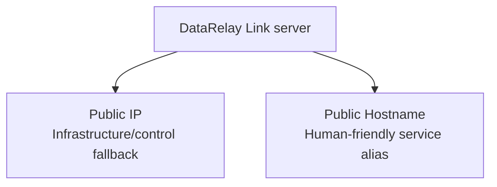
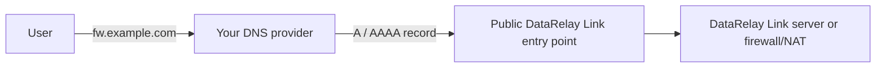
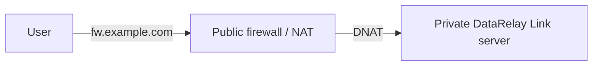
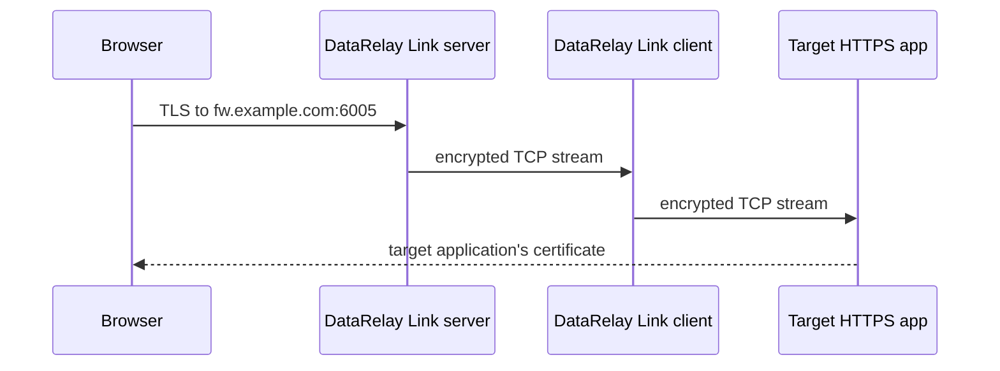

# DNS & Public Hostname

DataRelay Link separates the server's **Public IP** from an optional **Public Hostname**.



```text
Public IP       = primary infrastructure/control reference
Public Hostname = optional user-facing alias for published services
```

## Example

```text
Public IP       203.0.113.10
Public Hostname fw.example.com
SSH public port 6000
HTTPS port      6005
```

Both SSH forms can reach the same published service:

```bash
ssh -p 6000 user@203.0.113.10
ssh -p 6000 user@fw.example.com
```

Web examples:

```text
http://fw.example.com:6004
https://fw.example.com:6005
```

## Configure the service hostname

```bash
sudo drlink set server hostname fw.example.com
```

Remove it with:

```bash
sudo drlink unset server hostname
```

This metadata change does **not** change CLIENT ID, Service ID, public-port reservations, project CA, or DataRelay Link control identity.

## DNS remains external



DataRelay Link does not call Route53, Cloudflare DNS, DNSZi, or another provider API. Create the DNS record yourself so the hostname resolves to the **public entry point**.

## Server behind NAT

If the DataRelay Link server is private, the hostname should normally resolve to the **firewall/public IP**, not the private server address.



## HTTPS certificate behavior

Published HTTPS is TCP passthrough:



DataRelay Link does not issue or replace the published application's certificate. The **target application certificate** must be valid for the hostname users enter.

## Hairpin NAT

Internal clients may fail to reach the public hostname through the firewall's public IP if the firewall does not support hairpin NAT. Use hairpin NAT or split DNS when needed.

<Tip>
  When debugging a hostname problem, first prove the service works by public IP + public port. If IP works and hostname fails, debug DNS/certificate/hairpin behavior before changing DataRelay Link state.
</Tip>
