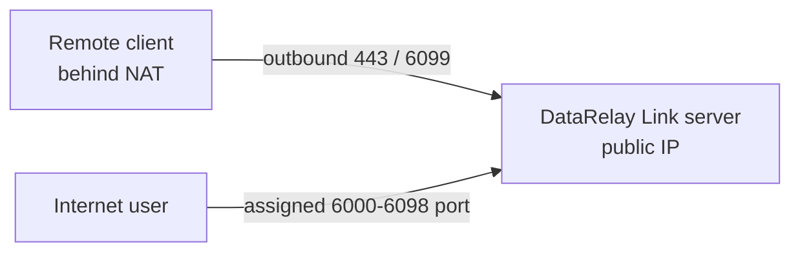
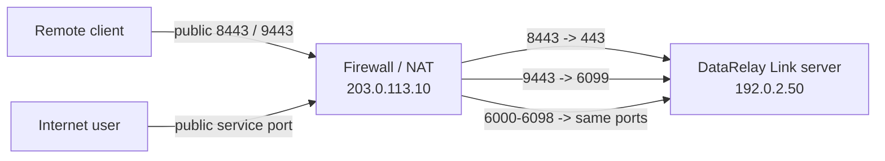
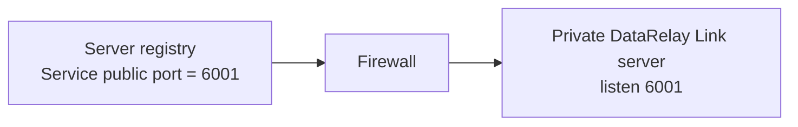
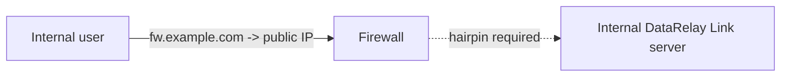

# Firewall & NAT

The remote **client** normally does not need inbound port forwarding. The **DataRelay Link server side** still needs a reachable public entry point for control, enrollment, and published service ports.


The diagram is useful for separating **where the server lives** from **which DataRelay Link mode it uses**. A private server behind DNAT can still run Direct mode; Enterprise single-443 is a different transport layout for constrained client networks.

## Topology A — server has a public IP



Direct defaults:

```text
TCP 443       DataRelay Link control
TCP 6099      Enrollment / management HTTPS
TCP 6000-6098 Published services
```

## Topology B — server is private behind a firewall



Example DNAT:

```text
203.0.113.10:8443       -> 192.0.2.50:443
203.0.113.10:9443       -> 192.0.2.50:6099
203.0.113.10:6000-6098  -> 192.0.2.50:6000-6098
```

The client configuration must use the **public** endpoints (`203.0.113.10:8443`, `:9443` in this example), not the private server address.

## Enterprise single-443 behind a firewall

In single-443, the public firewall only forwards the frontend control/enrollment endpoint on TCP 443. The internal backends remain loopback-only on the DataRelay Link server:

```text
Public firewall TCP 443  -> DataRelay Link server TCP 443 frontend
DataRelay Link server 127.0.0.1:7000 -> relay backend
DataRelay Link server 127.0.0.1:6099 -> enrollment/management backend
Published service ports   -> 6000-6098 (normally 1:1)
```

<Warning>
  **Do not DNAT public TCP 7000 or 6099 to the server in Enterprise single-443.** Those are internal backend listeners in this topology. Exposing them defeats the intended single-443 boundary.
</Warning>

The distinction between a **public port** and a **local listen/backend port** matters when the server is behind NAT. Always configure the client with the public endpoint and configure the firewall to forward to the intended local listener.

## Why published service ports should stay 1:1



Keeping public `6001 -> internal 6001` means the product's persistent reservation is also the port users actually connect to.

If an external firewall arbitrarily remaps every service port, the registry and Internet-facing endpoint stop matching, which makes operations and troubleshooting harder.

## Who is responsible for what?

| Component | DataRelay Link configures it? |
| --- | --- |
| DataRelay Link server/client config | **Yes** |
| Service-port reservation | **Yes** |
| AWS Security Group | No |
| OCI Security List / NSG | No |
| External firewall/DNAT | No |
| UFW/firewalld/iptables | No |
| DNS record | No |
| SSH account/key | No |

## Hairpin NAT / split DNS

An internal user may fail to reach `fw.example.com` if that hostname resolves to the firewall's public IP and the firewall does not support hairpin NAT.



If hairpin NAT is unavailable, use split DNS or another appropriate internal routing design.

## Troubleshooting NAT

Check in this order:

1. public DNS/IP points to the correct firewall
2. public control port DNATs to the expected server listen port
3. public enrollment HTTPS DNATs correctly
4. published service port stays open and preferably 1:1
5. local `drlink doctor` reports a healthy topology
6. the client can reach the **public** endpoints from its own network
