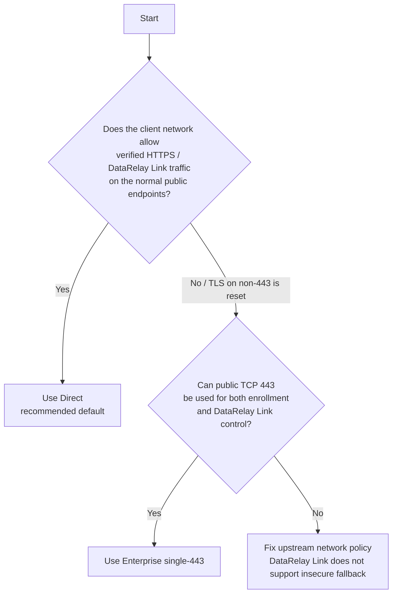
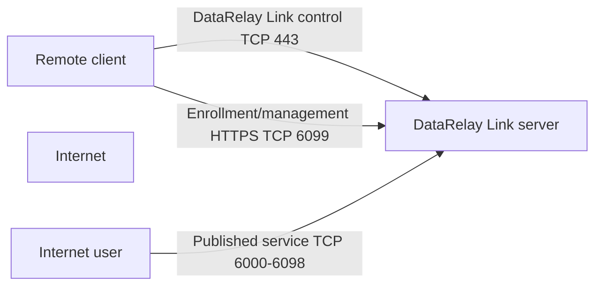
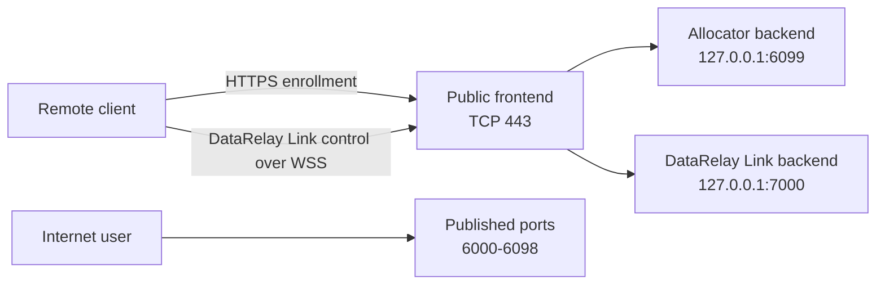
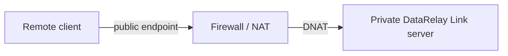

# Deployment Modes

DataRelay Link has **two** server deployment modes: **Direct** and **Enterprise single-443**.

NAT is not a third mode; it is a network topology around either deployment.


The image is the original field-guide overview: a direct public server, a private server behind DNAT, and the Enterprise single-443 layout. The tables below use the current v2.2.1 terminology and port rules.

## Which mode should I choose?



## Direct mode



Direct is the default and easiest mode to reason about.

| Purpose | Public TCP | Typical local listen |
| --- | --: | --: |
| DataRelay Link control | 443 | 443 |
| Enrollment / management HTTPS | 6099 | 6099 |
| Published services | 6000-6098 | 6000-6098 |

## Enterprise single-443

Use this when an enterprise client network strongly prefers TLS on TCP/443 or allows the TCP connection to a non-standard port but resets TLS there.



<Warning>
  In single-443 mode, backend ports `6099` and `7000` are not intended to be Internet-exposed.
</Warning>

## Side-by-side summary

| Question | Direct | single-443 |
| --- | --- | --- |
| Normal default? | **Yes** | No, use for constrained enterprise networks |
| Public DataRelay Link control | TCP 443 | TCP 443 via WSS frontend |
| Public enrollment HTTPS | TCP 6099 | TCP 443 |
| Published services | 6000-6098 | 6000-6098 |
| Backend 6099 | public/listen by default | loopback backend |
| Backend 7000 | not normal Direct path | loopback DataRelay Link backend |

## Server behind firewall/NAT

Either mode can be placed behind a firewall/NAT device if the public endpoints are forwarded correctly.



For a Direct example with public-to-private port translation, see [Firewall & NAT](/deployment/firewall-nat).

## Switching modes

Direct ↔ single-443 is a maintenance-window cutover, not a zero-downtime change. Persistent identity, CA, token, registry, and port reservations are designed to remain, but the client transport must match the new topology.

After any mode change:

```bash
sudo drlink show status
sudo drlink doctor
```

<Note>
  Do not solve TLS interception/reset by disabling certificate verification or by switching enrollment to plain HTTP. The supported management plane remains verified HTTPS.
</Note>
