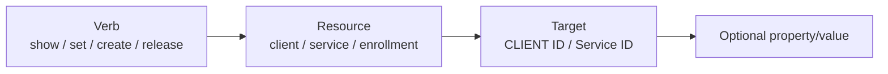
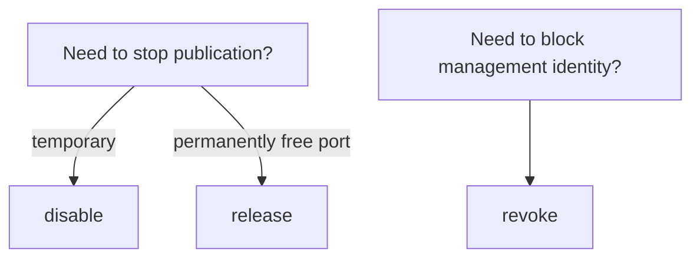

# drlink Guide

`drlink` is the everyday operator interface. You can use it interactively or run a full command directly from the shell.

## Start here if you are new

```bash
sudo drlink
```

The interactive CLI provides completion and context help:

```text
Tab    show/complete valid next tokens
?      context-sensitive help
help   full command help
↑/↓    in-memory history for this session
menu   guided numbered interface
exit   leave the CLI
```

## Choose the command by what you want to do

| Intent | Start with |
| --- | --- |
| Is everything healthy? | `show status`, `doctor` |
| What clients exist? | `show clients` |
| Inspect one client | `show client <ID>` |
| Onboard a new client | `create zero-touch` |
| Create a manual Enrollment Code | `create enrollment` |
| See a client's services | `show client <ID> services` |
| Change a client's label/note/tag | `set client <ID> ...` |
| Add/edit a client-side service | `add service`, `set service ...`, then `apply` |
| Temporarily stop a service | `disable service <service-id>` |
| Permanently free a service port | `release service <ID> <service-id>` |
| Block client management identity | `revoke client <ID>` |
| Check for project update | `update project --check` |
| Create a backup | `create backup` |

## The grammar

```text
<verb> <resource> [target] [property] [value]
```



## CLIENT ID is the canonical selector

The server's canonical identity is the immutable **CLIENT ID**. Label and hostname are human-friendly metadata and can change.

`show clients` prints CLIENT ID first. Tab completion prefers CLIENT ID. A unique label or hostname may work when typed manually, but an ambiguous selector fails closed.

## Common server commands

```text
show status
show version
show clients
show client <ID>
show client <ID> services
show client <ID> tags
show enrollments
show audit
show upstream

create zero-touch
create enrollment
create enrollment --one-line --ssh --ssh-user <ssh-user> --label branch-a
create enrollments --count 3
create backup

set client <ID> label <value>
set client <ID> note <value>
set client <ID> tag <key> <value>
set server hostname <fqdn>

unset client <ID> label
unset client <ID> note
unset client <ID> tag <key>
unset server hostname

revoke enrollment <ID>
revoke client <ID>
release service <ID> <service-id>
release client <ID>

update project --check
update project
update relay-engine --check
doctor
```

## Common client commands

```text
show status
show version
show services
show info

add service
set service <service-id> target-host <host>
set service <service-id> target-port <port>
set service <service-id> ssh-user <user>
set service <service-id> name <value>

enable service <service-id>
disable service <service-id>
apply
discard

doctor
```

Client service changes are staged. `apply` makes them live; `discard` drops pending changes.

## Three lifecycle verbs you must not mix up



```text
disable != release
revoke  != release
```

## Stable vs development commands

This documentation's operational baseline is stable **v2.2.1**. The mutable `main` branch may contain later development or docs-only changes; normal field operation should follow the immutable v2.2.1 release contract.

For exact stable syntax, use the [CLI Reference](/drlink/cli-reference).

## Safety behavior

- `doctor` is read-only.
- `history` is session-only and is not persisted by `drlink`.
- The bundled relay engine stays pinned to the project-tested version; `show upstream` is informational.
- Ambiguous identity selection should fail rather than guess.
