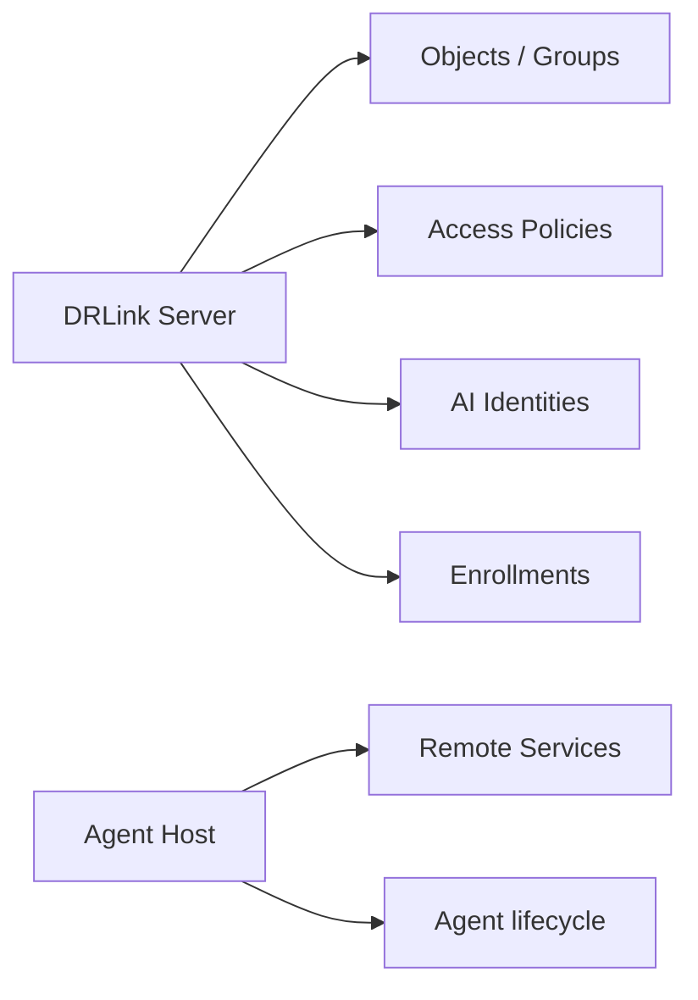

# Concepts & Mental Model

## The one-sentence model

> A Managed Host runs a DRLink Agent that connects outward to a Server; the Agent creates only the Remote Services you need, and the Server applies Remote, Internet, and AI Access policy.

## Core nouns

| Noun | Meaning |
| --- | --- |
| **DRLink Server** | Public/control entry point and policy authority |
| **Managed Host** | A real host managed through DataRelay Link |
| **DRLink Agent** | Software running on a Managed Host |
| **Network Object / Group** | IP, CIDR, FQDN, or Managed Host selector and reusable groups |
| **Service Object / Group** | TCP/UDP/Fixed TCP service definitions and reusable groups |
| **Permission Object / Group** | Reusable AI-operation permissions |
| **AI Identity** | Authenticated identity used by AI Access |
| **Remote Service** | Agent-owned connectivity object with a stable DataRelay Link endpoint |
| **Access Policy** | Remote Access, Internet Access, or AI Access authorization |

## Server vs Agent ownership



The Server may inspect Remote Service state, but normal Remote Service create/edit/delete happens on the owning Agent Host.

## Managed Host as a selector

A registered Managed Host also appears as a Network Object of type **Managed Host** where the policy context allows it.

Internet Access may use a Managed Host as a **source**. It must not use a Managed Host as a **destination**, directly or through a Network Group containing one.

## Remote Service states

```text
HEALTHY
DEGRADED
DISABLED
```

A valid configuration can remain DEGRADED during temporary target reachability, Server connectivity, or endpoint-allocation problems. Runtime failure does not automatically delete the configuration.

## Fixed TCP

Fixed TCP is a Service Object subtype. Its Service Object port is the destination TCP port. DataRelay Link allocates the public endpoint separately from a dedicated Fixed TCP endpoint pool.

## Policy modes

Initial policy state is No Policy / No Rules / effective ALLOW.

BLACKLIST denies matching enabled Rules. WHITELIST allows matching enabled Rules. There is no rule ordering and no per-rule action field.
