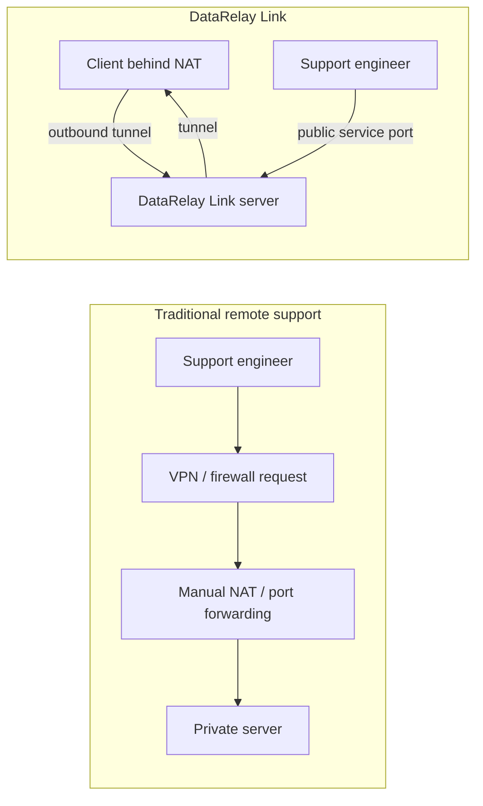
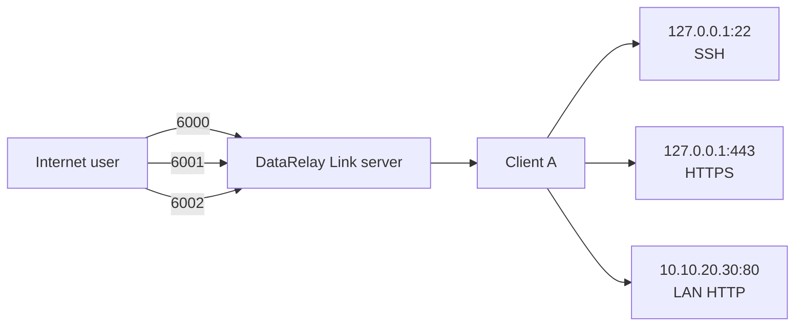
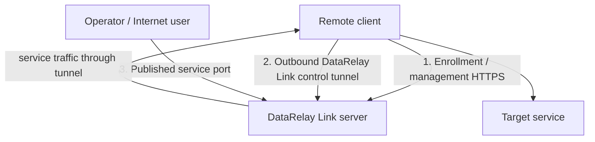
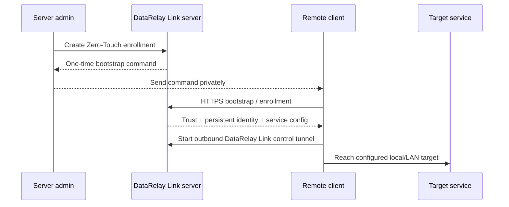

# Concepts & Mental Model

If you are new to NAT, reverse tunnels, or relay gateways, start here. You do **not** need to understand relay-engine internals before using DataRelay Link.

## The one-sentence model

> Install one public entry server, let remote clients connect **outbound** to it, then reach each published TCP service through a persistent public port on that server.

## Before vs after



The important difference is **who starts the connection**. The remote client starts the tunnel toward the server, so the client normally does not need its own public IP or inbound NAT rule.

## The five objects to remember

| Object | Plain-English meaning | Example |
| --- | --- | --- |
| **Server** | Public entry point that runs DataRelay Link server + management layer | `203.0.113.10` |
| **Client** | Remote machine running the DataRelay Link client runtime, usually behind NAT/firewall | branch Linux host |
| **CLIENT ID** | Immutable machine identity used for administration | `8f31a2c4` |
| **Service** | One TCP target reachable from a client | `ssh -> 127.0.0.1:22` |
| **Public port** | Persistent Internet-facing reservation for a service | `6003` |

Labels, hostnames, notes, and tags help humans organize clients, but they are **metadata**. They do not replace CLIENT ID.

## One client can publish many services



Each service has a stable Service ID and a persistent public-port reservation.

## Three different network paths

DataRelay Link has three paths that beginners often mix together:



1. **Enrollment / management** establishes trust and manages client state.
2. **DataRelay Link control** keeps the reverse tunnel available.
3. **Published service traffic** is the actual SSH/HTTP/HTTPS/custom TCP connection.

## What Zero-Touch actually does

Enrollment is similar to securely pairing a new client with the server.



After successful enrollment, normal reboots and supported updates do not require re-enrollment.

## Public IP vs public hostname

```text
Public IP       = infrastructure/control fallback
Public Hostname = optional human-friendly alias for published services
```

A hostname does not change CLIENT ID, Service ID, or public-port reservations.

## What DataRelay Link does not do

It intentionally leaves these responsibilities outside the product:

- cloud security groups and external firewall policy
- NAT/DNAT rules
- DNS provider records
- operating-system users and SSH keys
- application authentication
- application TLS certificates

<Note>
  If you only want to get a first connection working, continue with the [Quick Start](/getting-started/quickstart). If you want implementation details, read [Architecture](/reference/architecture).
</Note>
