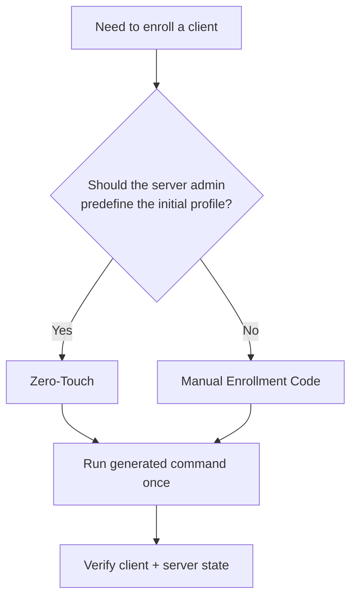
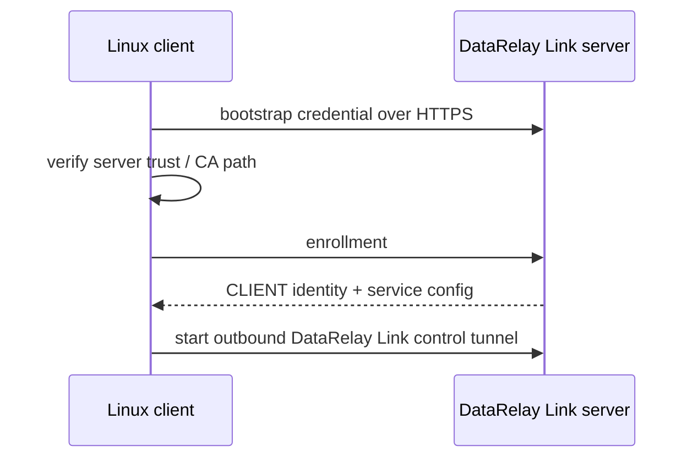

# Linux Client

Linux/systemd remains the product's server and Linux-client foundation. In stable v2.2.1, client validation also includes macOS Apple Silicon and Windows 10 / PowerShell 5.1. For Linux, Ubuntu 24 physical, Rocky Linux 8.10/9.4, and Amazon Linux 2023 are Real E2E validated; Amazon Linux 2 remains container/CI portability only.

## What the client needs

Before enrollment, confirm:

- `sudo`/root access is available for installation
- the client can make outbound connections to the DataRelay Link server public endpoints
- any service you want to publish already exists and is reachable from the client
- for SSH, the SSH user already exists and `sshd` is running

DataRelay Link does not create operating-system users, passwords, SSH keys, or application services.

## Client lifecycle at a glance

The original field guide used the following lifecycle diagram to show where enrollment, service configuration, normal operation, updates, and removal fit together.


The current v2.2.1 rule is the same at a high level: enroll once, keep the persistent CLIENT ID, change services through `drlink`, update without re-enrollment, and use the explicit lifecycle operations when retiring a client or releasing ports.

## Choose enrollment method

| Method | Best when | Who chooses initial services? |
| --- | --- | --- |
| **Zero-Touch** | server admin wants a ready-to-run command | server admin |
| **Manual Enrollment Code** | remote operator should choose services interactively | remote operator |



## Recommended: Zero-Touch

For the easiest interactive server workflow:

```bash
sudo drlink
```

Then:

```text
create zero-touch
```

For an explicit SSH profile:

```bash
sudo drlink create enrollment \
  --one-line \
  --ssh \
  --ssh-user <ssh-user> \
  --label branch-a
```

Replace `<ssh-user>` with an SSH account that already exists on the target machine. Run the **exact generated command** on the client; do not reconstruct the bootstrap payload manually.

## Manual Enrollment Code

On the server:

```bash
sudo drlink create enrollment
```

Run the generated client bootstrap command and enter the short-lived Enrollment Code when prompted. The installer can then guide the remote operator through service selection.

## What happens during enrollment



## Verify on the client

```bash
sudo drlink show version
sudo drlink show status
sudo drlink show services
sudo drlink show info
sudo drlink doctor
```

## Verify on the server

```bash
sudo drlink show clients
sudo drlink show enrollments
sudo drlink show client <CLIENT-ID>
sudo drlink show client <CLIENT-ID> services
```

The client receives a persistent CLIENT ID. Normal reboots, supported service edits, and normal stable project updates do not require a new enrollment.

## Changing services later

Client-side service edits are staged:

```text
add service
set service <service-id> target-host <host>
set service <service-id> target-port <port>
apply
```

Use `discard` before `apply` if you want to throw away pending changes.

## Important lifecycle rule

```text
client uninstall != server release
```

Removing local client software does not automatically free the server's public-port reservations. See [Lifecycle Semantics](/operations/lifecycle).
