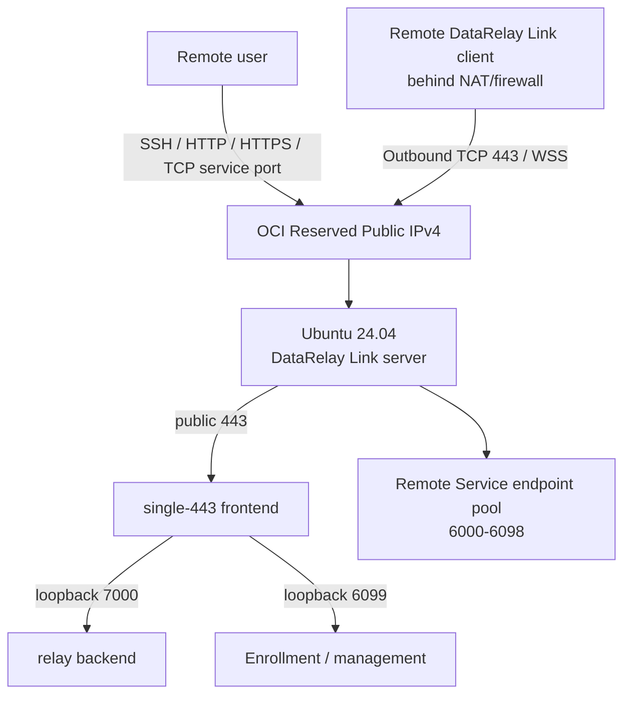

# OCI Free Tier DataRelay Link Server

This guide prepares an OCI Ubuntu 24.04 host with a persistent Reserved Public IPv4 address for DataRelay Link. It preserves the original OCI Console screenshots, while current product installation and Managed Host onboarding continue through the v2.4 documentation below.

<Note>
  OCI Console labels, Free Tier eligibility, capacity, and pricing can change. Treat the current Console's **Always Free Eligible** indicator and cost estimate as the final source before creating resources. Oracle also documents that idle Always Free compute instances may be reclaimed after a sustained low-usage period, so do not treat a Free Tier VM as an SLA-backed production host without reviewing the current OCI policy.
</Note>

## What you will build

The high-resolution architecture diagram below shows the same deployment from the operator's point of view: one OCI Reserved Public IP fronts the DataRelay Link server, while each remote client publishes one or more local or reachable LAN services through its assigned persistent public ports.

For this OCI walkthrough we use **Enterprise single-443** because it gives a simple public policy:

| Public ingress | Purpose |
| --- | --- |
| TCP 22 | OCI server administration; restrict to your admin IP `/32` |
| TCP 443 | DataRelay Link control over WSS + enrollment/management HTTPS |
| TCP 6000-6098 | Remote Service endpoints; restrict further when practical |
| TCP 6099 | **Do not expose** in single-443 |
| TCP 7000 | **Do not expose** in single-443 |

Direct mode is also fully supported. In Direct mode, TCP 6099 is a separate public enrollment/management endpoint.

## 10-minute map

| Step | OCI / DataRelay Link action | Value used in this guide |
| --: | --- | --- |
| 1 | Create VCN | `data-relay-vcn` / `10.0.0.0/16` |
| 2 | Internet Gateway + route | `0.0.0.0/0` → Internet Gateway |
| 3 | Create public subnet | `data-relay-public-subnet` / `10.0.0.0/24` |
| 4 | Security List | admin SSH, `443`, `6000-6098` |
| 5 | Create VM | Ubuntu 24.04 x86_64 / `VM.Standard.E2.1.Micro` when eligible |
| 6 | Public address | attach a **Reserved Public IPv4** |
| 7 | SSH | `ubuntu@<RESERVED-IP>` |
| 8 | Install DataRelay Link | follow current Server Installation / exact qualified source |
| 9 | Verify | show version, show status, system diagnostics |
| 10 | Add first Managed Host | set enrollment zero-touch |

## Continue the guide

<CardGroup cols={2}>
  <Card title="Part 1 — OCI network and VM" icon="cloud" href="/getting-started/oci-network-vm">
    Create the VCN, Internet Gateway, public subnet, ingress rules, Ubuntu VM, Reserved Public IPv4, and verify SSH access.
  </Card>
  <Card title="Part 2 — Install DataRelay Link" icon="server" href="/getting-started/oci-drlink-install">
    Prepare Ubuntu, install and verify the Server, check reboot persistence, and enroll the first Managed Host.
  </Card>
</CardGroup>

<Note>
  The two parts preserve the original field-deployment screenshots. Splitting the guide only improves navigation; it does not change the deployment procedure.
</Note>
