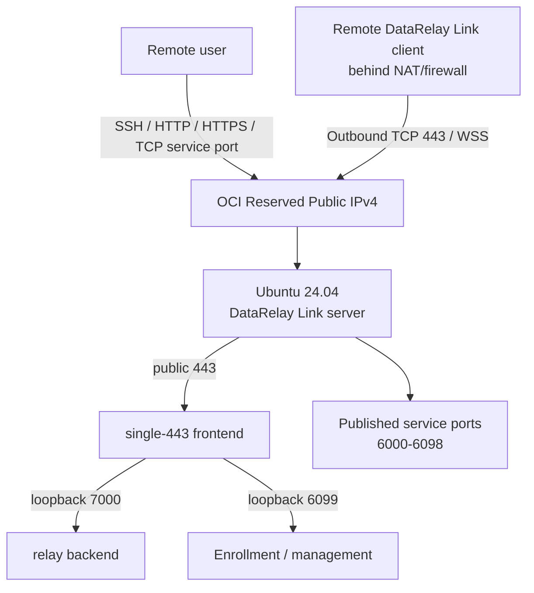

# OCI Free Tier DataRelay Link Server

This guide takes you from an empty OCI tenancy to a working **DataRelay Link v2.2.1** server and the first SSH client. It reuses the actual OCI Console screenshots from the original deployment guide while updating all commands and product behavior to the current DataRelay Link stable release.

<Note>
  OCI Console labels, Free Tier eligibility, capacity, and pricing can change. Treat the current Console's **Always Free Eligible** indicator and cost estimate as the final source before creating resources. Oracle also documents that idle Always Free compute instances may be reclaimed after a sustained low-usage period, so do not treat a Free Tier VM as an SLA-backed production host without reviewing the current OCI policy.
</Note>

## What you will build



The high-resolution architecture diagram below shows the same deployment from the operator's point of view: one OCI Reserved Public IP fronts the DataRelay Link server, while each remote client publishes one or more local or reachable LAN services through its assigned persistent public ports.


For this OCI walkthrough we use **Enterprise single-443** because it gives a simple public policy:

| Public ingress | Purpose |
| --- | --- |
| TCP 22 | OCI server administration; restrict to your admin IP `/32` |
| TCP 443 | DataRelay Link control over WSS + enrollment/management HTTPS |
| TCP 6000-6098 | Published client services; restrict further when practical |
| TCP 6099 | **Do not expose** in single-443 |
| TCP 7000 | **Do not expose** in single-443 |

Direct mode is also fully supported. In Direct mode, TCP 6099 is a separate public enrollment/management endpoint.

## 10-minute map

| Step | OCI / DataRelay Link action | Value used in this guide |
| --: | --- | --- |
| 1 | Create VCN | `data-relay-vcn` / `10.0.0.0/16` |
| 2 | Internet Gateway + route | `0.0.0.0/0` → Internet Gateway |
| 3 | Create public subnet | `data-relay-public-subnet` / `10.0.0.0/24` |
| 4 | Security List | admin SSH, `443`, `6000-6098` |
| 5 | Create VM | Ubuntu 24.04 x86_64 / `VM.Standard.E2.1.Micro` when eligible |
| 6 | Public address | attach a **Reserved Public IPv4** |
| 7 | SSH | `ubuntu@<RESERVED-IP>` |
| 8 | Install DataRelay Link | immutable `v2.2.1` |
| 9 | Verify | `drlink doctor` + listener checks |
| 10 | Add first client | current one-line Zero-Touch enrollment |

# Part I — Build the OCI network and VM

## 1. Open Virtual Cloud Networks

From the OCI Home page, enter **Networking → Virtual Cloud Networks**. The image below is the **original Picture 1** from the field-deployment Word guide; it is used without conversion or downscaling.


## 2. Create the VCN, Internet Gateway, route, subnet, and ingress rules

Use these values:

```text
VCN name             data-relay-vcn
VCN IPv4 CIDR         10.0.0.0/16
Internet Gateway      data-relay-internet-gateway
Default route         0.0.0.0/0 -> Internet Gateway
Public subnet         data-relay-public-subnet
Public subnet CIDR    10.0.0.0/24
Subnet type           Regional / Public
```

### 2-1. Create the VCN

Open **Virtual Cloud Networks → Create VCN**.


Set the VCN name to `data-relay-vcn` and the IPv4 CIDR to `10.0.0.0/16`.


### 2-2. Create the Internet Gateway

In the new `data-relay-vcn`, open the **Gateways** tab and create an Internet Gateway.


Use `data-relay-internet-gateway` as the example gateway name.


### 2-3. Add the Internet route to the default route table

Open the **Routing** tab and select `Default Route Table for data-relay-vcn`.


Choose **Route Rules → Add Route Rules**.


Add the following route:

```text
Target Type        Internet Gateway
Destination CIDR   0.0.0.0/0
Target             data-relay-internet-gateway
```


Confirm that the route rule is present after saving.


### 2-4. Start creating the public subnet

Open the **Subnets** tab and select **Create Subnet**.


### 2-5. Configure the public subnet

Create the public subnet with the following values:

```text
Name           data-relay-public-subnet
Subnet Type    Regional
IPv4 CIDR      10.0.0.0/24
Route Table    Default Route Table for data-relay-vcn
Subnet Access  Public Subnet
```


### 2-6. Configure the Security List

Open the VCN's **Security Lists** page.


Review the ingress rules on the **Default Security List**.


For DataRelay Link in single-443 mode, add TCP 443 and the published-service range TCP 6000-6098. Keep SSH 22 for administration, preferably restricted to your administrator public IP `/32`.


Confirm that the ingress rules were applied.


### Recommended single-443 ingress

| Protocol | Destination port | Source | Purpose |
| --- | --: | --- | --- |
| TCP | 22 | **your admin public IP/32** | SSH administration |
| TCP | 443 | client networks or `0.0.0.0/0` if required | WSS control + enrollment/management |
| TCP | 6000-6098 | only networks/users that need the services | published services |

<Warning>
  In **single-443** mode, do not create public OCI ingress or DNAT for **6099** or **7000**. They are internal loopback backends. Also do not blindly copy a broad `All Protocols` rule from a generic OCI tutorial.
</Warning>

If you do not want the whole `6000-6098` range exposed, allow only the service ports that are actually assigned, and constrain source CIDRs where possible.

## 3. Create the Ubuntu compute instance

Recommended values for this walkthrough:

```text
Name           data-relay-link-server
Image          Canonical Ubuntu 24.04 LTS x86_64
Shape          VM.Standard.E2.1.Micro (when Console marks it eligible/free)
VCN            data-relay-vcn
Subnet         data-relay-public-subnet
Boot volume    default
```

Before creating the Compute Instance, confirm that the VCN, Internet Gateway, route, public subnet, and Security List created above are ready, then open **Compute → Instances**.


### 3-1. Enter the basic Compute Instance settings

Start on **Create compute instance** and confirm the instance name and placement.


### 3-2. Select Canonical Ubuntu 24.04

Choose **Change image** and select Canonical Ubuntu 24.04. Treat the image/version currently shown in OCI Console as authoritative.


Unless your environment requires something different, keep the Security settings at their defaults.


### 3-3. Select the VCN and public subnet

Under Primary VNIC, select the `data-relay-vcn` and `data-relay-public-subnet` created earlier.


### 3-4. Disable automatic public IPv4 and configure the SSH key

Because this guide attaches a Reserved Public IP later, turn off **Automatically assign public IPv4 address**. Then upload an existing SSH public key or let OCI generate a new key pair, and store the private key securely.


### 3-5. Review the boot volume

Unless you have a separate storage requirement, keep the boot-volume settings at their defaults.


### 3-6. Review before creating the instance

Confirm that the image is Ubuntu 24.04 and that the shape, VCN/subnet, and SSH key match the intended configuration before creating the instance.


### 3-7. Confirm the created instance and Free/Eligible indicator

Confirm the instance state in the Compute Instances list.


The **Always Free** indicator shown in the original screenshot reflects the OCI Console at the time of the field deployment. Current Free Tier/Eligible status can vary by region and tenancy, so use the current Console's eligibility and cost display as the final authority.


Important points from the original deployment:

- choose the existing `data-relay-vcn`
- choose `data-relay-public-subnet`
- allow OCI to assign the **private IPv4** automatically
- turn off **Automatically assign public IPv4 address** for the final persistent-IP design
- generate/download or upload an SSH public key
- if OCI generated the key pair, store the private key securely; do not assume it can be downloaded again later
- keep the boot volume simple unless you have another storage requirement

<Warning>
  `VM.Standard.E2.1.Micro` availability and Free Tier treatment are tenancy/region dependent. If the Console does not show it as eligible at creation time, do not assume this guide makes it free.
</Warning>

## 4. Attach a Reserved Public IPv4

From the instance details page, open **Networking → Primary VNIC**.


In the VNIC, open **IP administration → Primary Private IP**.


If an ephemeral public IP is currently attached, edit the private IP and select **No public IP** first.


Confirm that no public IP is currently assigned.


Edit the private IP again and choose:

```text
Public IP type        Reserved public IP
Option                Create new Reserved IP Address
Name                  data-relay-reserved-public-ip
```


A Reserved Public IP is the address you should treat as the persistent public entry point for DataRelay Link. OCI performs the public/private mapping outside the Ubuntu guest, so `ip addr` on the VM normally shows the private `10.x.x.x` address rather than the public address.

Confirm that the Reserved Public IP is attached to the Primary Private IP. The public IP value in this screenshot has been masked before publication.


<Note>
  Picture 32 (successful SSH session) from the original Word guide is still not published because it contains field connection details. The SSH procedure below uses the `<RESERVED-PUBLIC-IP>` placeholder instead.
</Note>

## 5. Test SSH access

For OCI Ubuntu images the default account is normally `ubuntu`:

```bash
chmod 600 ~/Downloads/<private-key-file>
ssh -i ~/Downloads/<private-key-file> ubuntu@<RESERVED-PUBLIC-IP>
```

Then verify the host:

```bash
uname -m
cat /etc/os-release
systemctl --version
```

Expected for this guide:

```text
Architecture   x86_64
OS             Ubuntu 24.04 LTS
PID 1          systemd
```

# Part II — Install DataRelay Link v2.2.1

## 6. Prepare only the packages you need

```bash
sudo apt update
sudo apt -y install curl ca-certificates
```

Check time and the host firewall before installation:

```bash
timedatectl status
sudo ufw status
sudo iptables -S INPUT
```

<Warning>
  The older field notes contained an environment-specific procedure that flushed the Ubuntu `INPUT` chain. **Do not blindly run `iptables -F` or change the default INPUT policy just for DataRelay Link.** OCI Security Lists/NSGs and the Ubuntu host firewall are separate security boundaries; configure each deliberately for your environment.
</Warning>

## 7. Install the immutable stable release

```bash
curl -fsSL \
  https://raw.githubusercontent.com/xdr-labs/frp-auto-deploy/v2.2.1/dist/bootstrap-server.sh \
  | sudo bash
```

For this OCI walkthrough, choose **Enterprise single-443** when the installer asks for topology. Conceptually the result is:

```text
Public host                  <RESERVED-PUBLIC-IP or DNS>
Deployment mode              Enterprise single-443
Public control               TCP 443
DataRelay Link backend                  127.0.0.1:7000
Public enrollment/management HTTPS 443
Allocator backend            127.0.0.1:6099
Published service range      TCP 6000-6098
Bundled/tested relay engine             0.71.0
Project                       2.2.1
```

Do not copy the v2.1.0 environment-variable installation command from the old guide. The current field path is the immutable **v2.2.1** installer above and its current interactive questions.

## 8. Verify the server

```bash
sudo drlink show version
sudo drlink show status
sudo drlink doctor
```

For single-443, also inspect the listeners:

```bash
sudo ss -lntp | grep -E ':(443|6099|7000)\b'
```

The important exposure model is:

```text
0.0.0.0:443       public frontend
127.0.0.1:7000    frps backend
127.0.0.1:6099    allocator backend
```

From another machine on the Internet:

```bash
nc -vz -w 3 <RESERVED-PUBLIC-IP> 443
```

`drlink doctor` should have no blocking failure before onboarding clients.

## 9. Verify reboot persistence

```bash
sudo reboot
```

After reconnecting:

```bash
sudo drlink show status
sudo drlink doctor
sudo ss -lntp | grep -E ':(443|6099|7000)\b'
```

The services and listener topology should return without re-enrollment or manual reconstruction.

# Part III — Connect the first client

## 10. Generate a Zero-Touch SSH enrollment

On the DataRelay Link server:

```bash
sudo drlink create enrollment \
  --one-line \
  --ssh \
  --ssh-user <EXISTING-CLIENT-USER> \
  --label <CLIENT-LABEL>
```

The command printed by the server contains a short-lived, one-time bootstrap credential. **Copy the exact generated command** to the remote client instead of reconstructing it manually.

<Warning>
  Treat a generated Zero-Touch command as sensitive until it expires or is used. Do not paste a live ticket into public chat, documentation, or issue trackers.
</Warning>

On the client, run the generated line. DataRelay Link does not create the SSH user or `sshd`; they must already exist.

## 11. Verify the client and connect

On the client:

```bash
sudo drlink show version
sudo drlink show status
sudo drlink show services
sudo drlink doctor
```

On the server:

```bash
sudo drlink show clients
sudo drlink show client <CLIENT-ID>
sudo drlink show client <CLIENT-ID> services
```

Then use the assigned persistent public service port:

```bash
ssh -p <PUBLIC-SERVICE-PORT> <CLIENT-USER>@<RESERVED-PUBLIC-IP>
```

The **client does not manually choose the public port**. The DataRelay Link server allocates and persists the service reservation.

# Final checklist

- [ ] VCN `10.0.0.0/16` exists
- [ ] Internet Gateway exists
- [ ] default route has `0.0.0.0/0 → Internet Gateway`
- [ ] public subnet `10.0.0.0/24` exists
- [ ] admin SSH is restricted appropriately
- [ ] public TCP 443 is reachable
- [ ] service ports are allowed only as broadly as required
- [ ] 6099/7000 are not publicly exposed in single-443
- [ ] Ubuntu 24.04 x86_64 VM is running
- [ ] Reserved Public IPv4 is attached
- [ ] SSH to the VM succeeds
- [ ] DataRelay Link reports project 2.2.1 / bundled relay engine 0.71.0
- [ ] `drlink doctor` has no blocking finding
- [ ] listener exposure matches the selected topology
- [ ] state survives reboot
- [ ] first Zero-Touch client enrolls and the assigned SSH public port works

## Troubleshooting split

When a published service cannot be reached, test both halves independently:

```bash
# From an external workstation: Internet -> DataRelay Link server
nc -vz -w 3 <RESERVED-PUBLIC-IP> <PUBLIC-SERVICE-PORT>

# From the DataRelay Link client: client -> local/LAN target
nc -vz -w 3 <TARGET-IP> <TARGET-PORT>
```

This quickly separates an OCI/public-ingress problem from a client-to-target problem.

## Next steps

<CardGroup cols={2}>
  <Card title="Publish Services" icon="network-wired" href="/guides/services">
    Add SSH, HTTP, HTTPS, custom TCP, or services on other LAN hosts.
  </Card>

  <Card title="Firewall & NAT" icon="shield-halved" href="/deployment/firewall-nat">
    Compare Direct, public/listen NAT separation, and single-443.
  </Card>
</CardGroup>

## Official OCI references

- [Oracle Cloud Always Free Resources](https://docs.oracle.com/en-us/iaas/Content/FreeTier/freetier_topic-Always_Free_Resources.htm)
- [Launching Your First Linux Instance](https://docs.oracle.com/en-us/iaas/Content/Compute/tutorials/first-linux-instance/overview.htm)
- [Public IP Addresses](https://docs.oracle.com/en-us/iaas/Content/Network/Tasks/managingpublicIPs.htm)
- [Creating a Reserved Public IP](https://docs.oracle.com/en-us/iaas/Content/Network/Tasks/reserved-public-ip-create.htm)
- [Assigning a Reserved Public IP](https://docs.oracle.com/en-us/iaas/Content/Network/Tasks/reserved-public-ip-assign.htm)
