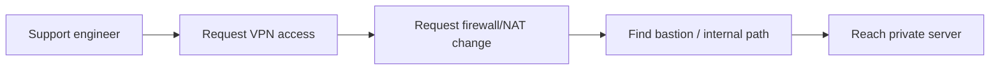
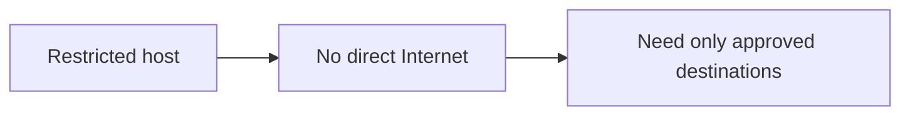
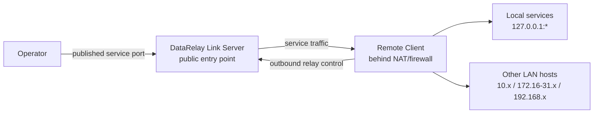
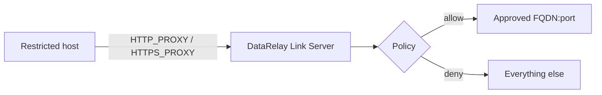
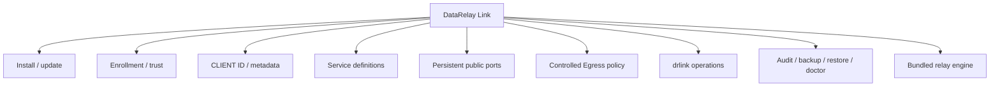

# What is DataRelay Link?

DataRelay Link is a **lightweight secure-connectivity gateway for small isolated, restricted, and NAT/firewall-protected environments**. It is designed around a simple rule:

> **Do not connect entire networks. Relay only the connections that are actually needed.**

It has two product pillars:

1. **Secure Remote Access** — outside → inside. Publish only selected services from systems behind NAT/firewalls.
2. **Controlled Egress** — inside → Internet. Allow restricted hosts to reach only policy-approved external destinations.

<Note>
  The intended scale is a few systems to a few dozen clients. The product is intentionally not a large-fleet orchestration platform, full VPN mesh, SWG, or SASE stack.
</Note>

## The problems it solves

Remote support often becomes a chain of infrastructure requests:

Restricted networks have the opposite problem: an internal server may need package updates, source repositories, APIs, or vendor services, but administrators do not want to grant broad Internet access.

DataRelay Link addresses both cases without turning the environment into one flat connected network.

## Secure Remote Access model

Install a public DataRelay Link Server once. Remote clients enroll and initiate outbound relay-control sessions toward it.

A client can publish its own services or selected services on other LAN hosts that it can reach.

## Controlled Egress model

A restricted host uses the DataRelay Link Server as an HTTP/HTTPS forward proxy. The host itself does not require a DataRelay Link agent for this v1 model.

The policy model includes source CIDR, FQDN, destination port, controlled wildcard rules, default deny, fail-closed behavior, and protections against unsafe destinations.

<Warning>
  Controlled Egress is currently under release qualification. The published stable v2.2.1 baseline is Secure Remote Access; do not treat Controlled Egress as part of immutable v2.2.1 until its Real E2E qualification is complete.
</Warning>

## Who is it for?

<CardGroup cols={2}>
  <Card title="System administrators" icon="server">
    Reach remote Linux, Windows, or macOS systems without building a full VPN/RMM stack.
  </Card>

  <Card title="Technical support engineers" icon="headset">
    Give customers or partners a controlled one-command onboarding path for remote support.
  </Card>

  <Card title="Restricted-network operators" icon="shield-halved">
    Permit only approved outbound HTTP/HTTPS destinations instead of granting broad Internet access.
  </Card>

  <Card title="Small infrastructure teams" icon="network-wired">
    Operate a few to a few dozen systems with persistent identity, service ports, policy, diagnostics, and a CLI.
  </Card>
</CardGroup>

## What DataRelay Link manages

## What it intentionally does not manage

- cloud security groups
- external firewall or NAT/DNAT rules
- host firewall policy
- DNS provider records
- operating-system accounts, passwords, or SSH keys
- application authentication
- application TLS certificates
- TLS inspection, DLP, malware inspection, CASB, browser isolation, or full SWG/SASE functions

## Recommended reading order

1. [Concepts & Mental Model](/getting-started/concepts)
2. [Quick Start](/getting-started/quickstart)
3. [Publishing Services](/guides/services)
4. [drlink Guide](/drlink/overview)
5. [Architecture](/reference/architecture)
