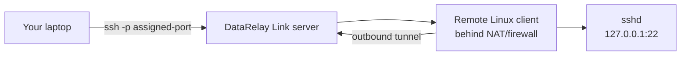
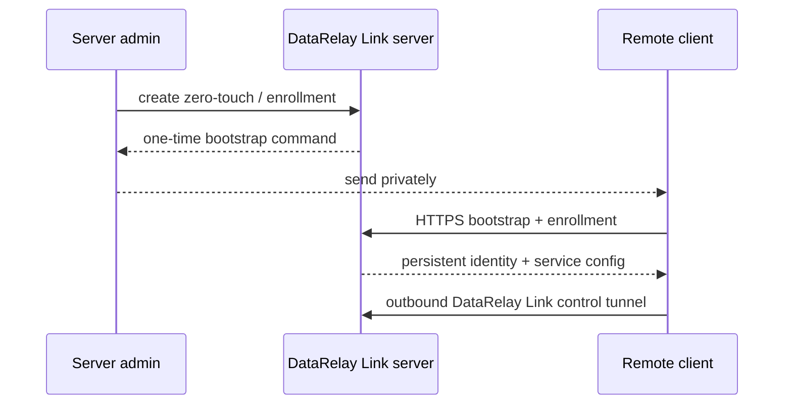

# Quick Start

This is the shortest stable **v2.2.1** path from an empty server to a working remote SSH connection.

## What you are building



## Before you start

You need:

- a Linux/systemd server that remote clients can reach through a public entry point
- a Linux/systemd client
- an SSH account that already exists on that client
- server firewall/NAT rules for the chosen deployment
- `sudo`/root privileges for installation

For a first deployment, **Ubuntu 24.04 x86_64** is the clearest real-validated baseline.

<Tip>
  If you do not already have a static public IP or spare Linux server, start with the screenshot-based [OCI Free Tier Server Preparation](/getting-started/oci-free-tier-server) guide to prepare an Always Free-eligible VM with a Reserved Public IPv4 address.
</Tip>

### Direct mode network requirements

| Direction | Purpose | Default TCP |
| --- | --- | --: |
| Client → Server | DataRelay Link control | 443 |
| Client → Server | Enrollment / management HTTPS | 6099 |
| User → Server | Published services | 6000-6098 as assigned |

<Warning>
  DataRelay Link does not automatically change cloud security groups, external firewalls, NAT rules, UFW, firewalld, or iptables.
</Warning>

## 1. Install the server

```bash
curl -fsSL \
  https://raw.githubusercontent.com/xdr-labs/frp-auto-deploy/v2.2.1/dist/bootstrap-server.sh \
  | sudo bash
```

The interactive installer asks for the public endpoint, optional published-service hostname, internal IP, deployment mode, and port settings.

If the server is behind a firewall/NAT device, read [Firewall & NAT](/deployment/firewall-nat) before accepting the defaults.

## 2. Verify the server

```bash
sudo drlink show version
sudo drlink show status
sudo drlink doctor
```

<Check>
  Continue only after the expected services are active and `doctor` does not report a blocking configuration/trust problem.
</Check>

## 3. Create the client enrollment

### Easiest interactive path

Start the CLI:

```bash
sudo drlink
```

Then use:

```text
create zero-touch
```

This is the recommended everyday onboarding path.

### Explicit SSH one-liner profile

For a predictable SSH profile from the shell:

```bash
sudo drlink create enrollment \
  --one-line \
  --ssh \
  --ssh-user <ssh-user> \
  --label branch-a
```

Replace `<ssh-user>` with an SSH user that **already exists on the remote client**.

DataRelay Link does not create OS users, install/configure `sshd`, change passwords, or manage SSH keys.

## 4. Run the generated command on the client

Send the **exact generated command** to the remote operator through an appropriate private channel and run it once on the Linux client.



Treat the generated bootstrap command as sensitive until it is used, expires, or is revoked.

## 5. Verify on the client

```bash
sudo drlink show version
sudo drlink show status
sudo drlink show services
sudo drlink show info
sudo drlink doctor
```

## 6. Verify on the server

```bash
sudo drlink show clients
sudo drlink show enrollments
```

Then inspect the assigned service port:

```bash
sudo drlink show client <CLIENT-ID> services
```

The client receives a persistent CLIENT ID and the SSH service receives a persistent public-port reservation.

## 7. Connect over SSH

```bash
ssh -p <public-port> <ssh-user>@<DataRelay Link-server-public-IP>
```

With an optional public service hostname:

```bash
ssh -p <public-port> <ssh-user>@fw.example.com
```

## Success checklist

You are finished when all of these are true:

- the client appears in `show clients`
- the client has a CLIENT ID
- the SSH service has an assigned public port
- the client reports healthy DataRelay Link state
- the public service port is allowed through the server-side firewall/NAT
- SSH reaches the intended target

## If it does not work

Use [Troubleshooting](/troubleshooting/overview) and run `drlink doctor` on both sides **before** editing generated config, registry, identity, or PKI files.

## Next steps

- [Concepts & Mental Model](/getting-started/concepts)
- [Linux Client](/getting-started/linux-client)
- [Publishing Services](/guides/services)
- [Deployment Modes](/deployment/modes)
- [drlink Guide](/drlink/overview)
