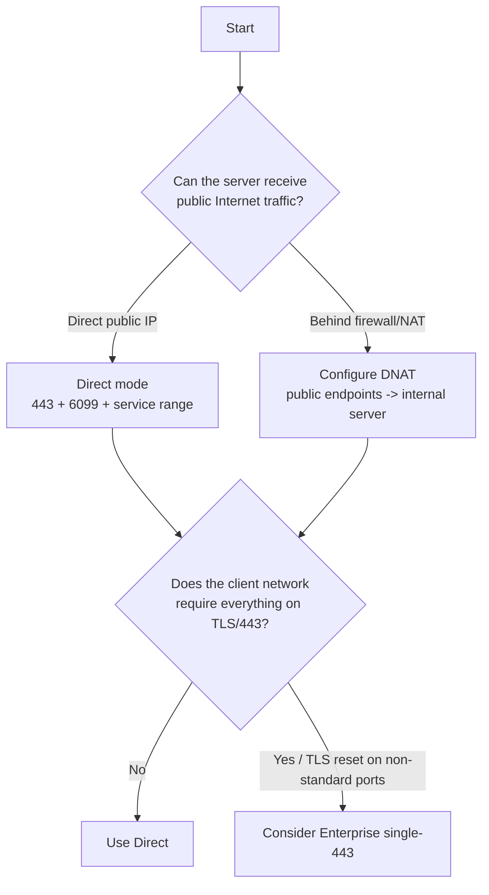
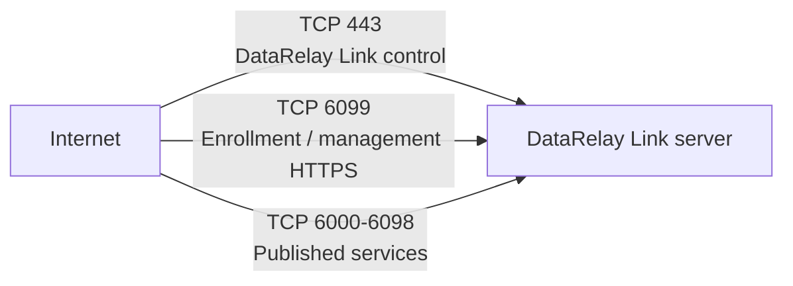
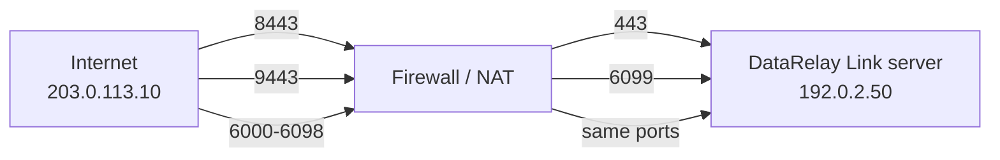

# Server Installation

The DataRelay Link server is the public entry point. It runs the bundled relay-server runtime plus enrollment, registry, lifecycle, and `drlink` management components.

## Recommended first environment

For the simplest first deployment, use an **Ubuntu 24.04 x86_64** server with a direct public IP. Ubuntu 24.04 is the clearest Real E2E-validated server baseline for the stable release; Ubuntu 22.04 has automated portability coverage but is not presented as an equivalent real-host validation claim.

<Tip>
  If you do not already have a static public IP or spare Linux server, use the screenshot-based [OCI Free Tier Server Preparation](/getting-started/oci-free-tier-server) guide to prepare an Always Free-eligible Ubuntu VM with a Reserved Public IPv4 address first.
</Tip>

Other Linux families have different validation levels; see [Supported Platforms](/reference/platforms).

## Choose the topology first

The original field guide summarized the three common network layouts in one diagram. Use it as a visual map before choosing the actual product mode.


<Note>
  The diagram shows **Direct**, **Direct behind NAT**, and **Enterprise single-443** as network layouts. NAT itself is not a third product mode; the product modes are Direct and Enterprise single-443.
</Note>



<Note>
  NAT is a network topology, not a third DataRelay Link mode. The two product modes are **Direct** and **Enterprise single-443**.
</Note>

## Direct mode defaults



TCP/22 is optional for your own administrative SSH access to the server; it is not part of the DataRelay Link tunnel path.

## If the server is behind NAT

Example:



Clients must use the **public** control/enrollment endpoints, not the server's private address. See [Firewall & NAT](/deployment/firewall-nat).

## Install the current stable release

Current published stable: **v2.2.1** with bundled/tested relay engine **v0.71.0**.

```bash
curl -fsSL \
  https://raw.githubusercontent.com/xdr-labs/frp-auto-deploy/v2.2.1/dist/bootstrap-server.sh \
  | sudo bash
```

Use the immutable stable tag for field installs rather than mutable `main` unless you intentionally want development behavior.

## What the installer asks for

Expect questions about:

1. public IP / public control endpoint
2. optional public service hostname
3. internal server IP
4. Direct vs Enterprise single-443
5. public and local control ports
6. public and local enrollment/allocator ports
7. published service range

<Warning>
  The installer does **not** create AWS Security Groups, OCI Security Lists, external firewall/NAT rules, UFW/firewalld/iptables policy, or DNS records.
</Warning>

## Verify immediately after installation

```bash
sudo drlink show version
sudo drlink show status
sudo drlink doctor
```

`doctor` is read-only and checks installation state, permissions, PKI, service state, registry consistency, topology, and common network problems.

## Persistent state you should understand

```text
/etc/frp-auto-deploy/config.json
/etc/frp-auto-deploy/pki/
/etc/frp/server_token
/var/lib/frp-auto-deploy/registry.json
```

These files/state protect trust, identity, and public-port reservations. Do not manually edit them during normal operation.

## Server readiness checklist

- required systemd services are active
- `drlink doctor` has no blocking finding
- public control/enrollment endpoints are reachable from the client network
- published service range is allowed by the server-side firewall/NAT
- if using DNS, the public hostname resolves to the correct public entry point

## Next

- [Quick Start](/getting-started/quickstart)
- [Deployment Modes](/deployment/modes)
- [Firewall & NAT](/deployment/firewall-nat)
- [Network Ports](/reference/network-ports)
