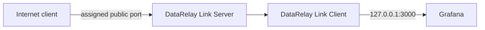
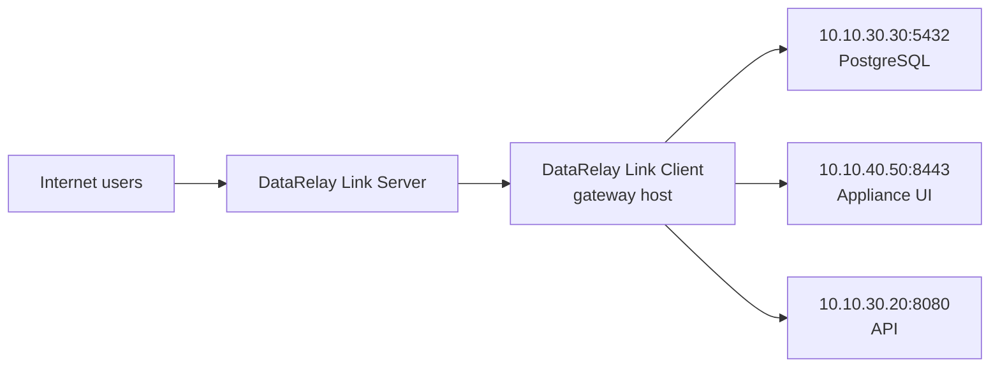
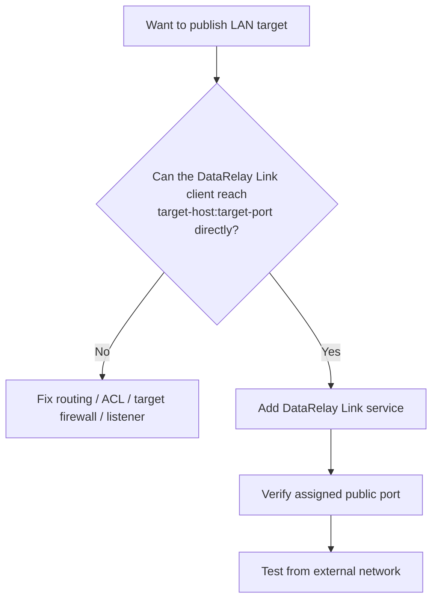

# Custom TCP & LAN Targets

DataRelay Link is not limited to SSH/web. The stable core can publish arbitrary **TCP** targets reachable from an enrolled client.

## Local custom TCP examples

```text
Grafana       127.0.0.1:3000
API           127.0.0.1:8080
Custom agent  127.0.0.1:9000
```



## LAN gateway pattern

The target does not have to run on the DataRelay Link client itself.



The only DataRelay Link-specific requirement for the target path is that the DataRelay Link client can make a normal TCP connection to the configured `target-host:target-port`.

## Before publishing a LAN target



## Stable Service ID

Use a descriptive stable Service ID, for example:

```text
postgres-reporting
appliance-ui
branch-api
```

Changing the display name or target later should not require changing the Service ID.

## Security responsibility

Publishing a database, appliance, or API makes that TCP endpoint reachable through the public DataRelay Link entry point. DataRelay Link does not automatically configure:

- database users or ACLs
- application authentication
- target host firewalls
- network segmentation
- source-IP allow lists

Keep the target application's own authentication and authorization enabled.

<Warning>
  Be especially cautious when publishing databases or administrative appliance ports. A reachable port is not the same thing as an appropriately secured service.
</Warning>

## Port lifecycle

Normal target edits and disable/enable operations are designed to preserve the public-port reservation. Use `release service` only when you intend to return the port to the pool.
