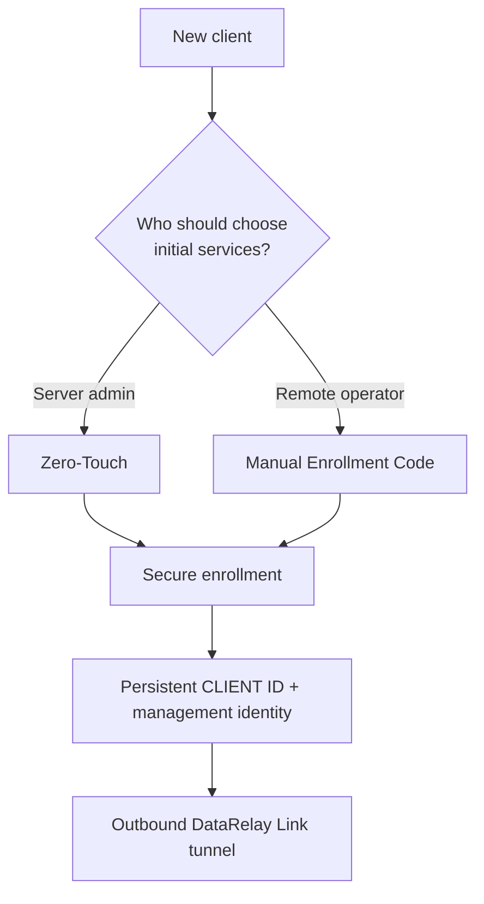
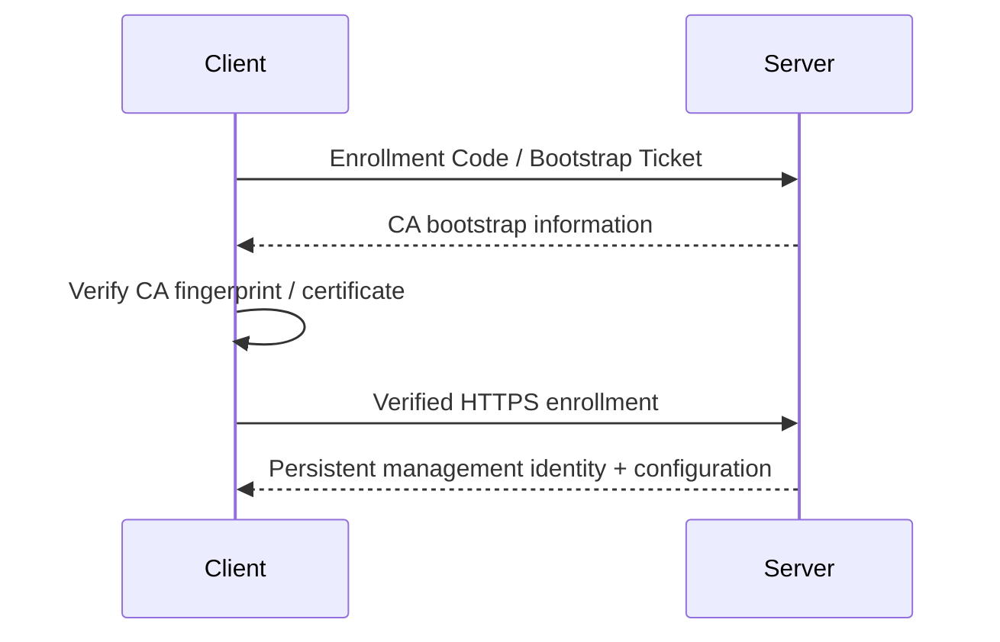

# Client Enrollment

Enrollment is the secure **first-time pairing** of a client with the DataRelay Link server. It establishes persistent management identity; it is not the same thing as the published SSH/web connection itself.


The lifecycle view helps separate first-time enrollment from normal service changes, updates, and final client/port retirement.

## Choose the workflow

| Workflow | Use it when | Typical operator experience |
| --- | --- | --- |
| **Zero-Touch** | the server admin should predefine the initial profile | remote user runs one generated command |
| **Manual Enrollment Code** | the remote operator should choose services interactively | remote user runs installer and enters a short-lived code |



## Zero-Touch

The easiest interactive CLI path is:

```bash
sudo drlink
```

Then:

```text
create zero-touch
```

For an explicit SSH profile:

```bash
sudo drlink create enrollment \
  --one-line \
  --ssh \
  --ssh-user <ssh-user> \
  --label branch-a
```

The generated bootstrap command contains a short-lived credential. Send it only through an appropriate private channel.

The SSH user must already exist. DataRelay Link does not create users, enable SSH, change passwords, or install SSH keys.

## Manual Enrollment Code

On the server:

```bash
sudo drlink create enrollment
```

The server produces enrollment information including a short-lived Enrollment Code, allocator URL, CA trust/fingerprint material, and a client bootstrap command.

The remote user runs the generated command and enters the Enrollment Code when prompted.

Typical service choices include:

```text
SSH
HTTP
HTTPS
Custom TCP
```

The server owns the public service-port assignment. The client chooses the target host and target port.

## Trust establishment



After that, normal supported operations use the persistent identity rather than repeatedly using the first-install secret.

## Verify enrollment

Server:

```bash
sudo drlink show enrollments
sudo drlink show clients
sudo drlink show client <CLIENT-ID>
```

Client:

```bash
sudo drlink show status
sudo drlink show services
sudo drlink doctor
```

## Stable v2.2.1 enrollment lifecycle

Use the non-secret enrollment ID to revoke an active credential:

```bash
sudo drlink revoke enrollment <ID>
```

`show enrollments` never prints the secret itself. Enrollment retention/purge and lifecycle behavior documented by the v2.2.1 CLI are part of the stable release contract; mutable `main` may contain later changes.

## Persistent identity

A successful enrollment creates a persistent CLIENT ID and management identity. Normal service edits, reboots, and supported updates do not require re-enrollment.
