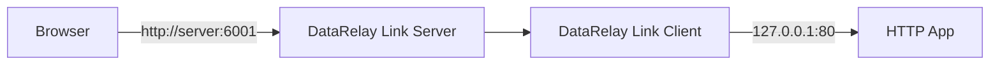
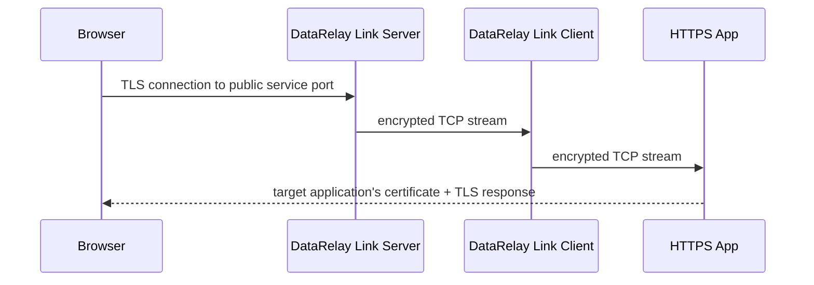
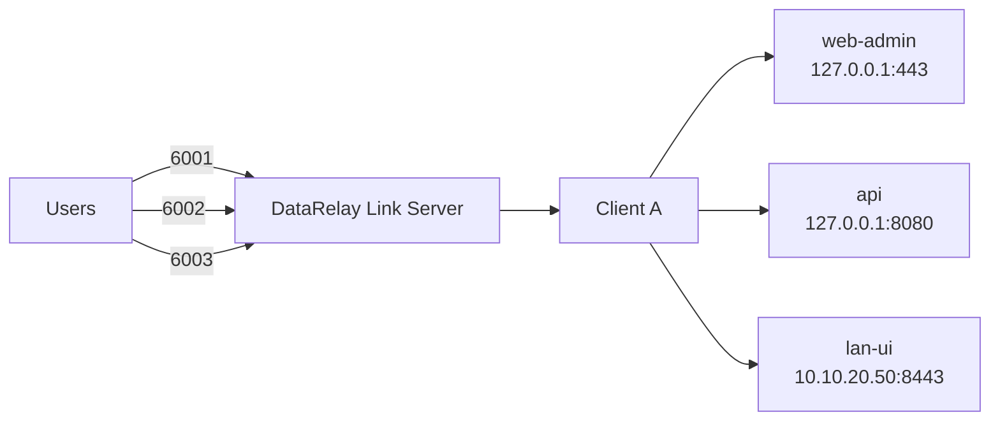

# HTTP & HTTPS

DataRelay Link publishes HTTP and HTTPS as **TCP services**. It is not an application-layer reverse proxy for the published service.

## HTTP path



Example targets:

```text
127.0.0.1:80
10.10.20.40:80
```

## HTTPS path: TLS stays encrypted through DataRelay Link



DataRelay Link does **not** terminate, replace, or automatically issue the target application's TLS certificate.

## DNS hostname and certificate

Suppose:

```text
Public service hostname : fw.example.com
Public service port     : 6005
Target                   : 127.0.0.1:443
```

Users connect to:

```text
https://fw.example.com:6005
```

The certificate presented by the **target application** must be valid for `fw.example.com` where hostname verification applies.

## Multiple web services on one client



Give each service a stable Service ID so later lifecycle and target changes remain unambiguous.

## Common failure patterns

| Symptom | Likely layer to check |
| --- | --- |
| Connection timeout | public firewall/NAT/service port |
| DataRelay Link path works but target returns connection refused | target listener/bind address |
| IP works, hostname does not | DNS/hairpin NAT |
| HTTPS certificate warning | target app certificate/SAN |
| LAN web target fails only | client-to-LAN routing/ACL |

<Tip>
  First prove the target is reachable from the DataRelay Link client. Then prove the public service port is reachable. Treat DNS and TLS hostname validation as later layers.
</Tip>
