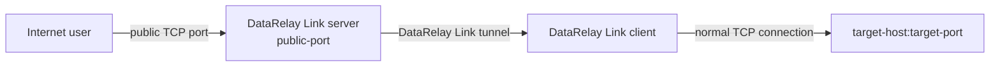
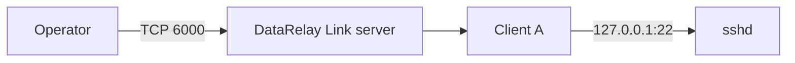
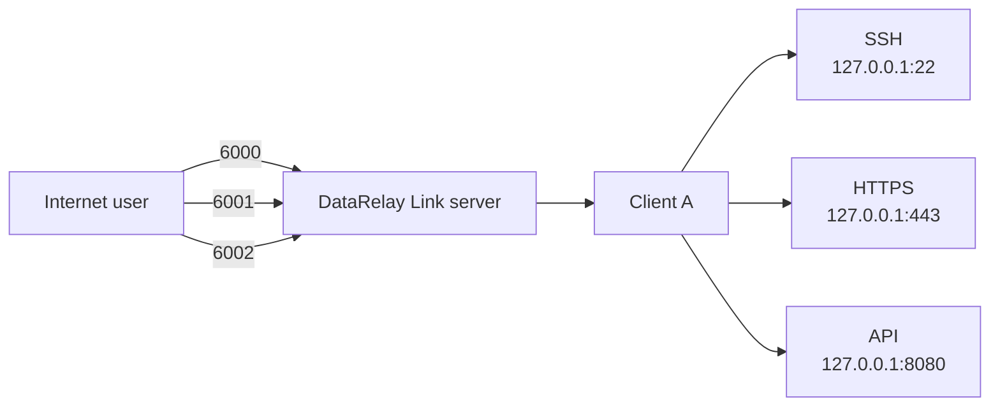
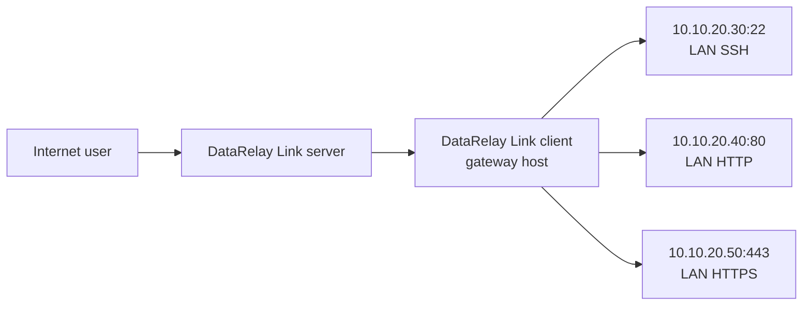
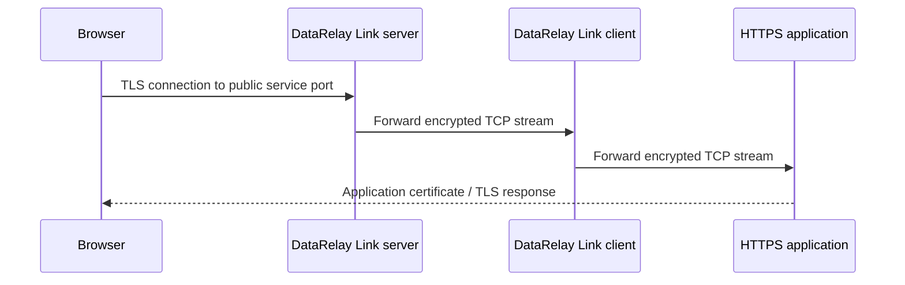
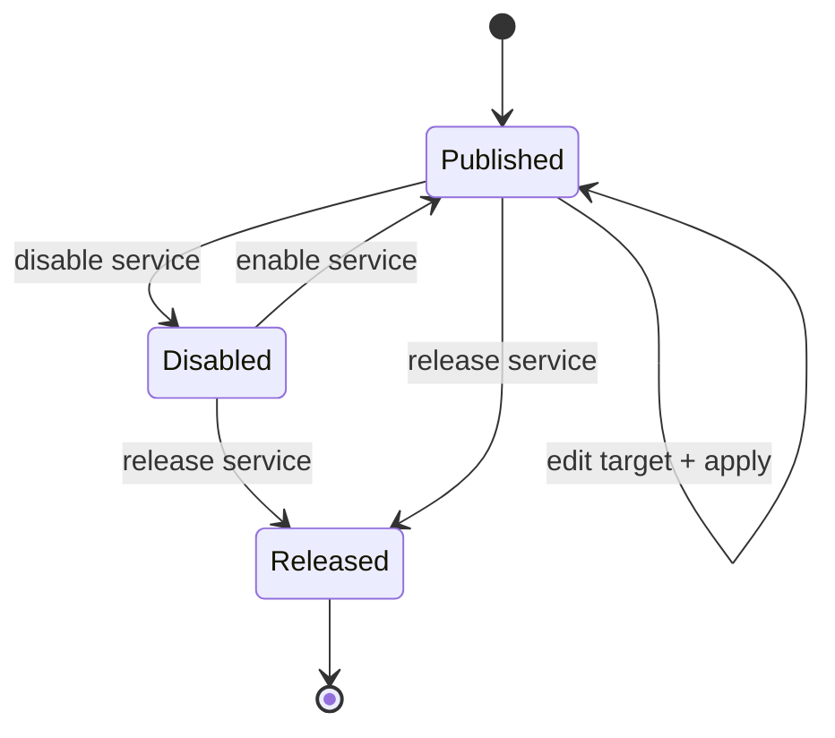

# Publishing Services

A **Service** is one TCP target that an enrolled client publishes through the DataRelay Link server. One client can publish one service or many.

## The universal service path



The target can be on the client itself or on another LAN host the client can reach.

## Common service types

| Type | Typical target | Example public access | Important note |
| --- | --- | --- | --- |
| SSH | `127.0.0.1:22` | `ssh -p 6000 user@server` | user/sshd must already exist |
| HTTP | `127.0.0.1:80` | `http://server:6001` | raw TCP forwarding |
| HTTPS | `127.0.0.1:443` | `https://server:6002` | TLS stays end-to-end to target |
| Custom TCP | `10.10.20.30:5432` | application-specific | keep target authentication enabled |

## Pattern 1 — publish the client's own SSH



Typical target:

```text
127.0.0.1:22
```

## Pattern 2 — one client, multiple local services



Each service gets its own stable Service ID and persistent public-port reservation.

## Pattern 3 — use the client as a small LAN gateway



The DataRelay Link client only needs normal IP reachability to those target hosts.

## Practical examples from the field guide

The same client can publish its own services and services on other LAN hosts at the same time. Typical examples:

| Use case | Target from the DataRelay Link client | Example |
| --- | --- | --- |
| Client SSH | `127.0.0.1:22` | administer the client itself |
| Client HTTPS | `127.0.0.1:443` | local web UI |
| Other LAN server SSH | `10.10.10.20:22` | administer a server behind the same firewall |
| Other LAN server HTTP | `10.10.10.30:80` | internal web application |
| Grafana | `10.10.10.40:3000` | monitoring UI |
| Internal API | `10.10.10.50:8080` | application-specific TCP client |
| PostgreSQL | `10.10.10.60:5432` | database client; keep DB authentication/ACLs enabled |

Before adding a LAN target, prove that the **DataRelay Link client itself** can reach it:

```bash
nc -vz -w 3 10.10.10.20 22
nc -vz -w 3 10.10.10.30 80
```

If this test fails, DataRelay Link cannot fix the client-to-LAN routing, target firewall, or target application. Resolve that path first, then publish the service.

<Note>
  You do not need a separate DataRelay Link client on every LAN host. A single enrolled client can act as a small gateway for hosts it can legitimately reach, which is useful for a few to a few dozen systems. Keep the scope deliberate rather than turning it into broad network exposure.
</Note>

## HTTPS is passthrough



DataRelay Link does not terminate or replace the application's TLS certificate. If users connect with `fw.example.com`, the target application must present a certificate valid for that hostname where applicable.

## Persistent public-port lifecycle



- **Disable** stops publication and keeps the port reserved.
- **Enable** resumes on the same reserved port.
- **Edit + apply** changes the target without intentionally changing the reservation.
- **Release** returns the public port to the pool.

## Security reminder

Publishing a service makes that service reachable through the assigned public endpoint. Keep the target application's own authentication, authorization, host firewall, and access controls enabled.

<CardGroup cols={3}>
  <Card title="SSH" icon="terminal" href="/guides/ssh">
    SSH-specific setup and checks.
  </Card>

  <Card title="HTTP & HTTPS" icon="globe" href="/guides/http-https">
    Web publishing and TLS passthrough.
  </Card>

  <Card title="Custom TCP & LAN" icon="network-wired" href="/guides/custom-tcp-lan">
    Databases, appliances, APIs, and LAN targets.
  </Card>
</CardGroup>
