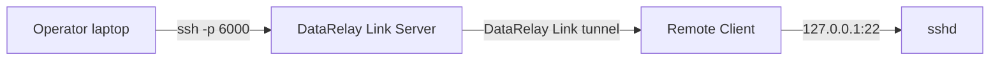
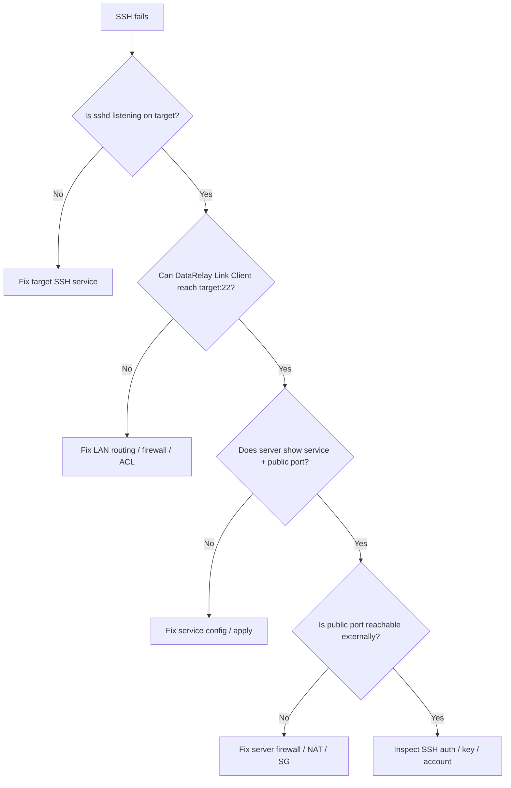

# SSH

SSH is the most common DataRelay Link service.

## Local SSH on the client



Typical target:

```text
Target host : 127.0.0.1
Target port : 22
SSH user    : existing-user
```

The SSH account and `sshd` must already exist. DataRelay Link does not create users, passwords, keys, `authorized_keys`, or `sshd_config`.

## Connect

After enrollment, the SSH service receives a persistent public port.

```bash
ssh -p <public-port> <ssh-user>@<server-public-IP>
```

With a public service hostname:

```bash
ssh -p <public-port> <ssh-user>@fw.example.com
```

The hostname is an access alias. It does not change CLIENT ID, Service ID, or the service-port reservation.

## Publish SSH on another LAN host


Example:

```text
Target host : 10.10.20.30
Target port : 22
SSH user    : admin
```

The DataRelay Link client must already have normal network reachability to `10.10.20.30:22`.

## Verify each hop



On the target/client:

```bash
ss -lntp | grep ':22'
```

On the client:

```bash
sudo drlink show services
sudo drlink show info
sudo drlink doctor
```

On the server:

```bash
sudo drlink show client <CLIENT-ID> services
```

## Disable vs release

- **Disable** SSH when you want to stop publication temporarily but keep the public port.
- **Release** when you intentionally want to return that port to the pool.

See [Lifecycle Semantics](/operations/lifecycle).
