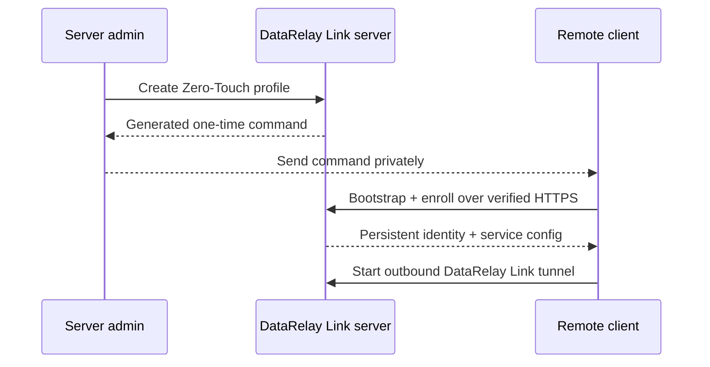

# Zero-Touch Enrollment

Zero-Touch is the recommended onboarding flow when the server administrator wants to define the initial client profile and send the remote user **one command to run**.

## Beginner view



The remote user does not need to understand DataRelay Link configuration. They run the exact generated command once.

## Create Zero-Touch

Recommended guided path:

```bash
sudo drlink
```

Then:

```text
create zero-touch
```

For an explicit SSH one-liner profile:

```bash
sudo drlink create enrollment \
  --one-line \
  --ssh \
  --ssh-user <ssh-user> \
  --label branch-a
```

Replace `<ssh-user>` with an account that already exists on the remote client.

## What it does not do

Zero-Touch does **not**:

- create operating-system users
- install or configure `sshd`
- set passwords
- create or install SSH keys
- change the client firewall
- change external NAT rules

It automates DataRelay Link onboarding, not the operating system's application/security configuration.

## Treat the command as sensitive

The generated command contains or references a short-lived bootstrap credential.

Do not put it in:

- public tickets
- public chat rooms
- shared analytics
- shell-history examples in documentation
- long-lived logs

A Zero-Touch Bootstrap Ticket is designed to be high-entropy, short-lived, first-machine bound, single-use after successful enrollment, and hashed at rest on the server.

## Stable v2.2.1 behavior

The stable release generates the qualified Zero-Touch bootstrap flow. Always run **exactly what `drlink` prints** rather than reconstructing the bootstrap payload from documentation.

<Accordion title="Stable Short URL option">
  v2.2.1 supports the Option B Short URL model with an optional operator-managed `bootstrap_hostname`, for example `https://bootstrap.example.com/i/<opaque-ticket>`. External DNS, publicly trusted TLS, and reverse-proxy lifecycle remain operator responsibilities; the private-CA management trust model is not weakened.
</Accordion>

## Verify after execution

Server:

```bash
sudo drlink show clients
sudo drlink show enrollments
sudo drlink show client <CLIENT-ID> services
```

Client:

```bash
sudo drlink show status
sudo drlink show services
sudo drlink doctor
```

A successful client receives a persistent CLIENT ID. Normal reboots and supported updates do not require a fresh enrollment.

## Revoke an unused/active enrollment credential

```bash
sudo drlink revoke enrollment <ID>
```

Revoking an enrollment credential is different from releasing an already-published service port or revoking an enrolled client's management identity.
