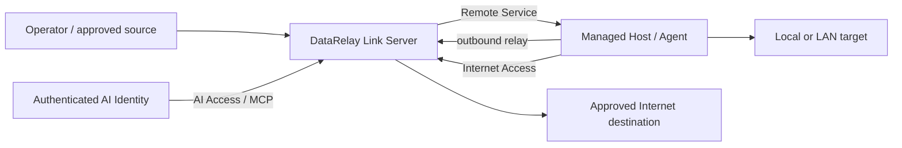

# DataRelay Link

**Relay only the connections that are actually needed. Do not join entire networks.**

DataRelay Link is a lightweight, CLI-first secure-connectivity gateway for isolated and restricted networks.

```text
Remote Access     outside → approved internal Remote Service
Internet Access   managed/protected source → approved outside destination
AI Access         authenticated AI Identity → approved target permissions
```

<Note>
  This site documents the current **v2.4.0 development target**. The latest published stable line remains **v2.3.0** until v2.4 exact-HEAD qualification and immutable release publication complete. See [Release Status](/reference/release-status).
</Note>

## Mental model



The key distinction is simple:

- **Remote Service** creates or represents connectivity.
- **Access Policy** decides whether that connectivity may be used.
- **Rules do not create Remote Services.**

For the complete object model, policy behavior, and role boundaries, read [Concepts & Mental Model](/getting-started/concepts).

## Choose your path

<CardGroup cols={2}>
  <Card title="Get started" icon="rocket" href="/getting-started/quickstart">
    Install a Server, enroll a Managed Host, and create a Remote Service.
  </Card>

  <Card title="Remote Access" icon="arrow-right-to-bracket" href="/guides/remote-access">
    Control who can use approved internal Remote Services.
  </Card>

  <Card title="Internet Access" icon="arrow-up-right-from-square" href="/guides/internet-access">
    Allow only approved outbound destinations.
  </Card>

  <Card title="AI Access / MCP" icon="robot" href="/guides/ai-access">
    Bind verified AI Identities to explicit target permissions.
  </Card>

  <Card title="CLI reference" icon="terminal" href="/drlink/cli-reference">
    Use the role-aware Server and Agent Host command grammar.
  </Card>

  <Card title="ConfigurationBundle" icon="file-code" href="/drlink/configuration-bundle">
    Validate, diff, and atomically apply dependent multi-resource changes.
  </Card>
</CardGroup>

## Product boundary

DataRelay Link relays explicitly configured services and approved destinations. It is not a full VPN, transparent network overlay, automatic cloud firewall/DNS manager, or large fleet-management platform.

External firewall/NAT rules, cloud security groups, DNS-provider records, OS accounts, and application certificates remain operator responsibilities unless a separately documented feature says otherwise.

<Note>
  DataRelay Link is **Source Available**, not Open Source. See [License](/reference/license).
</Note>
