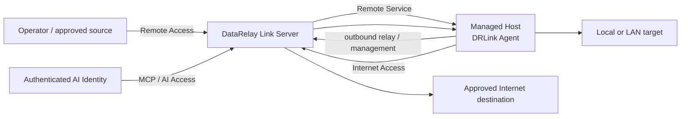

# DataRelay Link

**Relay only the connections that are actually needed. Do not join entire networks.**

DataRelay Link is a lightweight, CLI-first secure-connectivity gateway for isolated and restricted networks.

```text
Remote Access     outside → approved internal Remote Service
Internet Access   managed/protected source → approved outside destination
AI Access         authenticated AI Identity → approved target permissions
```

<Note>
  **v2.4 documentation:** This site describes the current **v2.4.0 development target**. A stable v2.4.0 tag does not exist until exact-HEAD qualification and immutable release publication complete. See [Release Status](/reference/release-status).
</Note>

<Note>
  **Free Early Access:** DataRelay Link is Source Available, not Open Source. Personal use, evaluation, internal business use, permitted internal modification, and customer-owned deployments are allowed under the current license. See [License](/reference/license).
</Note>

## Understand it in 30 seconds



## Current public model

```text
Managed Host / DRLink Agent

Network Object / Network Group
Service Object / Service Group
Permission Object / Permission Group

AI Identity
Remote Service

Remote Access
Internet Access
AI Access

BLACKLIST / WHITELIST

ConfigurationBundle
```

A **Remote Service creates connectivity**. An **Access Policy authorizes or denies use of that connectivity**. A Rule never creates a Remote Service.

## Choose your path

<CardGroup cols={2}>
  <Card title="Get started" icon="rocket" href="/getting-started/quickstart">
    Install a Server, enroll a Managed Host, and create a Remote Service.
  </Card>

  <Card title="Remote Access" icon="arrow-right-to-bracket" href="/guides/remote-access">
    Control who can use approved internal Remote Services.
  </Card>

  <Card title="Internet Access" icon="arrow-up-right-from-square" href="/guides/internet-access">
    Allow only approved outbound destinations.
  </Card>

  <Card title="AI Access / MCP" icon="robot" href="/guides/ai-access">
    Bind verified AI Identities to explicit target permissions.
  </Card>

  <Card title="CLI reference" icon="terminal" href="/drlink/cli-reference">
    Use the role-aware Server and Agent Host command grammar.
  </Card>

  <Card title="ConfigurationBundle" icon="file-code" href="/drlink/configuration-bundle">
    Validate, diff, and atomically apply dependent multi-resource changes.
  </Card>
</CardGroup>

## Policy model

Each Access Policy family uses BLACKLIST or WHITELIST Mode plus ENABLED or DISABLED enforcement.

- No Policy / No Rules → effective ALLOW.
- BLACKLIST: matching enabled Rule → DENY; otherwise ALLOW.
- WHITELIST: matching enabled Rule → ALLOW; otherwise DENY.
- Rules are **not ordered** and do **not** carry a per-rule ALLOW/DENY action.
- Disabling enforcement preserves Mode and Rules but makes policy effective ALLOW ALL.
- Policy Reset removes Mode and Rules.

AI authentication remains mandatory even when AI Access enforcement is disabled.

## Boundaries that matter

<AccordionGroup>
  <Accordion title="DataRelay Link is not a VPN or full-network overlay">
    It relays explicitly configured services and approved destinations rather than joining entire networks.
  </Accordion>

  <Accordion title="External infrastructure stays outside the product boundary">
    Cloud security groups, firewalls, NAT/DNAT, DNS-provider records, OS accounts, and application certificates remain operator responsibilities unless a separately approved feature says otherwise.
  </Accordion>

  <Accordion title="Remote Service health and policy result are separate">
    Policy can evaluate ALLOW while a target is temporarily unreachable. The Remote Service can remain configured as DEGRADED.
  </Accordion>

  <Accordion title="Target scale is intentionally small">
    The current target is roughly a few hosts to a few dozen Managed Hosts, not hundreds or thousands of endpoints.
  </Accordion>
</AccordionGroup>

<Tip>
  New users should read [Concepts & Mental Model](/getting-started/concepts) and then [Quick Start](/getting-started/quickstart).
</Tip>
