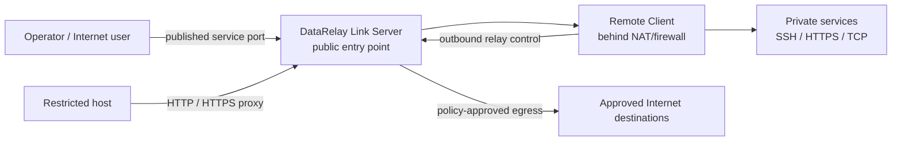
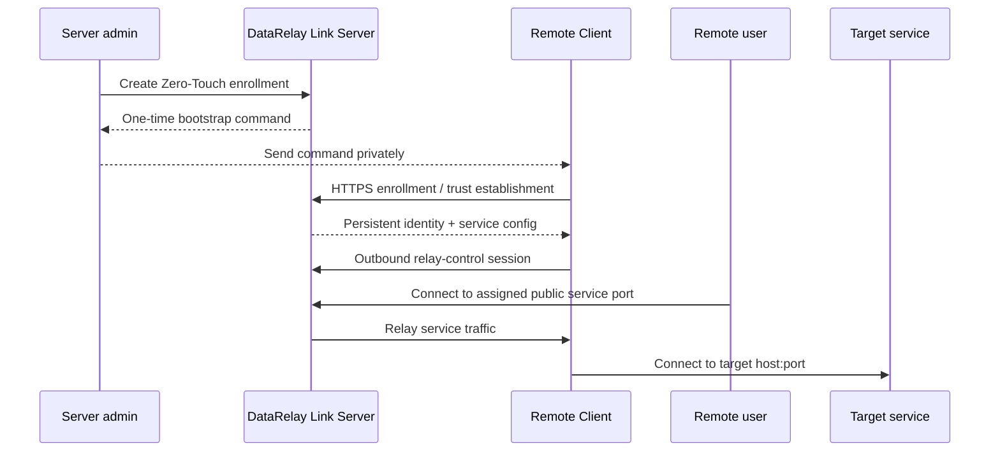

# DataRelay Link

**Relay only the connections you actually need — into private systems for remote access, or out from restricted networks to approved Internet destinations.**

DataRelay Link is a lightweight secure-connectivity gateway for small environments. It combines two complementary connection models:

- **Secure Remote Access** — publish selected SSH, HTTP, HTTPS, or custom TCP services from systems behind NAT/firewalls without requiring inbound access on every remote client.
- **Controlled Egress** — allow systems in isolated or restricted networks to reach only approved external destinations through an agentless HTTP/HTTPS proxy policy.

<Note>
  **Free Early Access:** DataRelay Link is currently available free of charge under the **DataRelay Link Early Access License 1.0**. It is Source Available, not Open Source. Personal use, evaluation, internal business use, permitted internal modification, and customer-owned deployments are allowed. Early Access has no SLA and support is best effort. Commercial General Availability is planned with a **perpetual-license** model. See [License](/reference/license).
</Note>

<Note>
  The target scale is **a few systems to a few dozen clients**. DataRelay Link is intentionally not a large-fleet orchestration, VPN mesh, SWG, or SASE platform.
</Note>

## Understand it in 30 seconds



The core principle is simple:

> **Do not connect entire networks. Relay only the connections that are actually needed.**

## Choose your path

<CardGroup cols={2}>
  <Card title="I want remote access" icon="arrow-right-to-bracket" href="/getting-started/quickstart">
    Install a server, enroll a client, and publish your first SSH service.
  </Card>

  <Card title="I need controlled outbound access" icon="arrow-up-right-from-square" href="/reference/architecture">
    Understand the Controlled Egress model, policy boundaries, and current qualification status.
  </Card>

  <Card title="I am completely new" icon="circle-question" href="/getting-started/concepts">
    Learn Server, Client, CLIENT ID, Service, public ports, and relay traffic flow visually.
  </Card>

  <Card title="I need a public server" icon="cloud" href="/getting-started/oci-free-tier-server">
    Prepare an OCI Always Free-eligible Ubuntu VM with a persistent Reserved Public IPv4 address.
  </Card>

  <Card title="I need to publish applications" icon="network-wired" href="/guides/services">
    Publish SSH, HTTP, HTTPS passthrough, custom TCP, or another reachable LAN target.
  </Card>

  <Card title="I want operator commands" icon="terminal" href="/drlink/overview">
    Use the `drlink` CLI for enrollment, services, lifecycle, diagnostics, backup, and updates.
  </Card>
</CardGroup>

## Secure Remote Access



A remote client normally needs **outbound** connectivity to the DataRelay Link Server, not a public IP or inbound NAT rule of its own.

## Controlled Egress

Controlled Egress is designed for hosts that cannot access the Internet directly but need tightly limited outbound connectivity.

```text
HTTP_PROXY=http://data-relay-link.example:6080
HTTPS_PROXY=http://data-relay-link.example:6080
```

The server-side policy can restrict:

- source CIDR/network
- destination FQDN
- destination port
- controlled wildcard subdomains
- IP-literal use

The design is **default deny / fail closed**, with server-side DNS resolution, SSRF protection, DNS-rebinding resistance, audit logging, diagnostics, and backup/restore integration.

<Warning>
  Controlled Egress is currently under release qualification. Secure Remote Access v2.2.1 is the published stable baseline; do not assume Controlled Egress is part of the immutable v2.2.1 release until its Real E2E qualification is complete.
</Warning>

## Current stable baseline

| Item | Current |
| --- | --- |
| Stable product release | **v2.2.1** |
| Bundled / tested relay engine | **v0.71.0** |
| Server | **Linux-based** |
| Default remote-access deployment | **Direct** |
| Operator CLI | **`drlink`** |

Real E2E client coverage for v2.2.1 includes **Ubuntu 24, Rocky Linux 8.10/9.4, Amazon Linux 2023, macOS Apple Silicon, and Windows 10 / PowerShell 5.1**. Amazon Linux 2 and PowerShell 7 have narrower validation levels.

See [Supported Platforms](/reference/platforms) for the validation matrix and [Release Status](/reference/release-status) for release details.

## Boundaries that matter

<AccordionGroup>
  <Accordion title="DataRelay Link does not configure your cloud firewall, NAT, or DNS provider">
    AWS Security Groups, OCI Security Lists, external NAT/DNAT, host firewall policy, and DNS records remain infrastructure responsibilities.
  </Accordion>

  <Accordion title="Published HTTPS is TCP passthrough">
    The target application, not DataRelay Link, presents the application TLS certificate.
  </Accordion>

  <Accordion title="Controlled Egress is not TLS inspection">
    The v1 egress design allows HTTP forwarding and HTTPS CONNECT. It does not decrypt TLS, perform DLP, malware inspection, CASB, browser isolation, or full SWG/SASE functions.
  </Accordion>

  <Accordion title="Disable, revoke, and release are different lifecycle actions">
    Disable stops publication but keeps the port. Revoke blocks management identity. Release returns a public-port reservation.
  </Accordion>
</AccordionGroup>

## Help improve DataRelay Link

Found a problem or have an idea that would make DataRelay Link easier or safer to operate?

<CardGroup cols={2}>
  <Card title="Report a Bug" icon="bug" href="/feedback">
    Report a reproducible problem with version, environment, reproduction steps, and redacted diagnostics.
  </Card>
  <Card title="Request a Feature" icon="lightbulb" href="/feedback">
    Describe the workflow or problem you want to improve and the behavior you would like to see.
  </Card>
</CardGroup>

<Tip>
  New user: start with [Concepts & Mental Model](/getting-started/concepts) and [Quick Start](/getting-started/quickstart). Operators can jump to the [drlink Guide](/drlink/overview), [Architecture](/reference/architecture), [Troubleshooting](/troubleshooting/overview), or [Feedback](/feedback).
</Tip>
