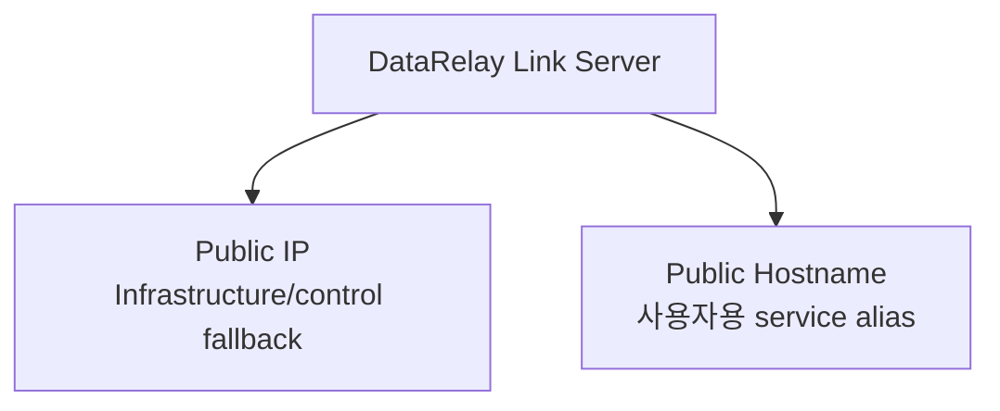
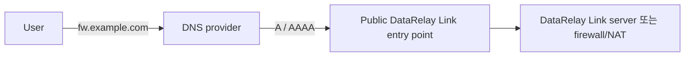
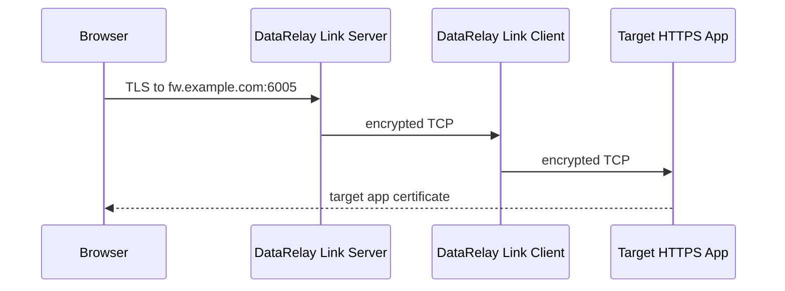

# DNS & Public Hostname

DataRelay Link에서는 **Public IP**와 선택적 **Public Hostname**을 서로 다른 개념으로 봅니다.



```text
Public IP       = 인프라/컨트롤 기준점
Public Hostname = 게시 서비스 접속에 쓰는 선택적 별칭
```

## 예

```text
Public IP       203.0.113.10
Public Hostname fw.example.com
SSH port        6000
HTTPS port      6005
```

```bash
ssh -p 6000 user@203.0.113.10
ssh -p 6000 user@fw.example.com
```

```text
https://fw.example.com:6005
```

## Hostname 설정

```bash
sudo drlink set server hostname fw.example.com
```

제거:

```bash
sudo drlink unset server hostname
```

Hostname metadata를 바꿔도 CLIENT ID, Service ID, public-port reservation, project CA, DataRelay Link control identity는 바뀌지 않습니다.

## DNS record는 직접 관리



DataRelay Link는 Route53, Cloudflare, DNSZi 같은 DNS provider API를 자동 호출하지 않습니다.

Server가 NAT 뒤라면 hostname은 보통 private server IP가 아니라 **public firewall/NAT IP**를 가리켜야 합니다.

## HTTPS certificate

Published HTTPS는 TCP passthrough입니다.



따라서 실제 Target application certificate가 사용자가 입력하는 hostname에 유효해야 합니다.

## Hairpin NAT

내부 LAN 사용자가 public hostname/public IP를 통해 다시 내부 server로 들어가야 한다면 firewall hairpin NAT 지원이 필요할 수 있습니다. 지원하지 않는다면 split DNS를 고려하세요.

<Tip>
  IP + public port는 되는데 hostname만 실패한다면 DataRelay Link state보다 DNS, certificate, hairpin NAT를 먼저 확인하세요.
</Tip>
