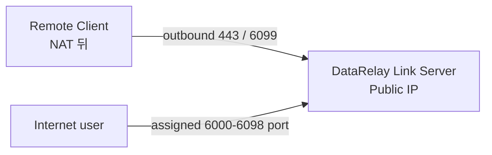
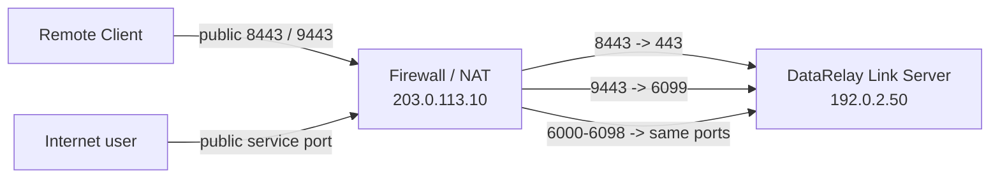
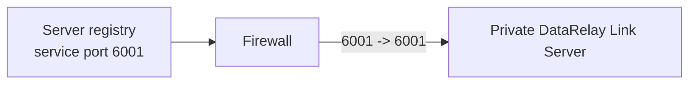
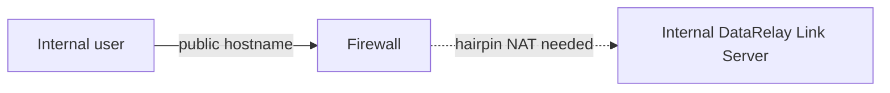

# 방화벽 & NAT

원격 **Client**에는 일반적으로 inbound port forwarding이 필요하지 않습니다. 반대로 **DataRelay Link Server 측 public entry point**는 control, enrollment, published service를 받을 수 있어야 합니다.


이 그림을 보면 **Server가 어디에 있는가**와 **어떤 제품 모드를 쓰는가**를 분리해서 이해하기 쉽습니다. Private IP Server를 DNAT 뒤에 두어도 Direct 모드를 사용할 수 있고, Enterprise single-443은 제약된 Client Network를 위한 별도 transport 구조입니다.

## 구성 A — Server가 공인 IP를 직접 가짐



Direct 기본:

```text
TCP 443       DataRelay Link control
TCP 6099      Enrollment / management HTTPS
TCP 6000-6098 Published services
```

## 구성 B — Server가 Firewall/NAT 뒤 private IP



예시 DNAT:

```text
203.0.113.10:8443       -> 192.0.2.50:443
203.0.113.10:9443       -> 192.0.2.50:6099
203.0.113.10:6000-6098  -> 192.0.2.50:6000-6098
```

Client에는 내부 IP가 아니라 **외부에서 보이는 public control/enrollment endpoint**를 사용해야 합니다.

## Enterprise single-443를 Firewall/NAT 뒤에 둘 때

single-443에서는 외부 Firewall이 TCP 443 frontend만 전달하고, 내부 backend는 DataRelay Link Server의 loopback에 남겨둡니다.

```text
Public Firewall TCP 443   -> DataRelay Link Server TCP 443 frontend
DataRelay Link Server 127.0.0.1:7000 -> relay backend
DataRelay Link Server 127.0.0.1:6099 -> Enrollment/Management backend
Published service ports    -> 6000-6098 (가능하면 1:1)
```

<Warning>
  **Enterprise single-443에서는 Public TCP 7000이나 6099를 DNAT하지 마세요.** 이 둘은 해당 topology에서 내부 backend listener입니다. 외부에 직접 노출하면 single-443의 보안/운영 경계를 우회하게 됩니다.
</Warning>

Server가 NAT 뒤에 있을 때는 **Public Port**와 **Local Listen/Backend Port**를 구분해야 합니다. Client에는 반드시 외부에서 실제로 보이는 public endpoint를 사용하고, Firewall에서는 그 endpoint를 의도한 내부 listener로 전달합니다.

## Published service port는 가능하면 1:1



Registry의 persistent port reservation과 실제 사용자가 접속하는 Internet port를 일치시키면 운영과 troubleshooting이 훨씬 단순해집니다.

## 누가 무엇을 설정하나요?

| 항목 | DataRelay Link가 자동 설정? |
| --- | --- |
| DataRelay Link server/client config | **예** |
| Service public-port reservation | **예** |
| AWS Security Group | 아니오 |
| OCI Security List/NSG | 아니오 |
| 외부 Firewall/DNAT | 아니오 |
| UFW/firewalld/iptables | 아니오 |
| DNS record | 아니오 |
| SSH account/key | 아니오 |

## Hairpin NAT / Split DNS

내부 사용자가 `fw.example.com`을 조회했을 때 public IP로 돌아가면 firewall이 hairpin NAT를 지원해야 내부 DataRelay Link server로 다시 들어올 수 있습니다.



지원하지 않는다면 split DNS 같은 내부 DNS 설계를 고려하세요.

## NAT 문제 확인 순서

1. Public DNS/IP가 올바른 firewall을 가리키는지
2. Public control port가 내부 DataRelay Link control listen port로 DNAT되는지
3. Public enrollment HTTPS가 allocator/listen port로 DNAT되는지
4. Published service port가 열려 있고 가능하면 1:1인지
5. Client가 자기 네트워크에서 **public endpoint**에 도달 가능한지
6. Server `drlink doctor`가 topology 문제를 보고하는지
