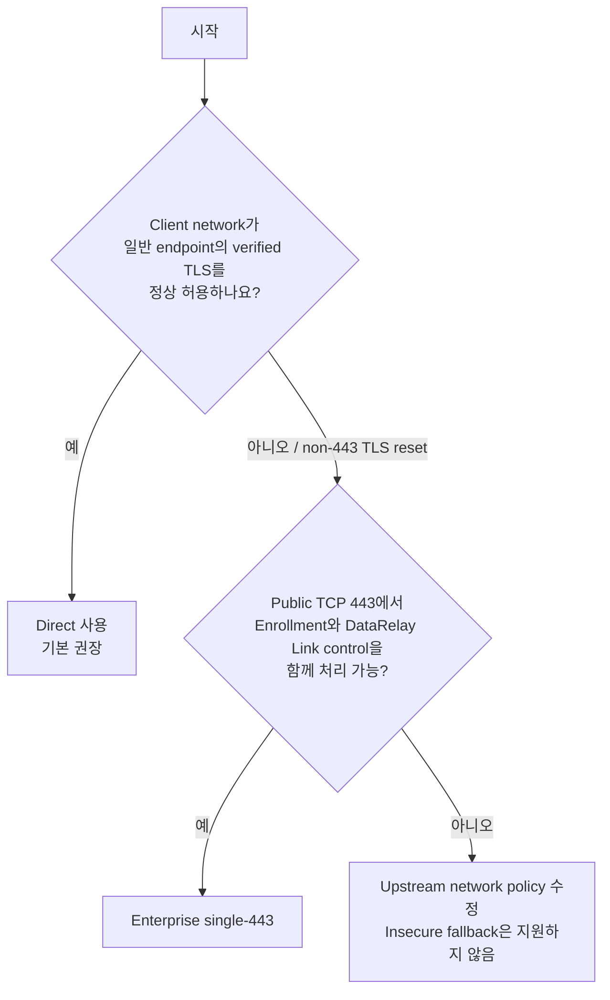
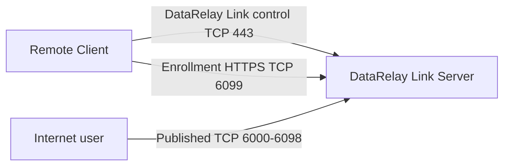
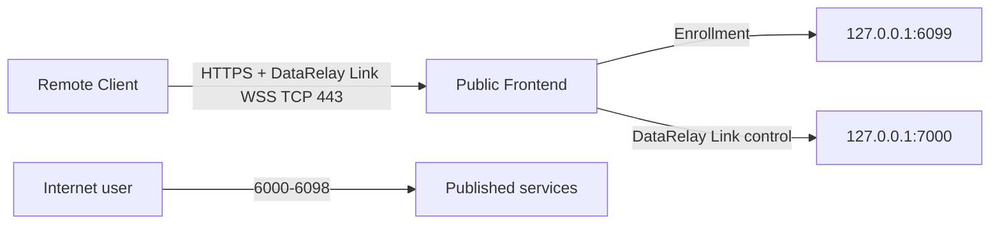

# 배포 모드

DataRelay Link의 server deployment mode는 **Direct**와 **Enterprise single-443** 두 가지입니다.

NAT는 별도 모드가 아니라 외부 network topology입니다.


이 그림은 공인 IP 직접 구성, 방화벽/NAT 뒤 private server, Enterprise single-443 구성을 한눈에 비교합니다. 아래 표와 포트 설명은 현재 stable v2.2.1 기준입니다.

## 어떤 모드를 선택하나요?



## Direct



| 용도 | Public TCP | 기본 listen |
| --- | ---: | ---: |
| DataRelay Link control | 443 | 443 |
| Enrollment / management HTTPS | 6099 | 6099 |
| Published services | 6000-6098 | 6000-6098 |

## Enterprise single-443



<Warning>
  single-443에서 backend `6099`, `7000`은 Internet에 직접 노출하면 안 됩니다.
</Warning>

## 요약 비교

| 항목 | Direct | single-443 |
| --- | --- | --- |
| 기본 권장 | **예** | Enterprise 제약 환경에서만 |
| Public DataRelay Link control | 443 | 443 via WSS |
| Public Enrollment HTTPS | 6099 | 443 |
| Published services | 6000-6098 | 6000-6098 |
| Internal 6099 | normal listen | loopback backend |
| Internal 7000 | normal path 아님 | loopback DataRelay Link backend |

## 모드 변경

Direct ↔ single-443 변경은 maintenance-window cutover입니다. Identity/CA/token/registry/public-port reservation을 유지하도록 설계되지만 client transport가 새 topology와 맞아야 합니다.

```bash
sudo drlink show status
sudo drlink doctor
```
