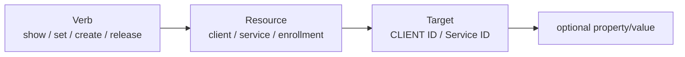
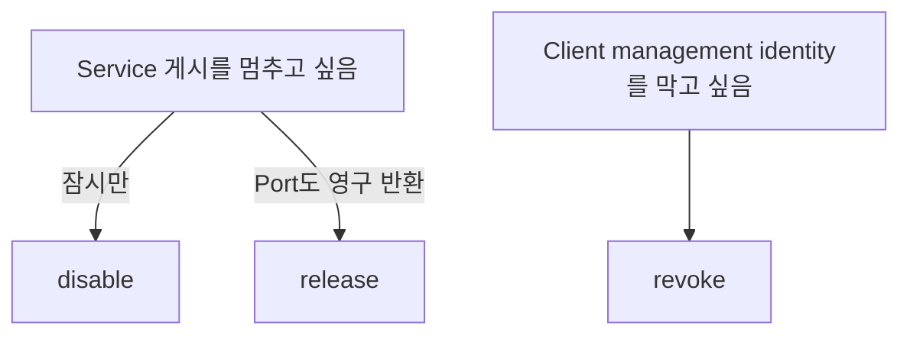

# drlink 사용법

일상 운영에서는 다음 하나만 기억하면 됩니다.

```bash
sudo drlink
```

## 처음 사용하는 사람을 위한 기본 키

```text
Tab    현재 위치에서 가능한 명령 표시/완성
?      현재 문맥 도움말
help   전체 도움말
↑/↓    현재 세션 history
menu   번호 기반 guided menu
exit   종료
```

## 무엇을 하고 싶은지로 명령을 찾으세요

| 목적 | 시작 명령 |
| --- | --- |
| 전체 상태 확인 | `show status`, `doctor` |
| Client 목록 보기 | `show clients` |
| Client 하나 상세 보기 | `show client <ID>` |
| 새 Client 붙이기 | `create zero-touch` |
| Manual Enrollment 생성 | `create enrollment` |
| Client Service 보기 | `show client <ID> services` |
| label/note/tag 수정 | `set client <ID> ...` |
| Client service 추가/수정 | `add service`, `set service ...`, `apply` |
| Service 잠시 중지 | `disable service <service-id>` |
| Public port 영구 반환 | `release service <ID> <service-id>` |
| Management identity 차단 | `revoke client <ID>` |
| Update 확인 | `update project --check` |
| Backup 생성 | `create backup` |

## 기본 문법

```text
<verb> <resource> [target] [property] [value]
```



## CLIENT ID가 관리 기준입니다

Canonical client selector는 immutable **CLIENT ID**입니다. Label/hostname은 사람이 보기 위한 metadata이며 바뀔 수 있습니다.

`show clients`에서 CLIENT ID를 먼저 확인하세요. Ambiguous selector는 추측해서 진행하지 않고 실패하는 것이 원칙입니다.

## Server에서 자주 쓰는 명령

```text
show status
show version
show clients
show client <ID>
show client <ID> services
show enrollments
show audit

create zero-touch
create enrollment
create enrollment --one-line --ssh --ssh-user <ssh-user> --label branch-a
create backup

set client <ID> label <value>
set client <ID> note <value>
set client <ID> tag <key> <value>
set server hostname <fqdn>

revoke enrollment <ID>
revoke client <ID>
release service <ID> <service-id>
release client <ID>

doctor
```

## Client에서 자주 쓰는 명령

```text
show status
show services
show info

add service
set service <service-id> target-host <host>
set service <service-id> target-port <port>
apply
discard

enable service <service-id>
disable service <service-id>

doctor
```

Client service 변경은 staged 상태이고 `apply` 후 live가 됩니다. 잘못 수정했다면 `apply` 전 `discard`할 수 있습니다.

## Disable / Release / Revoke



```text
disable != release
revoke  != release
```

## Stable와 development 구분

이 사이트의 운영 baseline은 **stable v2.2.1**입니다. Mutable `main`에는 이후 개발 또는 docs-only 변경이 있을 수 있으므로 field 운영은 immutable v2.2.1 contract를 기준으로 합니다.

Stable 서버에서는 현재 설치된 `drlink help`와 immutable release 문서를 기준으로 하세요.

## 안전성

- `doctor`는 read-only
- `drlink` history는 session-only
- `show upstream`은 정보용이며 최신 relay engine을 자동 설치하지 않음
- Identity가 ambiguous하면 fail closed
