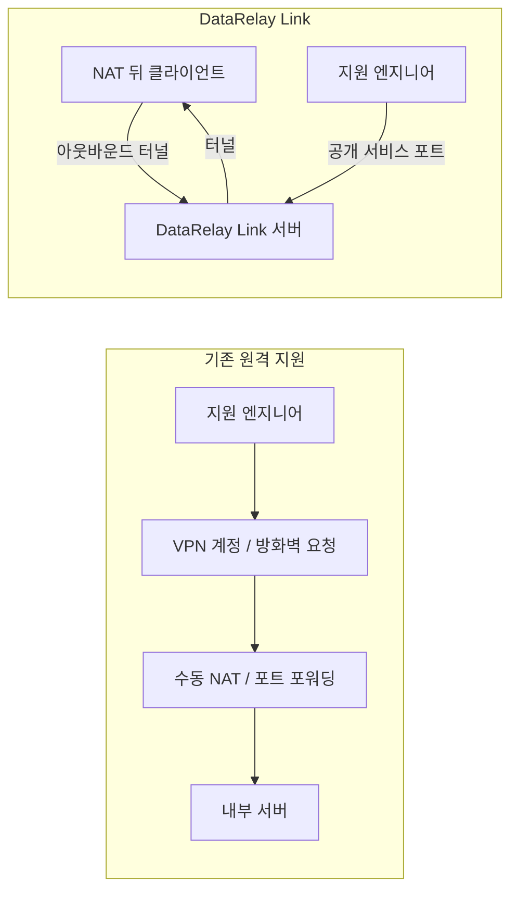
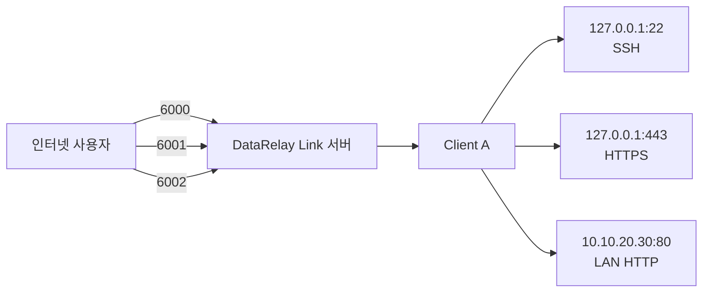
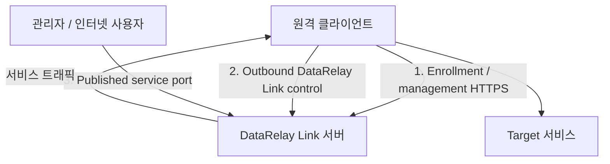
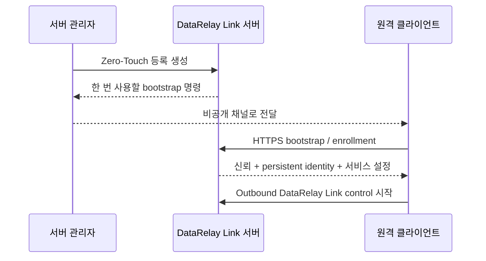

# 개념과 동작 원리

DataRelay Link, NAT, reverse tunnel을 잘 몰라도 이 페이지부터 보면 됩니다.

## 한 문장으로 이해하기

> 인터넷에서 접근 가능한 서버를 하나 준비하고, 원격 클라이언트가 그 서버로 **아웃바운드 터널**을 만들게 한 뒤, 서버의 공개 포트를 통해 클라이언트의 서비스를 접속합니다.

## 기존 방식과 비교



핵심 차이는 **누가 연결을 시작하느냐**입니다. 원격 클라이언트가 서버 쪽으로 연결을 시작하기 때문에 일반적으로 클라이언트에 공인 IP나 인바운드 NAT가 필요하지 않습니다.

## 다섯 가지 용어만 먼저 기억하세요

| 용어 | 쉬운 설명 | 예 |
| --- | --- | --- |
| **Server** | 인터넷의 공인 진입점 | `203.0.113.10` |
| **Client** | 보통 NAT/방화벽 뒤에서 DataRelay Link Client runtime이 실행되는 원격 장비 | 지점 Linux 서버 |
| **CLIENT ID** | 관리 시 사용하는 변경되지 않는 장비 식별자 | `8f31a2c4` |
| **Service** | 클라이언트가 외부에 게시하는 TCP 서비스 하나 | `ssh -> 127.0.0.1:22` |
| **Public port** | 인터넷 사용자가 접속하는 서버 측 영구 포트 예약 | `6003` |

label, hostname, note, tag는 사람이 보기 좋은 **metadata**이고 CLIENT ID를 대체하지 않습니다.

## 한 클라이언트에 여러 서비스를 게시할 수 있습니다



## 서로 다른 세 가지 네트워크 경로



1. **Enrollment / management**는 신뢰와 관리 identity를 만듭니다.
2. **DataRelay Link control**은 reverse tunnel을 유지합니다.
3. **Published service**는 실제 SSH/HTTP/HTTPS/TCP 사용자 트래픽입니다.

## Zero-Touch는 무엇을 하나요?

Zero-Touch는 새 장비를 서버와 안전하게 페어링하는 과정이라고 생각하면 쉽습니다.



정상 등록 후에는 일반적인 재부팅이나 지원되는 업데이트 때문에 다시 등록할 필요가 없습니다.

## Public IP와 Public Hostname

```text
Public IP       = 인프라/컨트롤의 기본 기준점
Public Hostname = 사용자가 보기 쉬운 선택적 서비스 접속 별칭
```

hostname을 바꿔도 CLIENT ID나 Service ID, 공개 포트 예약은 바뀌지 않습니다.

## 제품이 자동으로 처리하지 않는 영역

- cloud security group / 외부 firewall 정책
- NAT/DNAT rule
- DNS provider record
- OS user와 SSH key
- application authentication
- application TLS certificate

<Note>
  실제 설치를 바로 해보고 싶다면 [빠른 시작](/ko/getting-started/quickstart)으로 이동하세요. 더 깊은 구조가 필요하면 [아키텍처](/ko/reference/architecture)를 읽으세요.
</Note>
