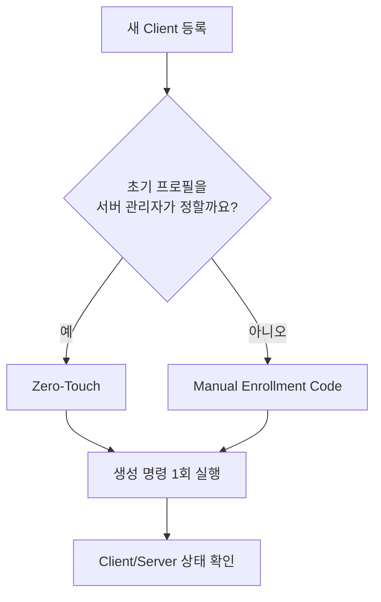
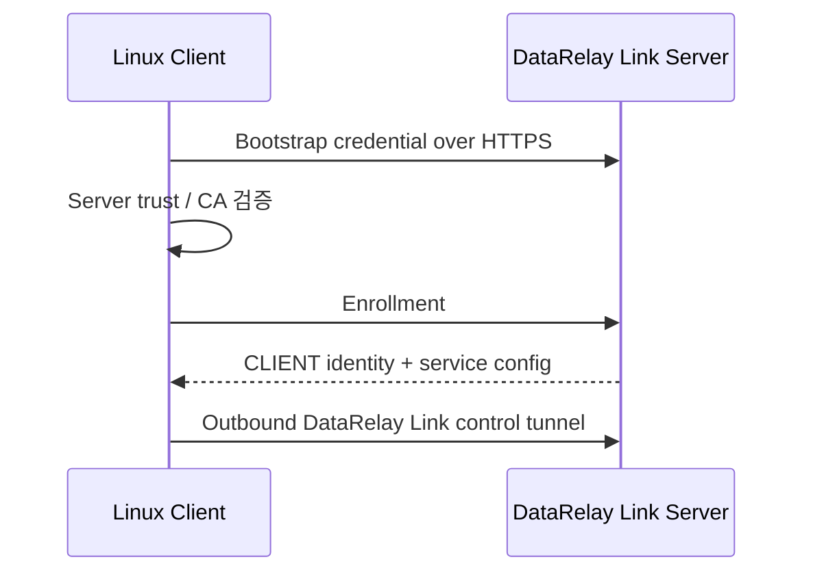

# Linux 클라이언트

Linux/systemd는 Server와 Linux Client의 기반입니다. Stable v2.2.1에서는 macOS Apple Silicon과 Windows 10 / PowerShell 5.1 Client도 검증됐습니다. Linux에서는 Ubuntu 24 physical, Rocky Linux 8.10/9.4, Amazon Linux 2023이 Real E2E 검증됐고 Amazon Linux 2는 Container/CI portability만 검증됐습니다.

## 등록 전 확인

- `sudo`/root 권한이 있음
- 클라이언트에서 DataRelay Link 서버 public endpoint로 outbound 연결 가능
- 게시할 target 서비스가 실제로 실행 중이거나 클라이언트에서 접근 가능
- SSH를 게시한다면 SSH 계정과 `sshd`가 이미 준비됨

DataRelay Link는 OS user/password/SSH key/application service를 자동 생성하지 않습니다.

## Client lifecycle 한눈에 보기

기존 실사용 가이드의 lifecycle 그림은 Enrollment, 서비스 구성, 정상 운영, 업데이트와 제거의 관계를 빠르게 이해하는 데 유용합니다.


현재 v2.2.1에서도 큰 원칙은 같습니다. 한 번 등록한 CLIENT ID를 유지하고, 서비스 변경은 `drlink`로 처리하며, 정상 업데이트 때문에 재등록하지 않습니다. 장비를 폐기하거나 public port를 반환할 때만 명시적인 lifecycle 작업을 사용합니다.

## 등록 방식을 선택하세요

| 방식 | 적합한 상황 | 초기 서비스 선택 |
| --- | --- | --- |
| **Zero-Touch** | 서버 관리자가 프로필을 미리 정함 | 서버 관리자 |
| **Manual Enrollment Code** | 원격 사용자가 설치 중 서비스를 선택 | 원격 사용자 |



## 권장: Zero-Touch

가장 쉬운 CLI 방식:

```bash
sudo drlink
```

```text
create zero-touch
```

SSH 프로필을 명시하려면:

```bash
sudo drlink create enrollment \
  --one-line \
  --ssh \
  --ssh-user <ssh-user> \
  --label branch-a
```

`<ssh-user>`는 원격 client에 이미 존재하는 SSH account로 바꾸세요. 서버가 출력한 **정확한 명령을 그대로** client에서 실행합니다.

## Manual Enrollment Code

서버에서:

```bash
sudo drlink create enrollment
```

생성된 bootstrap 명령을 client에서 실행하고 프롬프트에 단기 Enrollment Code를 입력합니다.

## 등록 과정



## Client에서 확인

```bash
sudo drlink show version
sudo drlink show status
sudo drlink show services
sudo drlink show info
sudo drlink doctor
```

## Server에서 확인

```bash
sudo drlink show clients
sudo drlink show enrollments
sudo drlink show client <CLIENT-ID>
sudo drlink show client <CLIENT-ID> services
```

정상 등록 후에는 일반 재부팅, 지원되는 service edit, 정상 project update 때문에 다시 enrollment할 필요가 없습니다.

## 나중에 서비스 변경

Client service 변경은 staged 상태입니다.

```text
add service
set service <service-id> target-host <host>
set service <service-id> target-port <port>
apply
```

`apply` 전에 취소하려면 `discard`를 사용합니다.

## 꼭 기억할 것

```text
client uninstall != server release
```

Client local software를 지워도 server public-port reservation이 자동 반환되지는 않습니다.
