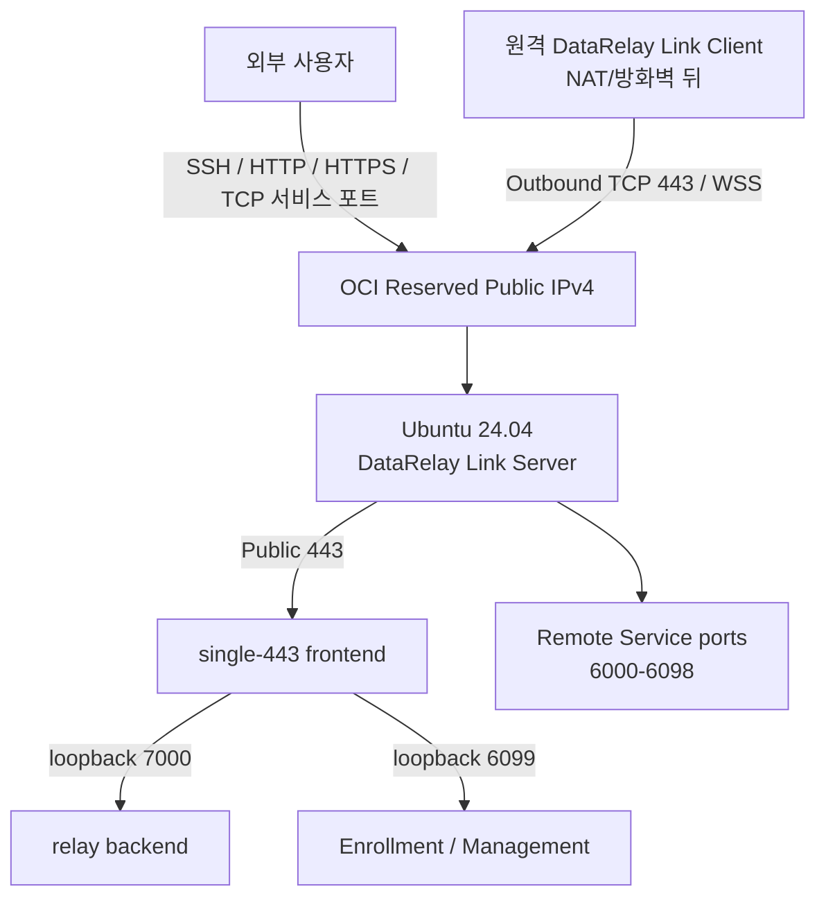

# OCI 무료티어 DataRelay Link 서버 구축

이 가이드는 OCI Ubuntu 24.04 Host와 지속적인 Reserved Public IPv4를 준비하는 절차입니다. 기존 OCI Console 실제 스크린샷은 유지하고, 제품 설치와 Managed Host 등록은 아래의 현재 v2.4 문서 흐름으로 이어집니다.

<Note>
  OCI Console 메뉴명, Free Tier 정책, 리전별 capacity와 가격은 바뀔 수 있습니다. 실제 생성 직전 Console의 **Always Free Eligible** 표시와 예상 비용을 최종 기준으로 확인하세요. Oracle은 장기간 사용량이 낮은 Always Free Compute Instance를 회수할 수 있다고 명시하므로, 현재 OCI 정책을 확인하지 않은 채 Free Tier VM을 SLA가 보장되는 운영 서버로 가정하지 마세요.
</Note>

## 최종 구성

이 OCI 예제는 외부 정책을 단순하게 만들기 위해 **Enterprise single-443**를 사용합니다.

| Public ingress | 용도 |
| --- | --- |
| TCP 22 | OCI 서버 관리용 SSH. 가능하면 관리자 IP `/32`로 제한 |
| TCP 443 | DataRelay Link control over WSS + Enrollment/Management HTTPS |
| TCP 6000-6098 | Client가 게시한 서비스. 필요하면 실제 사용 포트/source만 허용 |
| TCP 6099 | single-443에서는 **외부 공개 금지** |
| TCP 7000 | single-443에서는 **외부 공개 금지** |

Direct 모드도 stable 지원입니다. Direct를 선택하면 TCP 6099가 별도의 Public Enrollment/Management HTTPS 포트가 됩니다.

## 10분 퀵맵

| 순서 | 작업 | 이 가이드의 값 |
| --: | --- | --- |
| 1 | VCN 생성 | `data-relay-vcn` / `10.0.0.0/16` |
| 2 | Internet Gateway + Route | `0.0.0.0/0` → Internet Gateway |
| 3 | Public Subnet | `data-relay-public-subnet` / `10.0.0.0/24` |
| 4 | Security List | 관리용 SSH, `443`, `6000-6098` |
| 5 | Compute Instance | Ubuntu 24.04 x86_64 / eligible일 때 `VM.Standard.E2.1.Micro` |
| 6 | Public 주소 | **Reserved Public IPv4** 연결 |
| 7 | SSH 접속 | `ubuntu@<RESERVED-IP>` |
| 8 | DataRelay Link 설치 | 현재 Server Installation / exact qualified source 사용 |
| 9 | 검증 | `show version`, `show status`, `system diagnostics` + listener 확인 |
| 10 | 첫 Client | 현재 Zero-Touch one-line Enrollment |

## 다음 단계

<CardGroup cols={2}>
  <Card title="Part 1 — OCI Network와 VM" icon="cloud" href="/ko/getting-started/oci-network-vm">
    VCN, Internet Gateway, Public Subnet, Ingress Rule, Ubuntu VM, Reserved Public IPv4를 구성하고 SSH 접속을 확인합니다.
  </Card>
  <Card title="Part 2 — DataRelay Link 설치" icon="server" href="/ko/getting-started/oci-drlink-install">
    Ubuntu Host를 준비하고 Server 설치·검증, Reboot Persistence, 첫 Managed Host 등록까지 진행합니다.
  </Card>
</CardGroup>

<Note>
  두 Part는 기존 Field Deployment Screenshot을 그대로 유지합니다. 페이지를 나눈 것은 가독성 개선이며 배포 절차 자체는 변경하지 않습니다.
</Note>
