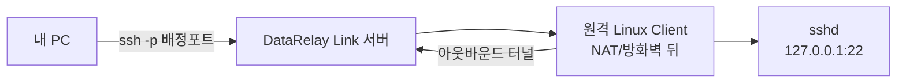
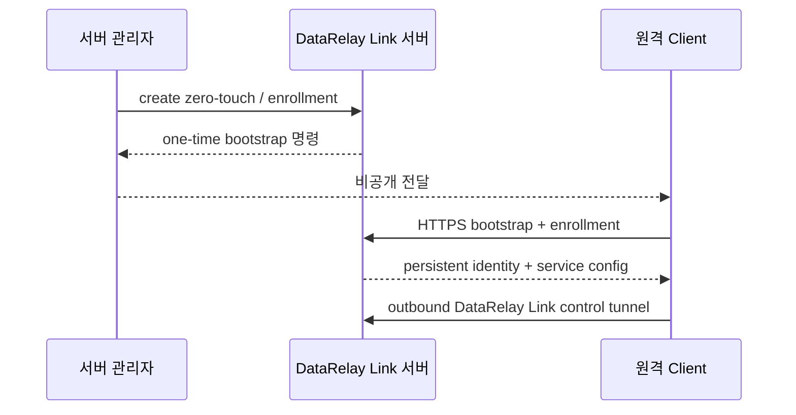

# 빠른 시작

이 가이드는 **stable v2.2.1** 기준으로 빈 서버에서 실제 원격 SSH 성공까지 따라갑니다.

## 만들게 될 구조



## 시작 전 준비

- 인터넷 공인 진입점으로 접근 가능한 Linux/systemd 서버
- 등록할 Linux/systemd 클라이언트
- 클라이언트에 이미 존재하는 SSH 계정
- 서버 측 방화벽/NAT 규칙
- 설치를 위한 `sudo`/root 권한

처음 구성한다면 **Ubuntu 24.04 x86_64**가 가장 명확한 real-validated baseline입니다.

<Tip>
  고정 공인 IP나 별도 Linux 서버가 없다면 먼저 실제 Console 화면을 포함한 [OCI 무료티어 서버 준비](/ko/getting-started/oci-free-tier-server)를 따라 OCI Always Free 대상 VM + Reserved Public IPv4를 준비할 수 있습니다.
</Tip>

### Direct 기본 네트워크

| 방향 | 용도 | 기본 TCP |
| --- | --- | --: |
| Client → Server | DataRelay Link control | 443 |
| Client → Server | Enrollment / management HTTPS | 6099 |
| User → Server | Published service | 배정된 6000-6098 |

<Warning>
  DataRelay Link는 AWS/OCI 보안 정책, 외부 방화벽/NAT, UFW/firewalld/iptables를 자동 변경하지 않습니다.
</Warning>

## 1. 서버 설치

```bash
curl -fsSL \
  https://raw.githubusercontent.com/xdr-labs/frp-auto-deploy/v2.2.1/dist/bootstrap-server.sh \
  | sudo bash
```

서버가 방화벽/NAT 뒤라면 [방화벽 & NAT](/ko/deployment/firewall-nat)를 먼저 확인하세요.

## 2. 서버 상태 확인

```bash
sudo drlink show version
sudo drlink show status
sudo drlink doctor
```

<Check>
  필요한 서비스가 active이고 `doctor`가 blocking 구성/신뢰 오류를 보고하지 않을 때 다음 단계로 진행하세요.
</Check>

## 3. 클라이언트 등록 생성

### 가장 쉬운 방식

```bash
sudo drlink
```

CLI 안에서:

```text
create zero-touch
```

### SSH 프로필을 명시해서 생성

```bash
sudo drlink create enrollment \
  --one-line \
  --ssh \
  --ssh-user <ssh-user> \
  --label branch-a
```

`<ssh-user>`는 **원격 Linux 클라이언트에 이미 존재하는 SSH 계정**으로 바꾸세요.

## 4. 원격 클라이언트에서 생성된 명령 실행

서버가 출력한 **정확한 명령을 그대로** 원격 사용자에게 비공개 채널로 전달하고 한 번 실행합니다.



## 5. 클라이언트 확인

```bash
sudo drlink show version
sudo drlink show status
sudo drlink show services
sudo drlink show info
sudo drlink doctor
```

## 6. 서버에서 등록과 포트 확인

```bash
sudo drlink show clients
sudo drlink show enrollments
sudo drlink show client <CLIENT-ID> services
```

SSH 서비스에 배정된 public port를 확인합니다.

## 7. 실제 SSH 접속

```bash
ssh -p <public-port> <ssh-user>@<DataRelay Link-server-public-IP>
```

Public hostname을 설정했다면:

```bash
ssh -p <public-port> <ssh-user>@fw.example.com
```

## 성공 기준

- `show clients`에 CLIENT ID가 보임
- SSH 서비스에 public port가 배정됨
- client `show status`가 정상
- 외부 방화벽/NAT가 해당 published port를 허용
- `ssh -p ...`가 실제 target SSH에 도달

## 안 되면

먼저 서버와 클라이언트 양쪽에서 `drlink doctor`를 실행하고 [문제 해결](/ko/operations/troubleshooting)을 따라가세요. Registry, identity, PKI, generated DataRelay Link config를 먼저 수동 수정하지 마세요.

## 다음 단계

- [개념과 동작 원리](/ko/getting-started/concepts)
- [Linux 클라이언트](/ko/getting-started/linux-client)
- [Zero-Touch 등록](/ko/guides/zero-touch)
- [서비스 게시](/ko/guides/services)
