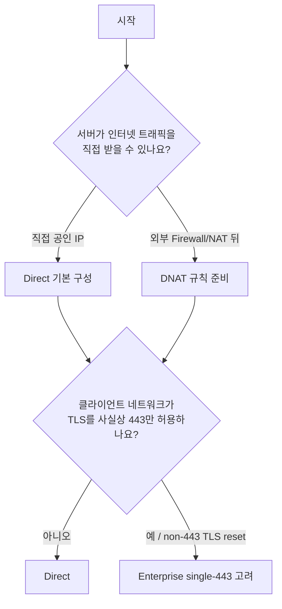
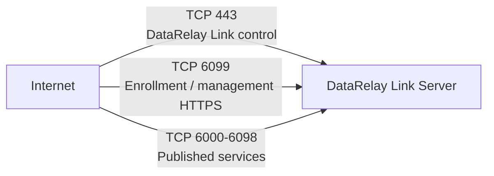
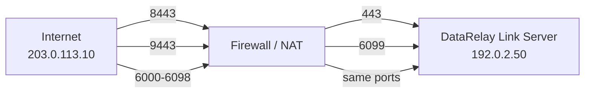

# 서버 설치

DataRelay Link 서버는 인터넷의 공인 진입점입니다. bundled relay runtime와 enrollment/registry/lifecycle/`drlink` 관리 계층이 함께 동작합니다.

## 처음이라면 권장 환경

가장 이해하기 쉬운 첫 구성은 **Ubuntu 24.04 x86_64 + 직접 공인 IP**입니다. Ubuntu 24.04는 stable release에서 가장 명확한 Real E2E 검증 서버 baseline이며, Ubuntu 22.04는 automated portability coverage가 있지만 동일한 real-host 검증 claim으로 표현하지 않습니다.

<Tip>
  고정 공인 IP나 별도 Linux 서버가 없다면 실제 Console 화면을 포함한 [OCI 무료티어 서버 준비](/ko/getting-started/oci-free-tier-server)에서 Always Free 대상 Ubuntu VM과 Reserved Public IPv4를 먼저 준비할 수 있습니다.
</Tip>

다른 Linux 계열은 validation level이 다르므로 [지원 플랫폼 & 제한](/ko/reference/platforms)을 확인하세요.

## 먼저 토폴로지를 고르세요

기존 실사용 가이드의 구성도를 먼저 보면 Direct, NAT 뒤 Direct, Enterprise single-443의 차이를 훨씬 쉽게 이해할 수 있습니다.


<Note>
  그림은 **Direct**, **NAT 뒤 Direct**, **Enterprise single-443**의 네트워크 배치를 비교합니다. NAT 자체가 세 번째 제품 모드는 아니며 실제 제품 모드는 Direct와 Enterprise single-443 두 가지입니다.
</Note>



<Note>
  NAT는 세 번째 배포 모드가 아닙니다. 제품 배포 모드는 **Direct**와 **Enterprise single-443** 두 가지입니다.
</Note>

## Direct 기본 포트



TCP/22는 서버 자체 관리 SSH용 선택 포트이며 DataRelay Link의 tunnel 경로는 아닙니다.

## 서버가 NAT 뒤인 경우



클라이언트에는 내부 `192.0.2.50`가 아니라 외부에서 보이는 public endpoint를 사용해야 합니다.

## Stable 버전 설치

```bash
curl -fsSL \
  https://raw.githubusercontent.com/xdr-labs/frp-auto-deploy/v2.2.1/dist/bootstrap-server.sh \
  | sudo bash
```

운영 설치에서는 mutable `main`보다 immutable stable tag를 사용하세요.

## 설치기가 묻는 항목

대략 다음 순서의 정보가 필요합니다.

1. Public IP / control endpoint
2. 선택적 public service hostname
3. 내부 서버 IP
4. Direct vs single-443
5. Public/local control port
6. Public/local enrollment/allocator port
7. Published service port range

<Warning>
  AWS Security Group, OCI Security List/NSG, 외부 방화벽/NAT, UFW/firewalld/iptables, DNS record는 자동 생성되지 않습니다.
</Warning>

## 설치 직후 검증

```bash
sudo drlink show version
sudo drlink show status
sudo drlink doctor
```

`doctor`는 읽기 전용이며 설치 파일, 권한, PKI, 서비스 상태, registry, topology와 흔한 네트워크 문제를 확인합니다.

## 보존해야 할 상태

```text
/etc/frp-auto-deploy/config.json
/etc/frp-auto-deploy/pki/
/etc/frp/server_token
/var/lib/frp-auto-deploy/registry.json
```

일반 운영 중 이 상태를 직접 편집하지 마세요.

## 서버 준비 완료 체크

- 필요한 systemd 서비스가 active
- `doctor`에 blocking 오류 없음
- 클라이언트 네트워크에서 public control/enrollment endpoint 도달 가능
- Published service range가 서버 측 firewall/NAT에서 허용
- DNS 사용 시 hostname이 올바른 public entry point를 가리킴

## 다음

[빠른 시작](/ko/getting-started/quickstart)에서 첫 클라이언트를 등록하세요.
