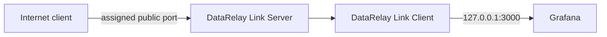
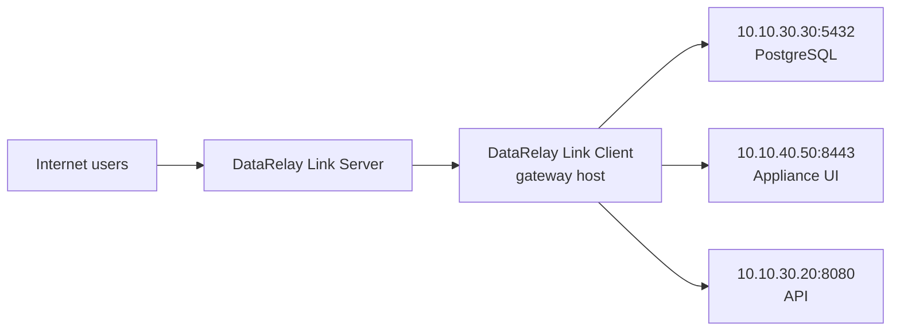
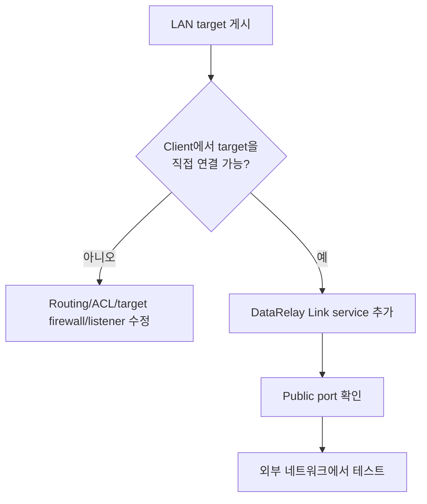

# Custom TCP & LAN Target

SSH/웹 외에도 Client가 연결할 수 있는 임의 **TCP target**을 게시할 수 있습니다.

## Local TCP 예

```text
Grafana       127.0.0.1:3000
API           127.0.0.1:8080
Custom agent  127.0.0.1:9000
```



## Client를 LAN Gateway로 사용



DataRelay Link Client가 `target-host:target-port`로 normal TCP 연결을 할 수 있어야 합니다.

## 게시 전에 먼저 확인



## Service ID

사람이 이해할 수 있는 stable ID를 사용하세요.

```text
postgres-reporting
appliance-ui
branch-api
```

## 보안

Database나 appliance admin port를 public endpoint로 게시하면 공격 표면이 외부에서 도달 가능해집니다. DataRelay Link는 database account/ACL, app auth, target firewall, network segmentation을 대신 설정하지 않습니다.

<Warning>
  "포트가 연결된다"와 "서비스가 안전하게 공개되었다"는 같은 의미가 아닙니다. Target application의 자체 authentication/authorization을 유지하세요.
</Warning>
