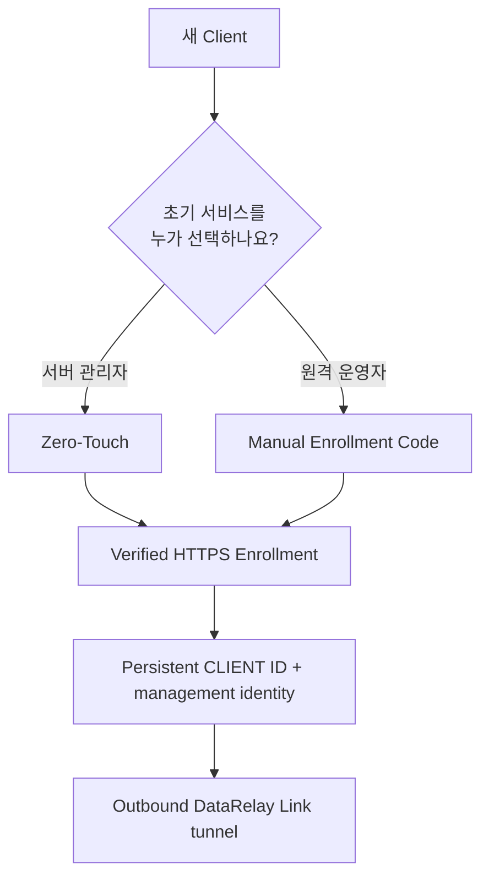

# 클라이언트 등록

Enrollment는 Client와 DataRelay Link Server를 **처음 한 번 안전하게 연결하는 과정**입니다. 등록이 완료되면 persistent CLIENT ID와 management identity가 생성되며, 일반적인 reboot·서비스 변경·stable update 때문에 다시 등록할 필요는 없습니다.

## 어떤 방식을 선택하나요?

| 방식 | 적합한 경우 | 초기 서비스를 누가 정하나요? |
| --- | --- | --- |
| **Zero-Touch** | 서버 관리자가 초기 구성을 미리 정하고 원격 사용자에게 한 번 실행할 명령을 전달 | 서버 관리자 |
| **Manual Enrollment Code** | 원격 운영자가 설치 중 SSH/HTTP/HTTPS/Custom TCP를 직접 선택 | 원격 운영자 |



## Zero-Touch

일상적인 권장 경로는 서버에서 다음을 실행하는 것입니다.

```bash
sudo drlink
```

CLI에서:

```text
create zero-touch
```

서버가 출력한 **정확한 bootstrap 명령을 그대로** 원격 Client에서 한 번 실행합니다. 명령에는 short-lived credential이 포함될 수 있으므로 사용·만료 전까지 secret처럼 취급합니다.

자세한 내용은 [Zero-Touch 등록](/ko/guides/zero-touch)을 참고하세요.

## Manual Enrollment Code

서버에서:

```bash
sudo drlink create enrollment
```

생성 결과에는 non-secret Enrollment ID, short-lived Enrollment Code, allocator URL, CA trust 정보와 Client bootstrap 명령이 포함됩니다.

원격 Client에서 서버가 생성한 bootstrap 명령을 실행하고, 요청되면 Enrollment Code를 입력합니다. 이후 설치 메뉴에서 필요한 서비스를 선택합니다.

```text
SSH
HTTP
HTTPS
Custom TCP
```

Public service port는 Client가 직접 정하지 않습니다. Server가 service마다 할당하고 persistent reservation으로 관리합니다.

## 등록 후 확인

Server:

```bash
sudo drlink show enrollments
sudo drlink show clients
sudo drlink show client <CLIENT-ID>
```

Client:

```bash
sudo drlink show status
sudo drlink show services
sudo drlink doctor
```

## 꼭 기억할 것

- DataRelay Link는 OS user, password, SSH key, `sshd`, Windows RDP 설정을 자동 생성하지 않습니다.
- Enrollment credential revoke, Client management revoke, service/client release는 서로 다른 lifecycle 작업입니다.
- Client uninstall만으로 Server의 public-port reservation이 반환되지는 않습니다.

관련 문서: [Lifecycle 의미](/ko/operations/lifecycle), [서비스 게시](/ko/guides/services), [문제 해결](/ko/operations/troubleshooting).
