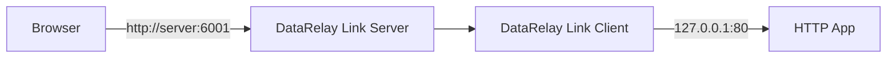
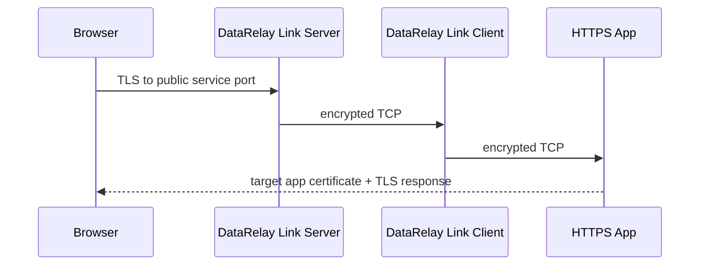
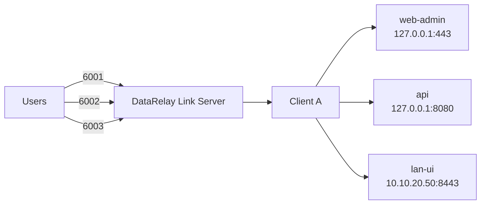

# HTTP & HTTPS

DataRelay Link는 HTTP/HTTPS를 **TCP service**로 게시합니다. Published service용 application reverse proxy가 아닙니다.

## HTTP



Target은 Client local 또는 LAN host일 수 있습니다.

```text
127.0.0.1:80
10.10.20.40:80
```

## HTTPS: TLS는 target까지 그대로 전달



DataRelay Link가 TLS를 종료하거나 certificate를 발급/교체하지 않습니다.

## Hostname과 certificate

예:

```text
Public hostname : fw.example.com
Public port     : 6005
Target          : 127.0.0.1:443
```

사용자 접속:

```text
https://fw.example.com:6005
```

실제 target application certificate가 `fw.example.com`에 유효해야 합니다.

## 한 Client에서 여러 Web Service



## 증상별 확인

| 증상 | 우선 확인 |
| --- | --- |
| Timeout | public firewall/NAT/service port |
| Connection refused | target listener/bind |
| IP는 되고 hostname 실패 | DNS/hairpin NAT |
| HTTPS certificate warning | target certificate SAN |
| LAN Web만 실패 | Client→LAN routing/ACL |

<Tip>
  먼저 Client에서 target에 직접 연결 가능한지 확인하고, 그 다음 public service port, 마지막으로 DNS/TLS hostname을 확인하세요.
</Tip>
