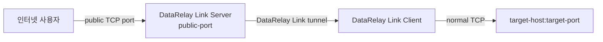
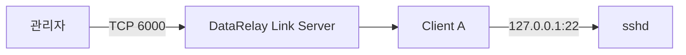
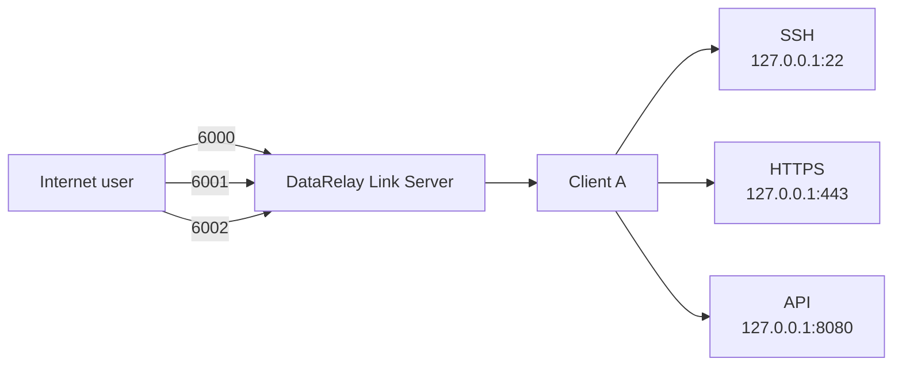
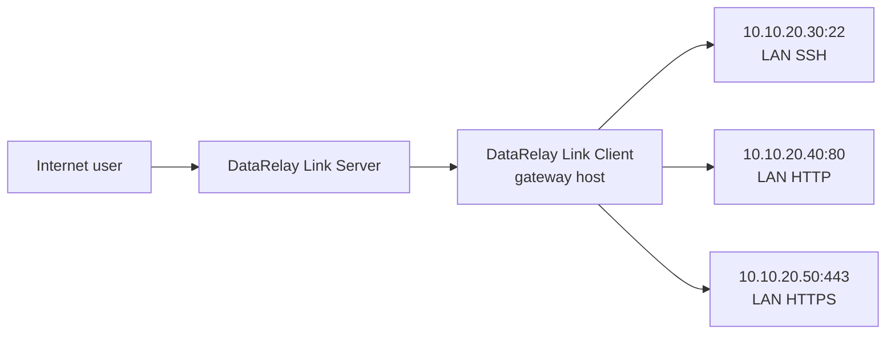
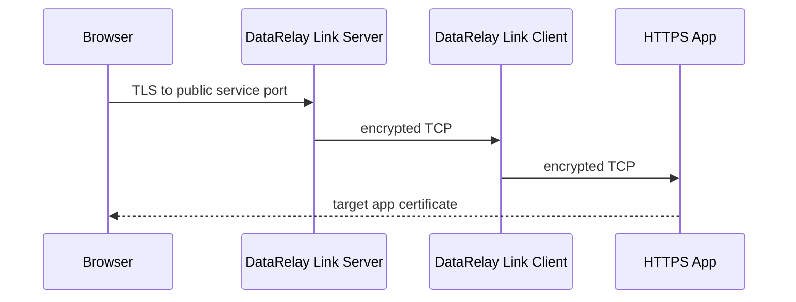
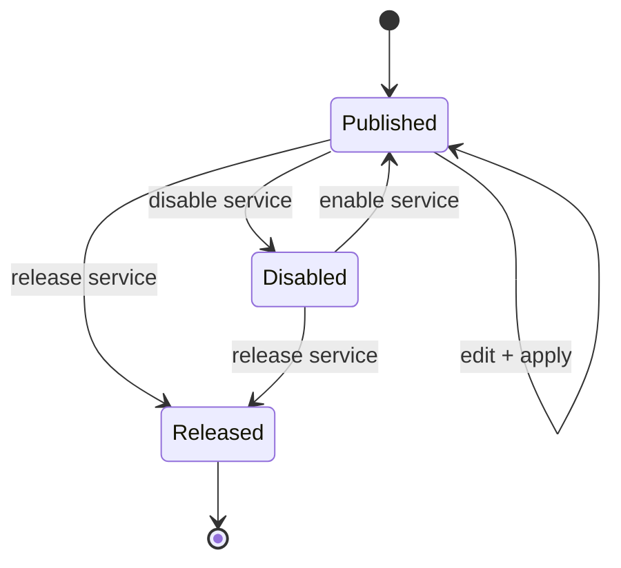

# 서비스 게시

**Service**는 Enrollment된 Client가 DataRelay Link server를 통해 외부에 게시하는 TCP target 하나입니다. 한 Client에 여러 Service를 둘 수 있습니다.

## 모든 서비스의 공통 경로



Target은 Client 자신의 localhost일 수도 있고 Client가 접근 가능한 다른 LAN host일 수도 있습니다.

## 서비스 종류

| 종류 | 일반 Target | 외부 접속 예 | 주의 |
| --- | --- | --- | --- |
| SSH | `127.0.0.1:22` | `ssh -p 6000 user@server` | user/sshd가 이미 있어야 함 |
| HTTP | `127.0.0.1:80` | `http://server:6001` | TCP forwarding |
| HTTPS | `127.0.0.1:443` | `https://server:6002` | TLS는 target까지 passthrough |
| Custom TCP | `10.10.20.30:5432` | app-specific | target 인증 유지 |

## 예 1 — Client 자신의 SSH만 게시



## 예 2 — 한 Client에서 여러 서비스



각 Service는 stable Service ID와 persistent public-port reservation을 갖습니다.

## 예 3 — Client를 LAN gateway처럼 사용



Client가 해당 LAN target에 normal IP/TCP로 도달할 수 있어야 합니다.

## 실사용 예제

한 Client에서 자신의 서비스와 내부 LAN의 다른 서버 서비스를 동시에 게시할 수 있습니다.

| 사용 예 | DataRelay Link Client에서 보이는 Target | 설명 |
| --- | --- | --- |
| Client SSH | `127.0.0.1:22` | Client 자체 관리 |
| Client HTTPS | `127.0.0.1:443` | Client의 로컬 Web UI |
| 다른 LAN 서버 SSH | `10.10.10.20:22` | 같은 내부망 서버 원격 관리 |
| 다른 LAN 서버 HTTP | `10.10.10.30:80` | 내부 Web Application |
| Grafana | `10.10.10.40:3000` | Monitoring UI |
| 내부 API | `10.10.10.50:8080` | Application별 TCP Client |
| PostgreSQL | `10.10.10.60:5432` | DB 인증/ACL을 유지한 상태로 사용 |

LAN Target을 등록하기 전에 먼저 **DataRelay Link Client 자체에서** 해당 Target에 도달되는지 확인합니다.

```bash
nc -vz -w 3 10.10.10.20 22
nc -vz -w 3 10.10.10.30 80
```

여기서 실패하면 DataRelay Link 문제가 아니라 Client→LAN Target 사이의 routing, target firewall 또는 application 문제입니다. 이 경로를 먼저 해결한 뒤 Service를 게시하세요.

<Note>
  모든 LAN 서버에 DataRelay Link Client를 각각 설치할 필요는 없습니다. 하나의 Enrollment된 Client가 자신이 정상적으로 접근 가능한 내부 서버의 작은 gateway 역할을 할 수 있습니다. 다만 제품 목표 규모는 몇 대~몇십 대이므로 불필요하게 내부망 전체를 광범위하게 노출하지 마세요.
</Note>

## HTTPS는 passthrough



DataRelay Link가 TLS를 종료하거나 인증서를 교체하지 않습니다. 사용자가 `fw.example.com`으로 접속한다면 실제 target application certificate가 해당 hostname에 유효해야 합니다.

## Public port lifecycle



- **Disable**: 게시 중지, port 예약 유지
- **Enable**: 같은 port로 재개
- **Edit + apply**: target 변경, reservation 유지 목표
- **Release**: public port를 pool로 반환

<Warning>
  Service를 외부에 게시하면 해당 application의 공격 표면도 외부로 열립니다. Application authentication, ACL, host firewall, database 권한은 계속 유지하세요.
</Warning>
