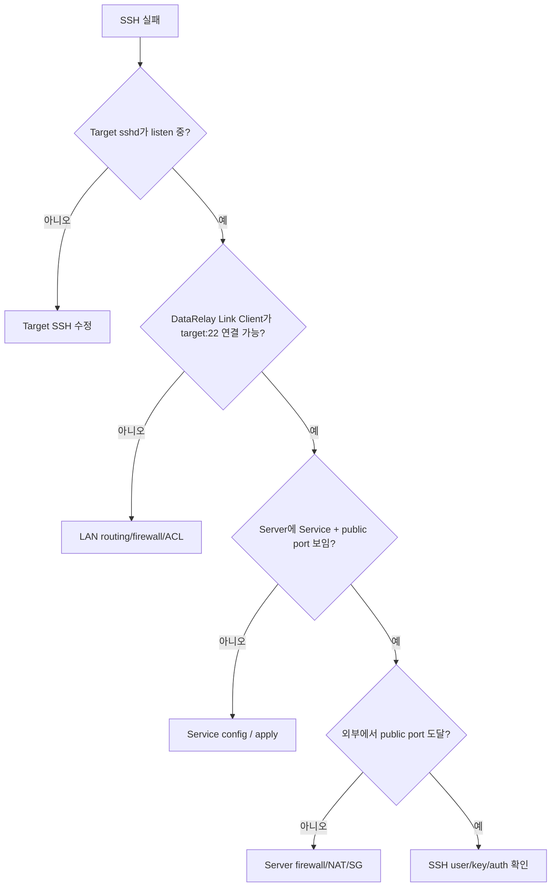

# SSH

SSH는 가장 자주 사용하는 서비스입니다.

## Client 자신의 SSH


일반 target:

```text
Target host : 127.0.0.1
Target port : 22
SSH user    : existing-user
```

SSH account와 `sshd`는 이미 준비되어 있어야 합니다.

## 접속

```bash
ssh -p <public-port> <ssh-user>@<server-public-IP>
```

Public service hostname 사용 시:

```bash
ssh -p <public-port> <ssh-user>@fw.example.com
```

## 다른 LAN Server의 SSH 게시


Client에서 해당 `10.10.20.30:22`로 직접 연결 가능해야 합니다.

## 문제 확인 순서



```bash
ss -lntp | grep ':22'
sudo drlink show services
sudo drlink doctor
```

Server:

```bash
sudo drlink show client <CLIENT-ID> services
```

Disable은 port를 유지하며 게시만 중지하고, Release는 port reservation을 반환합니다.
