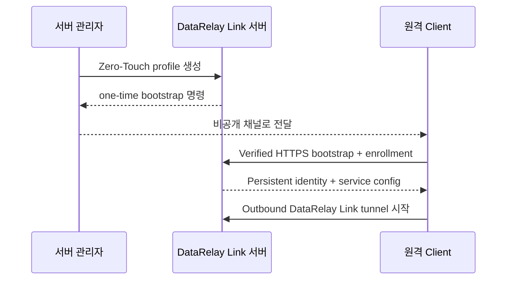

# Zero-Touch 등록

Zero-Touch는 서버 관리자가 초기 Client 프로필을 정하고 원격 사용자에게 **한 줄 명령만 실행하게 하는** 권장 onboarding 방식입니다.


이 그림에서 Enrollment는 첫 등록 단계이고, 이후 서비스 변경/업데이트/운영은 persistent CLIENT ID를 유지한 채 진행됩니다.

## 전체 흐름



원격 사용자는 DataRelay Link 설정 파일을 이해할 필요가 없습니다. 서버가 출력한 정확한 명령을 한 번 실행하면 됩니다.

## 가장 쉬운 생성 방식

```bash
sudo drlink
```

CLI 안에서:

```text
create zero-touch
```

SSH 초기 프로필을 명시하려면:

```bash
sudo drlink create enrollment \
  --one-line \
  --ssh \
  --ssh-user <ssh-user> \
  --label branch-a
```

`<ssh-user>`는 원격 시스템에 이미 존재하는 SSH account여야 합니다.

## Zero-Touch가 하지 않는 것

- OS user 생성
- `sshd` 설치/설정
- password 설정
- SSH key 생성/배포
- client firewall 변경
- 외부 NAT 변경

즉 OS/application provisioning이 아니라 **DataRelay Link onboarding**을 자동화합니다.

## 생성 명령은 민감 정보입니다

Bootstrap command에는 short-lived credential이 포함되거나 참조될 수 있습니다.

다음 위치에 남기지 마세요.

- public issue/ticket
- public chat
- analytics
- 문서 예제의 shell history
- long-lived log

Bootstrap Ticket은 high entropy, short-lived, first-machine bound, successful enrollment 후 single-use, server hashed-at-rest를 목표로 설계되어 있습니다.

## Stable v2.2.1 기준

Stable 서버에서는 **`drlink`이 실제로 출력한 명령을 그대로** 사용하세요. 문서의 토큰/URL을 조합해서 임의로 다시 만들지 마세요.

<Accordion title="Stable Short URL 옵션">
  v2.2.1은 optional operator-managed `bootstrap_hostname`을 사용하는 Option B Short URL 모델을 지원합니다. 외부 DNS, publicly trusted TLS, reverse proxy lifecycle은 operator 책임이며 private-CA management trust model은 그대로 유지됩니다.
</Accordion>

## 실행 후 검증

Server:

```bash
sudo drlink show clients
sudo drlink show enrollments
sudo drlink show client <CLIENT-ID> services
```

Client:

```bash
sudo drlink show status
sudo drlink show services
sudo drlink doctor
```

## Active enrollment credential 차단

```bash
sudo drlink revoke enrollment <ID>
```

Enrollment credential revoke, enrolled client management revoke, public-port release는 서로 다른 lifecycle 작업입니다.
