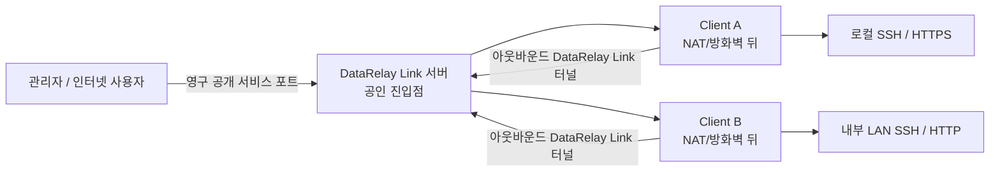
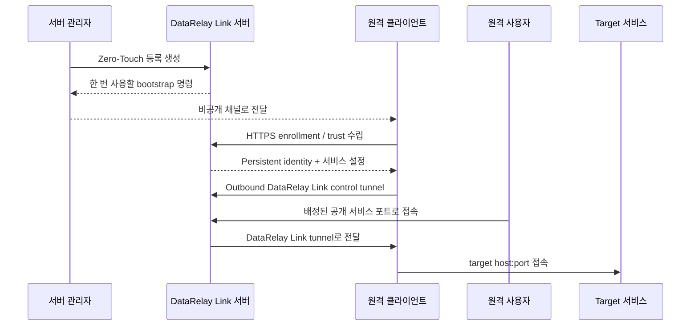

# DataRelay Link

**폐쇄망과 제한망에서 네트워크 전체를 열지 않고, 실제로 필요한 연결만 안전하게 중계합니다.**

DataRelay Link는 하나의 경량 운영 모델로 **Secure Remote Access**와 **Controlled Egress**를 제공하는 연결 게이트웨이입니다. 원격 접속에서는 NAT/방화벽 뒤의 필요한 서비스만 외부에 게시하고, Controlled Egress에서는 승인된 외부 목적지만 허용하는 방향으로 설계됩니다. 등록, 영구 CLIENT ID, 서비스/포트 관리, lifecycle, 진단, 백업/복구는 `drlink` CLI에서 관리합니다.

<Note>
  **Free Early Access:** DataRelay Link는 현재 **DataRelay Link Early Access License 1.0**에 따라 무료로 사용할 수 있습니다. Source Available이며 Open Source는 아닙니다. 개인 사용, 평가·테스트, 기업·기관의 자체 내부 사용, 허용된 내부 소스 수정, 고객 소유 환경 배포가 허용됩니다. Early Access에는 SLA가 없으며 기술지원은 Best Effort입니다. 향후 Commercial General Availability에서는 **Perpetual License** 모델을 적용할 계획입니다. 자세한 내용은 [라이선스](/ko/reference/license)를 확인하세요.
</Note>

<Note>
  Secure Remote Access는 현재 stable 기능입니다. Controlled Egress는 현재 개발 및 Real E2E 검증 단계이므로 stable 지원으로 표시하지 않습니다.
</Note>

<Note>
  목표 규모는 **몇 대에서 몇십 대 정도**입니다. 수백 대 이상의 fleet orchestration 제품으로 만들려는 프로젝트가 아닙니다.
</Note>

## 30초 만에 이해하기

원격 클라이언트가 서버 쪽으로 **아웃바운드 연결**을 시작합니다. 그래서 일반적인 환경에서는 클라이언트 자체에 공인 IP나 인바운드 NAT/포트포워딩이 필요하지 않습니다.

## 내 상황에 맞게 시작하세요

<CardGroup cols={2}>
  <Card title="NAT/터널 구조를 잘 모릅니다" icon="circle-question" href="/ko/getting-started/concepts">Server, Client, CLIENT ID, Service, 공개 포트를 그림으로 먼저 이해합니다.</Card>
  <Card title="고정 공인 IP나 무료 서버가 없습니다" icon="cloud" href="/ko/getting-started/oci-free-tier-server">
    실제 OCI Console 화면을 보면서 Always Free 대상 Ubuntu VM과 Reserved Public IPv4를 단계별로 준비합니다.
  </Card>
  <Card title="일단 SSH부터 연결하고 싶습니다" icon="rocket" href="/ko/getting-started/quickstart">빈 서버 준비부터 실제 원격 SSH 성공까지 가장 짧은 절차입니다.</Card>
  <Card title="서버/방화벽을 구성해야 합니다" icon="server" href="/ko/getting-started/server-installation">Direct/single-443, 필요한 포트, NAT 책임 경계를 확인합니다.</Card>
  <Card title="원격 Linux 장비를 붙이려 합니다" icon="laptop" href="/ko/getting-started/linux-client">Zero-Touch와 Manual Enrollment 중 맞는 방식을 고릅니다.</Card>
  <Card title="SSH/웹/LAN 서비스를 게시합니다" icon="network-wired" href="/ko/guides/services">
    한 클라이언트의 여러 서비스와 내부 다른 서버 서비스를 게시합니다.
  </Card>
  <Card title="구조와 보안을 자세히 보고 싶습니다" icon="sitemap" href="/ko/reference/architecture">
    Control/data plane, identity, 신뢰 수립, persistent state를 확인합니다.
  </Card>
</CardGroup>

## 등록부터 실제 접속까지

## 어떤 서비스를 연결할 수 있나요?

| 종류 | 일반적인 Target | 외부 접속 예 |
| --- | --- | --- |
| SSH | `127.0.0.1:22` | `ssh -p <public-port> user@server` |
| HTTP | `127.0.0.1:80` 또는 LAN host | `http://server:<public-port>` |
| HTTPS | `127.0.0.1:443` 또는 LAN host | `https://server:<public-port>` |
| Custom TCP | `host:any-tcp-port` | 애플리케이션별 클라이언트 |

한 클라이언트에 여러 서비스를 등록할 수 있고, 클라이언트가 접근 가능한 **다른 LAN 서버의 서비스**도 게시할 수 있습니다.

## 현재 stable

| 항목 | 현재 |
| --- | --- |
| Stable release | **v2.2.1** |
| Bundled relay engine | **v0.71.0** |
| Server | **Linux 기반** |
| 기본 배포 | **Direct** |

v2.2.1의 Real E2E Client 검증에는 **Ubuntu 24, Rocky Linux 8.10/9.4, Amazon Linux 2023, macOS Apple Silicon, Windows 10 / PowerShell 5.1**이 포함됩니다. Amazon Linux 2와 PowerShell 7은 더 좁은 검증 수준을 사용합니다.

정확한 검증 matrix는 [지원 플랫폼 & 제한](/ko/reference/platforms), release/tag 세부 정보는 [Release Status](/ko/reference/release-status)를 확인하세요.

## 가장 많이 헷갈리는 네 가지

<AccordionGroup>
  <Accordion title="클라이언트는 보통 인바운드 포트를 열지 않습니다">
    클라이언트가 enrollment와 DataRelay Link control tunnel을 서버 쪽으로 아웃바운드로 시작합니다. 대신 DataRelay Link 서버/공인 방화벽은 필요한 public endpoint를 받아야 합니다.
  </Accordion>

  <Accordion title="DataRelay Link가 방화벽/NAT/DNS를 자동 설정하지는 않습니다">
    AWS/OCI 보안 정책, 외부 DNAT, UFW/firewalld/iptables, DNS provider record는 인프라 담당 영역입니다.
  </Accordion>

  <Accordion title="HTTPS는 TLS termination이 아니라 passthrough입니다">
    브라우저가 보는 인증서는 실제 target 애플리케이션의 인증서입니다.
  </Accordion>

  <Accordion title="Disable, Revoke, Release는 서로 다릅니다">
    Disable은 포트를 유지하며 게시만 중지, Revoke는 management identity 차단, Release는 public-port reservation 반환입니다.
  </Accordion>
</AccordionGroup>

## DataRelay Link 개선에 참여해 주세요

문제를 발견했거나 실제 운영에서 더 편리하고 안전하게 쓸 수 있는 개선 아이디어가 있나요?

<CardGroup cols={2}>
  <Card title="버그 리포트" icon="bug" href="/ko/feedback">
    버전, 환경, 재현 절차와 필요한 범위의 진단 정보를 포함해 문제를 알려주세요.
  </Card>
  <Card title="기능 개선 요청" icon="lightbulb" href="/ko/feedback">
    해결하려는 실제 문제나 운영 흐름과 원하는 동작을 제안해 주세요.
  </Card>
</CardGroup>

<Tip>
  처음이라면 [개념과 동작 원리](/ko/getting-started/concepts) → [빠른 시작](/ko/getting-started/quickstart) 순서로 보는 것이 가장 쉽습니다. 문제나 개선 제안은 [피드백](/ko/feedback)에서 제출할 수 있습니다.
</Tip>
