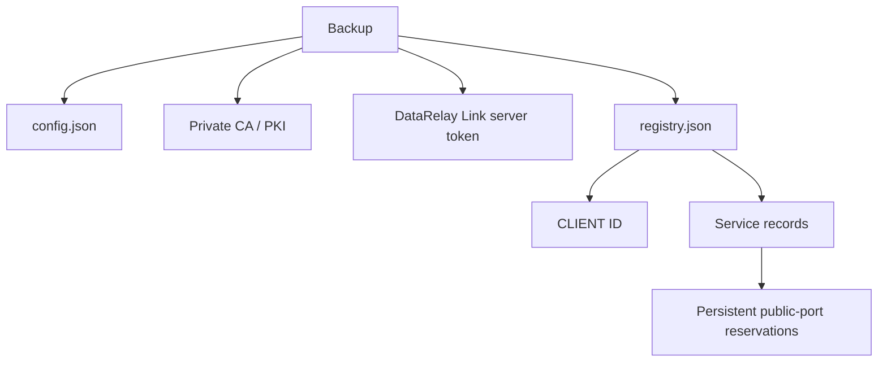
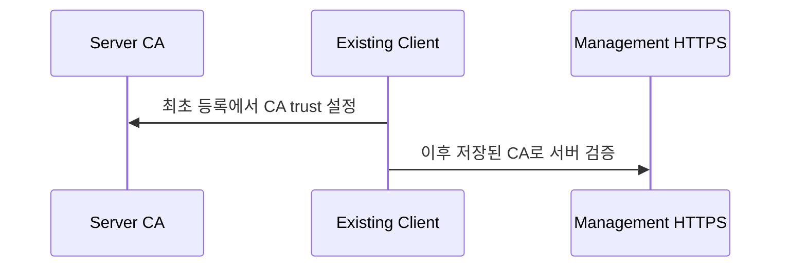

# 백업 & 복구

DataRelay Link 서버는 단순 설정 파일만이 아니라 **신뢰와 식별 상태**를 보관합니다. 따라서 서버 장애 대비에서 백업은 매우 중요합니다.

## 무엇을 보호하나요?



최소 핵심 상태는 다음과 같습니다.

```text
/etc/data-relay-link/config.json
/etc/data-relay-link/pki/
/etc/data-relay-link/server_token
/var/lib/data-relay-link/registry.json
```

## 백업 생성

```bash
sudo drlink create backup
```

백업 파일은 private key와 token 같은 민감한 정보를 포함할 수 있으므로 안전한 위치에 저장하세요.

## 복구

```bash
sudo drlink restore backup <path>
```

지원되는 restore는 단순 파일 복사가 아닙니다. Archive 검증, 현재 상태 snapshot, restore, 서비스 재시작, health check를 포함해 일관성이 깨지는 경우 보수적으로 실패하도록 설계되어 있습니다.

## 왜 CA가 중요한가요?



기존 Client는 Project private CA를 신뢰합니다. CA private key를 잃어버리면 기존 trust 관계를 그대로 재현하기 어려울 수 있습니다.

## 복구 후 검증

```bash
sudo drlink show status
sudo drlink show clients
sudo drlink doctor
```

그 다음 대표 published service를 **실제 public host/public port**에서 테스트하세요.

<Warning>
  Disaster recovery를 준비하려면 backup 파일이 실제로 복구 가능한지도 별도 테스트 환경에서 주기적으로 검증하는 것이 좋습니다.
</Warning>
