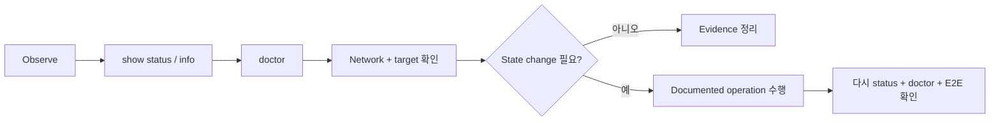

# 진단 & Doctor

문제가 생기면 **상태 확인 → doctor → network/target 확인 → 필요한 변경** 순서가 안전합니다.



## Server

```bash
sudo drlink show version
sudo drlink show status
sudo drlink show clients
sudo drlink show enrollments
sudo drlink doctor
```

## Client

```bash
sudo drlink show version
sudo drlink show status
sudo drlink show services
sudo drlink show info
sudo drlink doctor
```

## Doctor가 확인하는 범주

- 설치 상태와 expected files
- secret file permission
- PKI / CA trust
- systemd service state
- DataRelay Link config / transport
- allocator/enrollment reachability
- registry / client-state consistency
- topology와 common network failure

<Warning>
  server/client runtime config, registry, client identity, PKI 파일을 troubleshooting 첫 단계에서 직접 수정하지 마세요.
</Warning>

더 자세한 증상별 흐름은 [문제 해결](/ko/operations/troubleshooting)을 사용하세요.
