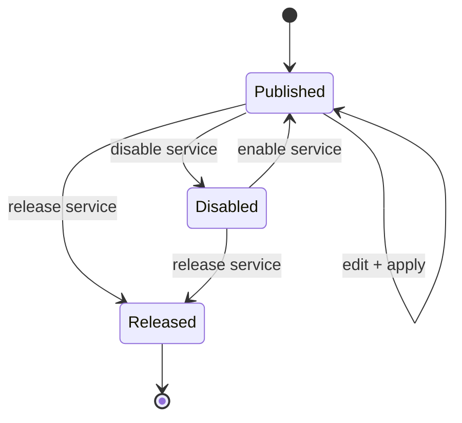
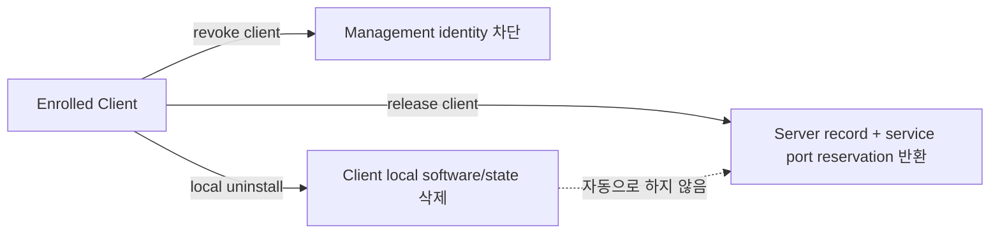
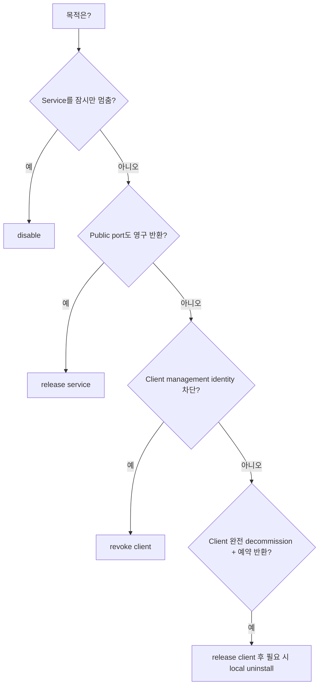

# Lifecycle 의미

DataRelay Link는 **서비스 게시 상태**, **management identity**, **public-port reservation**을 서로 다른 상태로 관리합니다.

```text
disable   != release
revoke    != release
uninstall != release
update    != re-enrollment
```

## Service lifecycle



| 동작 | 의미 | Public port |
| --- | --- | --- |
| Disable | 게시 일시 중지 | **유지** |
| Enable | 게시 재개 | **같은 port 재사용** |
| Edit + apply | Target/config 변경 | **가능하면 유지** |
| Release | Reservation 삭제 | **pool 반환** |

## Client lifecycle



- `revoke client`: management identity 차단
- `release client`: server record와 service reservation 반환
- local uninstall: client local state 삭제, server reservation 자동 반환 아님

## 어떤 명령을 선택해야 하나요?



## Stable v2.2.1 Enrollment credential

Active enrollment credential은 다음처럼 revoke할 수 있습니다.

```bash
sudo drlink revoke enrollment <ID>
```

<Note>
  Stable v2.2.1에는 qualified enrollment lifecycle/retention command가 포함됩니다. Mutable `main`에는 이후 변경이 있을 수 있으므로 field 운영은 immutable v2.2.1 contract를 기준으로 합니다.
</Note>

## Update

정상적인 supported project update는 re-enrollment가 아닙니다. CLIENT ID, CA, token, registry, public-port reservation을 유지하도록 설계되어 있습니다.

<Warning>
  잠시 중지하려는 것뿐인데 `release`를 실행하면 public-port reservation을 반환하게 됩니다. Intent를 먼저 확인하세요.
</Warning>
