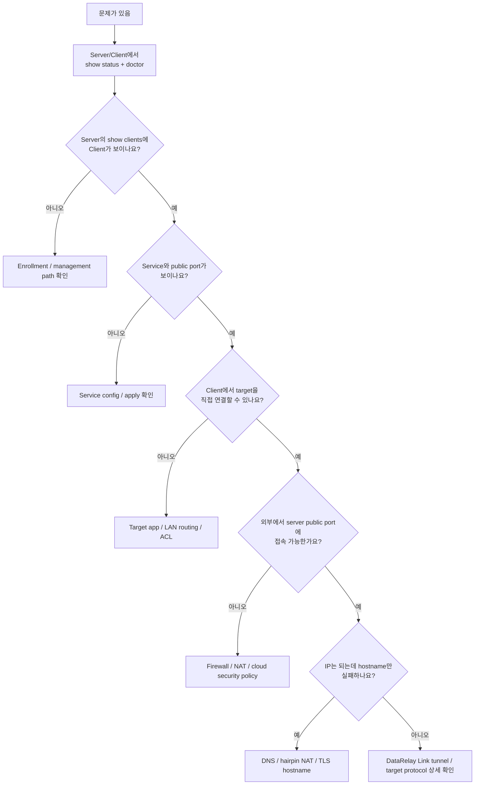
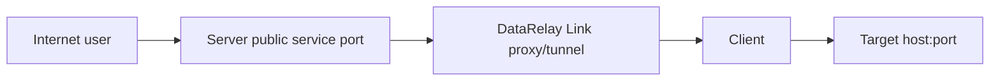
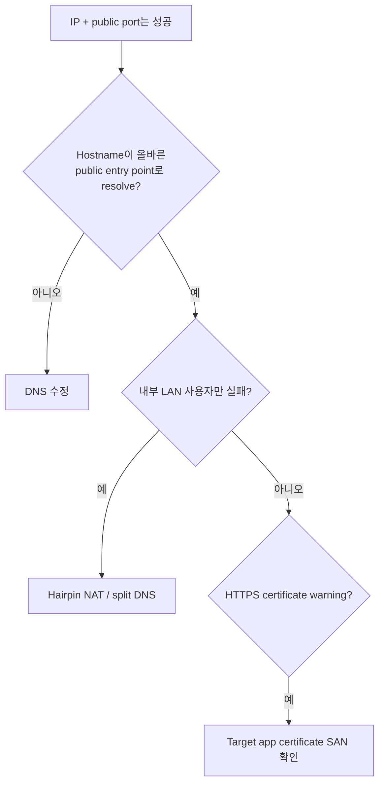

# 문제 해결

문제가 생기면 generated config/registry/identity 파일을 먼저 수정하지 말고 **read-only evidence**부터 확인하세요.

## 첫 번째 Decision Tree



## 1. 최소 증거 수집

Server:

```bash
sudo drlink show version
sudo drlink show status
sudo drlink show clients
sudo drlink show enrollments
sudo drlink doctor
```

Client:

```bash
sudo drlink show version
sudo drlink show status
sudo drlink show services
sudo drlink show info
sudo drlink doctor
```

<Note>
  `doctor`는 읽기 전용입니다. Generated DataRelay Link config, registry, identity, PKI를 수동 수정하기 전에 먼저 실행하세요.
</Note>

## 증상: 새 Client가 Server에 안 보임

다음 순서로 봅니다.

1. Server가 출력한 Zero-Touch 명령을 정확히 실행했는가
2. Bootstrap/Enrollment credential이 아직 유효한가
3. Client가 **public enrollment HTTPS endpoint**에 도달 가능한가
4. Client 시간 오차가 과도하지 않은가
5. TLS trust/certificate 검증이 성공하는가
6. 다른 네트워크에서 private server IP를 잘못 사용하고 있지 않은가

Direct 기본에서는 Client가 보통 TCP `443`, `6099`로 outbound 가능해야 합니다.

## 증상: Client는 보이는데 SSH/Web이 안 됨



모든 hop을 확인합니다.

- `show client <ID> services`에서 public port 확인
- 외부 firewall/cloud security policy가 해당 port 허용
- Client DataRelay Link 상태 정상
- Client가 target host/port에 직접 연결 가능
- Target application 실제 listen 중

Client 자신의 SSH라면:

```bash
ss -lntp | grep ':22'
```

## 증상: LAN target만 안 됨

DataRelay Link 없이 Client에서 target으로 먼저 직접 연결 가능해야 합니다.

```text
Client -> 10.10.20.30:22
```

이게 실패하면 routing, ACL, target firewall, bind address, application 상태를 먼저 고치세요.

## 증상: TCP는 연결되는데 TLS가 reset됨

일부 enterprise network는 non-standard TCP port의 handshake는 허용하지만 TLS를 reset할 수 있습니다.

`curl -k`, plain HTTP enrollment, TLS verification disable로 우회하지 마세요. [배포 모드](/deployment/modes)의 Enterprise single-443 설계를 검토해야 합니다.

## 증상: IP는 되는데 hostname만 실패



DataRelay Link는 hostname을 사용하지만 DNS record를 자동 생성하지 않습니다.

## 증상: HTTPS certificate warning

Published HTTPS는 TCP passthrough입니다. Browser가 보는 certificate는 **target application**의 certificate입니다.

`https://fw.example.com:6005`로 접속시 target certificate가 `fw.example.com`에 적합해야 합니다.

## 증상: Server가 NAT 뒤

다음 매핑을 명시적으로 확인하세요.

```text
public control       -> DataRelay Link control listen
public enrollment    -> allocator/enrollment listen
public service port  -> same DataRelay Link service port (1:1 권장)
```

## 처음부터 하면 안 되는 것

- Port 한 개 안 된다고 Client를 바로 delete/re-enroll
- 일시 중지가 목적인데 `release`
- verified HTTPS 대신 plain HTTP
- production fix로 `curl -k`
- Client 간 secret file 복사
- recovery 절차 없이 registry/identity/PKI 수동 수정

## Escalation 시 준비할 정보

- Server/Client `show version`
- Server/Client `show status`
- 관련 `doctor` output
- deployment mode
- public ↔ internal port mapping
- CLIENT ID / Service ID (secret은 제외)
- target host/port
- IP는 되는지, hostname만 실패하는지
- Client에서 target 직접 연결이 되는지
