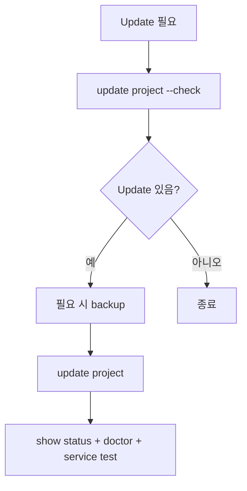

# 업데이트

DataRelay Link는 **Project update**와 **upstream DataRelay Link binary update**를 분리합니다.

## 안전한 흐름



## Project update

```bash
sudo drlink update project --check
sudo drlink update project
```

정상 supported update는 다음 상태를 유지하도록 설계되어 있습니다.

- CLIENT ID / management identity
- Project private CA
- Relay transport token
- Registry
- Service definition
- Persistent public-port reservation

Update는 re-enrollment가 아닙니다.

## Stable vs main

| 채널 | 의미 |
| --- | --- |
| **v2.2.1 tag** | 현재 published stable, field install 기준 |
| **main** | mutable development/docs channel |

## DataRelay Link Update

```bash
sudo drlink show upstream
sudo drlink update relay-engine --check
```

`show upstream`은 정보용입니다. 프로젝트는 newest upstream DataRelay Link를 자동 채택하지 않고 현재 stable에서 검증된 **v0.71.0**을 pinned 상태로 유지합니다.

## Update 후

```bash
sudo drlink show version
sudo drlink show status
sudo drlink doctor
```

대표 published service 하나 이상을 public endpoint에서 실제 테스트하세요.

<Warning>
  Upstream에 새 relay engine이 있다는 이유만으로 bundled server/client runtime을 수동 교체하지 마세요. Pinned/tested 정책은 release safety의 일부입니다.
</Warning>
