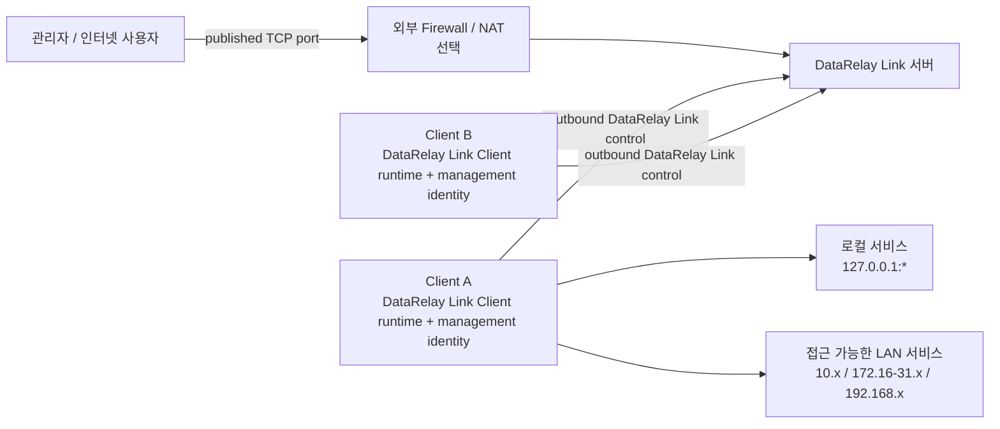
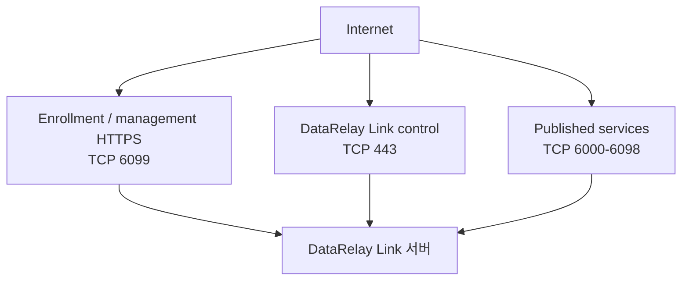
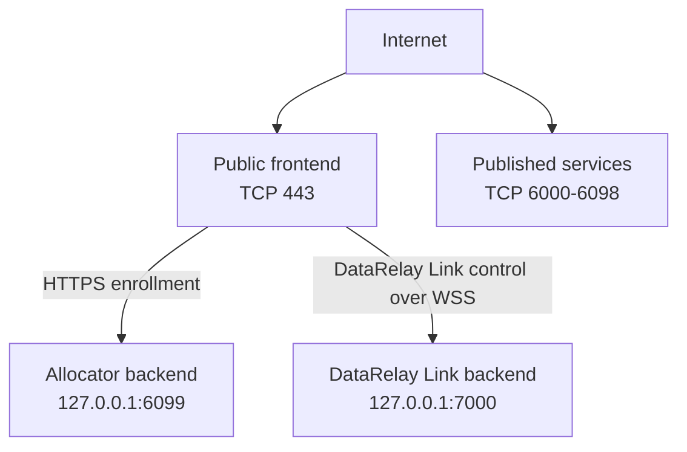
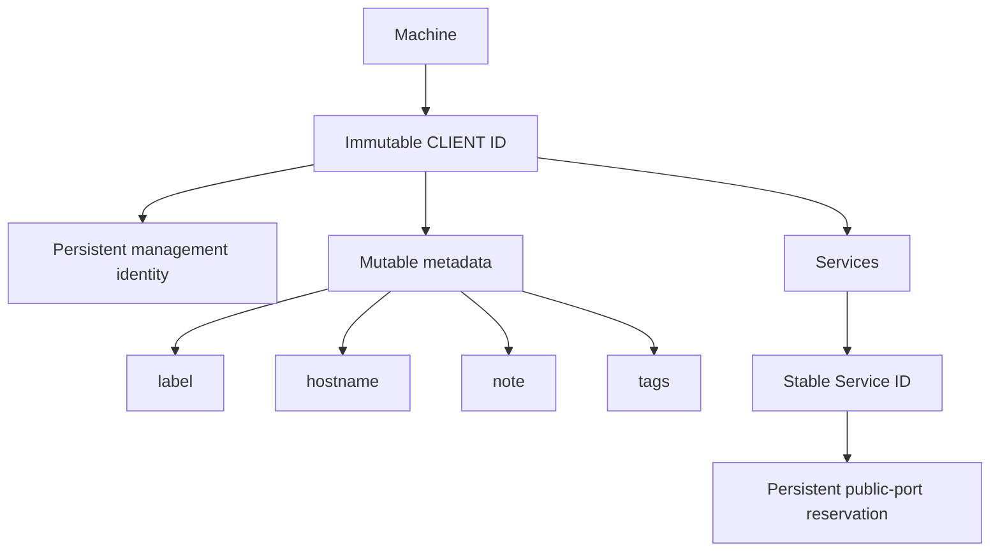
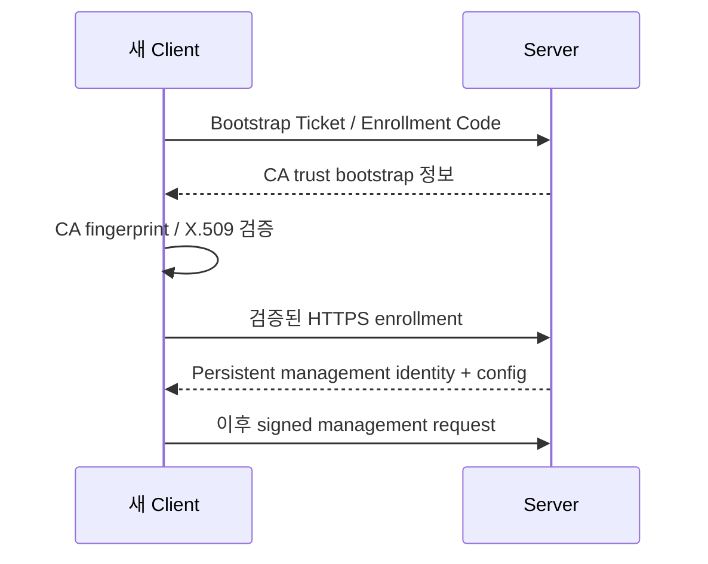

# 아키텍처

이 페이지는 전문가/운영자를 위한 구조 설명입니다. 처음 보는 사용자라면 [개념과 동작 원리](/ko/getting-started/concepts)부터 읽는 것이 빠릅니다.

## 전체 구조



DataRelay Link는 Secure Remote Access용 **bundled relay engine**과 enrollment, identity, service lifecycle, policy, audit를 하나의 제품으로 관리합니다. 내부 transport runtime은 사용자-facing 제품 identity와 분리합니다.

## Control plane과 data plane

| 영역 | 역할 | 일반 전송 방식 |
| --- | --- | --- |
| Enrollment / management | 최초 신뢰, identity, 서비스 metadata, 관리 작업 | 검증된 HTTPS |
| Relay control | proxy 등록과 reverse tunnel 유지 | bundled relay transport의 TLS 또는 WSS |
| Published service data | SSH/HTTP/HTTPS/Custom TCP 실제 트래픽 | relay tunnel을 통한 TCP |

각 영역은 서로 다른 자격 증명과 역할을 가집니다.

## Direct 모드



## Enterprise single-443



single-443에서는 backend `6099`, `7000`을 인터넷에 직접 노출하면 안 됩니다.

## Identity 모델



## 신뢰 수립



Relay transport token은 Secure Remote Access tunnel 인증용이며 Enrollment Code, Bootstrap Ticket, management identity와 같은 자격 증명이 아닙니다.

## 보존되는 서버 상태

```text
/etc/data-relay-link/config.json
/etc/data-relay-link/pki/
/etc/data-relay-link/server_token
/var/lib/data-relay-link/registry.json
```

정상적인 업데이트, 재부팅, 지원되는 restore에서는 identity, CA trust, token, registry, public-port reservation을 보존하는 것이 설계 목표입니다.

## 설계 규모

주 대상은 몇 대에서 몇십 대입니다. 수백/수천 endpoint orchestration, CMDB, endpoint compliance, HA management cluster는 현재 제품 목표가 아닙니다.
