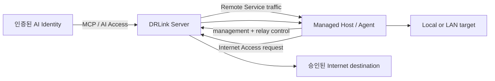

# 아키텍처

## 역할



Server는 Enrollment, Managed Host inventory, Network/Service/Permission Object와 Group, AI Identity, Access Policy, Revision, Audit, Backup/Restore, Server ConfigurationBundle을 관리합니다.

Agent는 로컬 lifecycle과 Remote Service를 관리합니다. Remote Service는 destination 하나와 Service Object 하나를 연결하고 안정적인 DataRelay Link endpoint를 가집니다.

Remote Access, Internet Access, AI Access는 독립 policy family이며 BLACKLIST/WHITELIST + Enforcement 모델을 사용합니다. Rule은 unordered이며 Rule별 action이 없습니다.

v2.4 authoritative Server state는 다음 SQLite DB입니다.

```text
/var/lib/drlink/drlink.db
```

Enrollment bootstrap credential, persistent Agent management identity, Relay Engine credential, AI OAuth credential은 서로 다른 trust boundary입니다.

MCP는 Server-side authenticated bridge이며 AI Access policy, Agent identity, target OS permission을 우회하지 않습니다.
