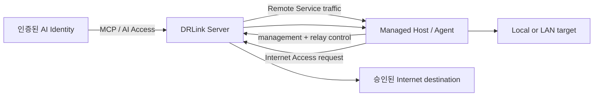

# 아키텍처

## 역할


```mermaid
flowchart LR
    S[DRLink Server]
    A[Managed Host / Agent]
    T[Local or LAN target]
    I[승인된 Internet destination]
    AI[인증된 AI Identity]

    A -->|management + relay control| S
    S -->|Remote Service traffic| A
    A --> T
    A -->|Internet Access request| S
    S --> I
    AI -->|MCP / AI Access| S
    S --> A
```

Server는 Enrollment, Managed Host 목록, Network/Service/Permission Object와 Group, AI Identity, Access Policy, Revision, Audit, 백업/복구, Server ConfigurationBundle을 관리합니다.

Agent는 로컬 실행 상태와 Remote Service를 관리합니다. Remote Service는 하나의 목적지와 하나의 Service Object를 연결하고 고정된 DataRelay Link endpoint를 사용합니다.

Remote Access, Internet Access, AI Access는 서로 독립된 정책 영역이며 BLACKLIST/WHITELIST + Enforcement 모델을 사용합니다. Rule은 순서로 평가하지 않고 각 Rule에 별도 동작을 지정하지 않습니다.

v2.4 authoritative Server state는 다음 SQLite DB입니다.

```text
/var/lib/drlink/drlink.db
```

Enrollment bootstrap credential, persistent Agent management identity, Relay Engine credential, AI OAuth credential은 서로 다른 trust boundary입니다.

MCP는 Server에서 인증되는 연결 계층이며 AI Access 정책, Agent identity, 대상 OS 권한을 우회하지 않습니다.
