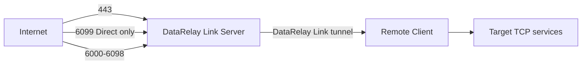
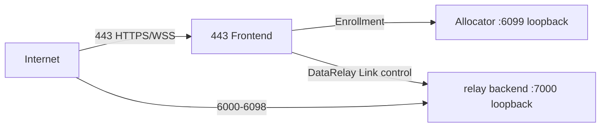

# 네트워크 포트

DataRelay Link의 현재 stable core scope는 **TCP**입니다. 기본 published service range는 `6000-6098`입니다.

## 한눈에 보기



## Direct mode

| 목적 | 기본 public TCP | 기본 listen TCP |
| --- | ---: | ---: |
| DataRelay Link control | 443 | 443 |
| Enrollment / management HTTPS | 6099 | 6099 |
| Published services | 6000-6098 | 6000-6098 |

`TCP/22`는 DataRelay Link product path가 아니라 서버 자체 관리용 SSH일 뿐입니다.

## Enterprise single-443

| 목적 | Public TCP | 내부/backend TCP |
| --- | ---: | ---: |
| Enrollment HTTPS + DataRelay Link control over WSS | 443 | allocator 6099 + relay backend 7000 loopback |
| Published services | 6000-6098 | 6000-6098 |



<Warning>
  single-443의 allocator/relay backend port는 Internet에 직접 노출하는 포트가 아닙니다.
</Warning>

## NAT 배포

Control/enrollment 외부 포트는 방화벽에서 translation할 수 있지만, published service는 가능하면 1:1을 권장합니다.

```text
Public 6005 -> Internal 6005
```

이렇게 해야 registry의 persistent reservation과 실제 사용자가 접속하는 포트가 일치합니다.

## 현재 범위

- SSH — TCP
- HTTP — TCP
- HTTPS — TCP passthrough
- Custom TCP — TCP
- UDP — 현재 stable core scope 아님
