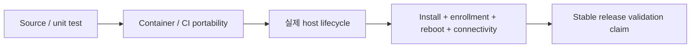

# 지원 플랫폼 & 제한

현재 published stable은 **DataRelay Link v2.2.1**, bundled relay engine은 **v0.71.0**입니다.

v2.2.1은 **동일한 exact candidate HEAD에서 전체 Real E2E를 두 번 연속 PASS**했고, qualified candidate와 최종 release tree가 동일한 상태로 릴리스됐습니다.

## 가장 중요한 구분

**Container/CI portability PASS와 실제 장비에서 수행한 Real E2E는 같은 의미가 아닙니다.**

낮은 단계의 테스트 결과를 더 강한 support claim으로 올려서 표현하지 않습니다.

## v2.2.1 Stable Validation Matrix

| 환경 | 현재 stable claim |
| --- | --- |
| Ubuntu 24 physical host | **Real E2E 검증 완료** |
| Rocky Linux 8.10 real host | **Real E2E 검증 완료** |
| Rocky Linux 9.4 real host | **Real E2E 검증 완료** |
| Amazon Linux 2023 real host | **Real E2E 검증 완료** |
| macOS Apple Silicon | **Real E2E 검증 완료** — launchd, lifecycle, reboot/autostart, CLI/PTTY 포함 |
| Windows 10 / PowerShell 5.1 | **Real E2E 검증 완료** — SYSTEM task, lifecycle, reboot/autostart 포함 |
| Amazon Linux 2 | **Container / CI portability만 검증** — live-host Real E2E claim 없음 |
| PowerShell 7 | **CI 검증 완료** — 실제 host에 `pwsh`가 설치된 경우에만 same-host Real E2E claim |

<Note>
  Amazon Linux 2와 PowerShell 7은 의도적으로 더 좁은 검증 claim을 사용합니다. v2.2.1은 live AL2 Real E2E나 `pwsh`가 없던 장비의 PS7 same-host 결과를 과장하지 않습니다.
</Note>

## 추가 자동 Portability Coverage

Linux userspace/container matrix에서는 Ubuntu 22.04/24.04, Rocky Linux 8/9, AlmaLinux 9, Amazon Linux 2023, Amazon Linux 2 등을 추가로 검증합니다. 이는 유용한 호환성 증거지만 위 Real E2E matrix와는 별도의 검증 수준입니다.

## Real E2E에서 확인한 범위

플랫폼별 applicable 범위에서 단순 프로세스 기동이 아니라 실제 product path를 검증했습니다.

- install / Zero-Touch enrollment
- persistent CLIENT ID와 Service identity
- 실제 SSH / HTTP 연결
- internal LAN target publishing
- service lifecycle과 public-port 보존
- sync/reconcile
- update preservation
- reboot/autostart
- qualified release path의 backup/restore 및 **Manual Group MVP (수동 그룹만 지원)**

## Server 범위

DataRelay Link **Server는 Linux 기반**입니다. macOS와 Windows는 지원되는 Client 플랫폼이며 Windows DataRelay Link Server는 현재 제품 범위가 아닙니다.

## 별도 검증이 필요한 환경

OS family가 검증됐다고 모든 변형 환경까지 자동으로 검증된 것은 아닙니다. 다음 항목이 중요한 환경이라면 별도 gate로 확인해야 합니다.

- qualified host와 다른 SELinux Enforcing 조합
- 실제 host gate가 없는 Native ARM64 systemd 조합
- 오래된 OpenSSL/system library
- 특수한 firewall/DNAT translation
- Enterprise TLS interception/reset

새 환경에서는 `sudo drlink doctor`를 함께 사용하세요.

## 제품 운영 규모

지원 OS와 무관하게 제품 목표는 **약 1–50 Clients**, 특히 몇 대에서 몇십 대 운영입니다. 수백/수천 endpoint fleet orchestration은 현재 목표가 아닙니다.

## 기타 Stable 제한

- TCP service 중심
- 외부 firewall/NAT/cloud security policy 자동 설정 없음
- Published stable **v2.2.1**에는 published TCP service에 대한 built-in 서비스별 source-IP allowlist 정책이나 application-style RBAC 계층이 없음; 외부 firewall/ACL과 target service 자체 authentication/authorization을 사용
- OS account/password/SSH key 자동 관리 없음
- HTTPS publish는 TLS termination이 아니라 passthrough
- bootstrap script는 checksum 검증 대상이지만 project 자체 cryptographic signature는 현재 제공하지 않음
