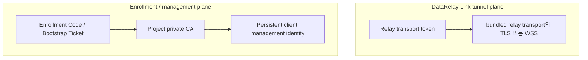
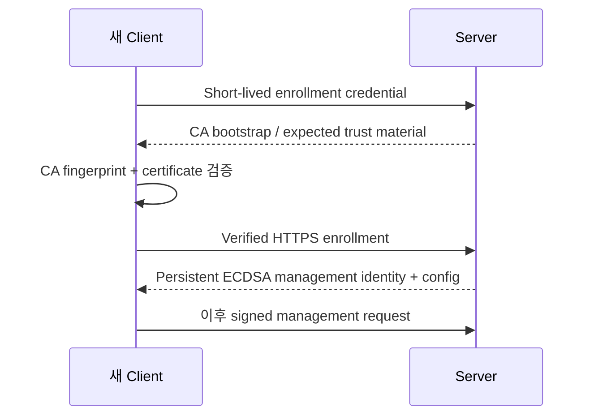
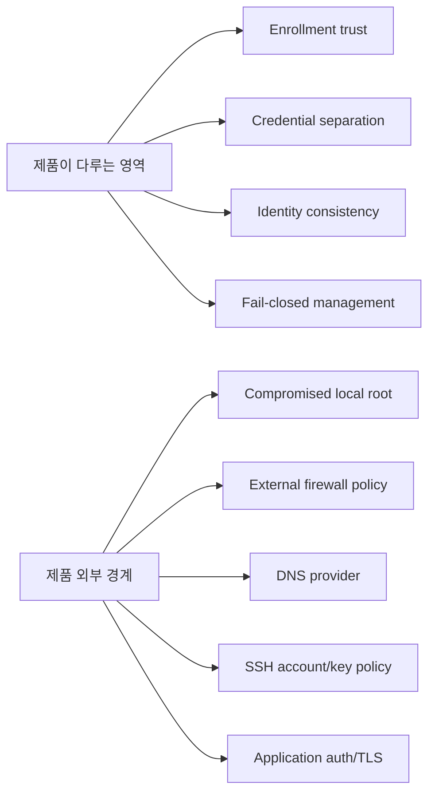

# 보안 개요

DataRelay Link는 **DataRelay Link tunnel authentication**과 **management-plane trust**를 분리합니다. 문제 해결이나 보안 검토에서 두 자격 증명을 혼동하지 않는 것이 중요합니다.

## 한눈에 보는 보안 모델

Relay transport token은 Enrollment Code, Bootstrap Ticket, management API credential과 같은 것이 아닙니다.

## 최초 신뢰 수립

Enrollment와 signed client management는 verified HTTPS를 사용하며 production plain-HTTP fallback은 지원하지 않습니다.

## DataRelay Link tunnel plane

- Direct: DataRelay Link native TLS control
- Enterprise single-443: DataRelay Link control over WSS
- Relay transport token: tunnel authentication
- Published service traffic: proxy 등록 후 DataRelay Link를 통해 전달

## Persistent management identity

Enrollment 후 Client는 persistent ECDSA P-256 management identity를 유지하고 private key는 Client에 남습니다.

Signed management request는 freshness/replay protection을 위해 timestamp/nonce 등의 검증과 결합됩니다.

## Zero-Touch credential 특성

Bootstrap Ticket은 다음 특성을 목표로 합니다.

- high entropy
- short-lived
- first-machine bound
- successful enrollment 후 single-use
- server에서 hashed-at-rest
- 사용/만료/revoke 전까지 민감 정보

Generated bootstrap command를 public issue, public chat, analytics, long-lived log에 남기지 마세요.

## 보호해야 할 Secret

| Secret | 역할 |
| --- | --- |
| DataRelay Link server token | DataRelay Link tunnel client 인증 |
| Enrollment Code | Manual first enrollment |
| Bootstrap Ticket | Zero-Touch first enrollment |
| Client management private key | Persistent management identity |
| Management MAC material | Management request authentication |
| CA private key | Project management trust root |
| TLS private key | 해당 TLS endpoint identity |
| Token 포함 generated DataRelay Link config | Tunnel credential 노출 가능 |

## 보안 경계

Server나 Client의 local root가 완전히 침해된 상황은 제품 보호 경계 밖입니다.

## Published stable의 접근제어 경계

현재 published stable은 **v2.2.1**입니다. 이 버전에는 published TCP service에 대해 제품이 직접 적용하는 **서비스별 source-IP allowlist 정책**이나 application-style **RBAC 계층**이 stable 기능으로 포함되어 있지 않습니다.

v2.2.1에서는 외부 firewall/security group, target host ACL, SSH account/key, database ACL, target application의 authentication/authorization처럼 해당 접근 경계를 실제로 소유하는 제어를 사용해야 합니다.

<Note>
  Product `main` / release-preparation tree에는 이후 Access Control Pack 작업이 포함되어 있지만, 해당 기능이 들어간 release가 실제 tag/publish되기 전까지는 published stable 기능으로 간주하지 않습니다.
</Note>

## Fail closed

Unknown identity, invalid signature, CA mismatch, registry inconsistency, ambiguous client selector 같은 상태에서는 추측해서 계속 진행하지 않고 실패하는 것이 원칙입니다.

<Warning>
Trust 문제를 `curl -k`, TLS verification disable, plain HTTP enrollment, Client 간 secret 복사로 해결하지 마세요.
</Warning>

## 관련 문서

- [아키텍처](/ko/reference/architecture)
- [Zero-Touch 등록](/ko/guides/zero-touch)
- [문제 해결](/ko/operations/troubleshooting)
