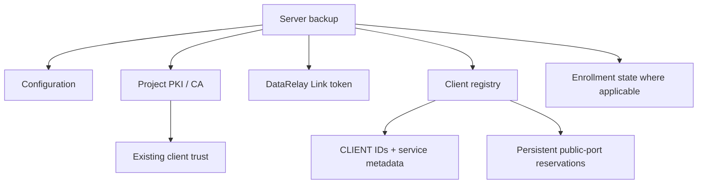
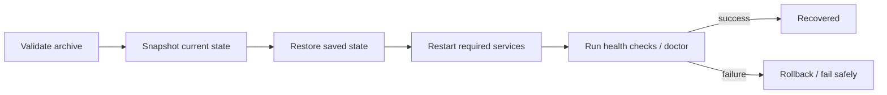
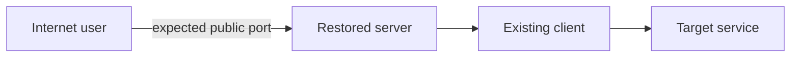

# Backup & Restore

The DataRelay Link server contains state that is more important than the software binaries themselves. Backups protect the trust and reservation data needed to keep existing clients working after recovery.

## What you are protecting



## Create a backup

```bash
sudo drlink create backup
```

Store the resulting backup as sensitive infrastructure material.

## Important persistent state

At minimum, understand these locations:

```text
/etc/data-relay-link/config.json
/etc/data-relay-link/pki/
/etc/data-relay-link/relay_token
/var/lib/data-relay-link/registry.json
```

The supported backup format also handles related state according to the installed release.

## Restore

```bash
sudo drlink restore backup <path>
```

Restore is not a blind `cp -r`. The supported flow is designed around validation and rollback behavior.



## Why the CA matters

Existing clients trust the project's private CA. Losing the CA private key can force advanced trust recovery or re-establishment. A normal reinstall/update should not intentionally rotate that CA.

## When to create a backup

- before high-risk maintenance or migration
- before a restore test
- before changing topology if rollback matters
- on a regular operational schedule appropriate for your environment
- after meaningful stable changes to client/service inventory when recovery point matters

## After restore

```bash
sudo drlink show version
sudo drlink show status
sudo drlink show clients
sudo drlink doctor
```

Then verify one or more representative public service paths.



## What not to do

- do not treat the PKI directory as disposable configuration
- do not restore only `relay-server.toml` and expect identity/port state to follow
- do not copy registry fragments manually between unrelated servers
- do not store backups in a public location

<Warning>
  Backups can contain highly sensitive trust and authentication material. Protect them at least as carefully as the production server state they represent.
</Warning>
