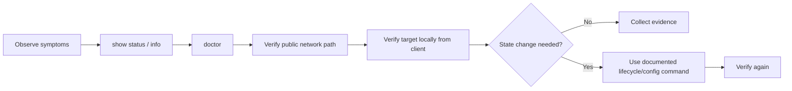
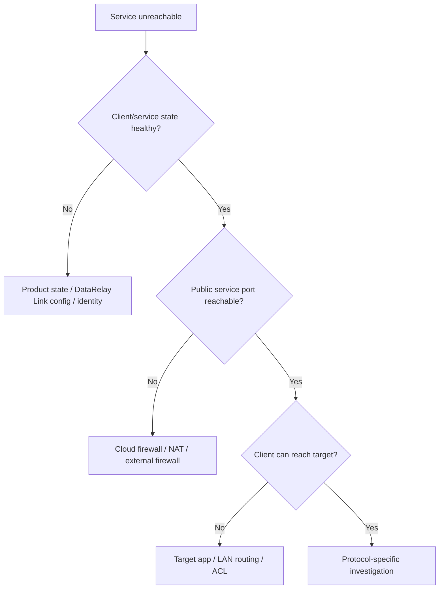

# Diagnostics

The safest diagnostic pattern is **observe first, change later**.



## Server baseline

```bash
sudo drlink show version
sudo drlink show status
sudo drlink show clients
sudo drlink show enrollments
sudo drlink doctor
```

## Client baseline

```bash
sudo drlink show version
sudo drlink show status
sudo drlink show services
sudo drlink show info
sudo drlink doctor
```

## What `doctor` can surface

| Area | Examples |
| --- | --- |
| Installation | expected files/components, version state |
| Permissions | secret-file modes and ownership |
| PKI / trust | CA material and consistency |
| Runtime | systemd service state |
| DataRelay Link | generated config, transport, local consistency |
| Enrollment | allocator/HTTPS reachability and trust path |
| State | registry/client-state consistency |
| Topology | Direct/single-443 and common network mismatch |

`doctor` is read-only.

## Separate product state from network state



DataRelay Link does not automatically control external security groups, NAT, DNS, or the target application's own listener/authentication.

## Useful target checks

For a local SSH target:

```bash
ss -lntp | grep ':22'
```

For a LAN target, prove the client itself can reach `target-host:target-port` before debugging the DataRelay Link public path.

## Avoid destructive diagnosis

Do not start by editing or replacing:

```text
/etc/data-relay-link/relay-server.toml
/etc/data-relay-link/relay-client.toml
/var/lib/data-relay-link/registry.json
/etc/data-relay-link/client-state.json
client management identity files
project PKI
```

Manual edits can erase the evidence that explains the original problem or create a second consistency problem.

## When the symptom is already known

Use the symptom-driven [Troubleshooting](/troubleshooting/overview) page for:

- client missing after enrollment
- published SSH/web port unreachable
- LAN target unreachable
- TCP handshake works but TLS resets
- IP works but hostname fails
- HTTPS certificate warning
- server behind NAT
